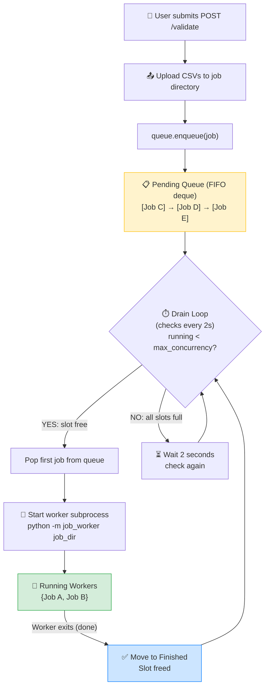
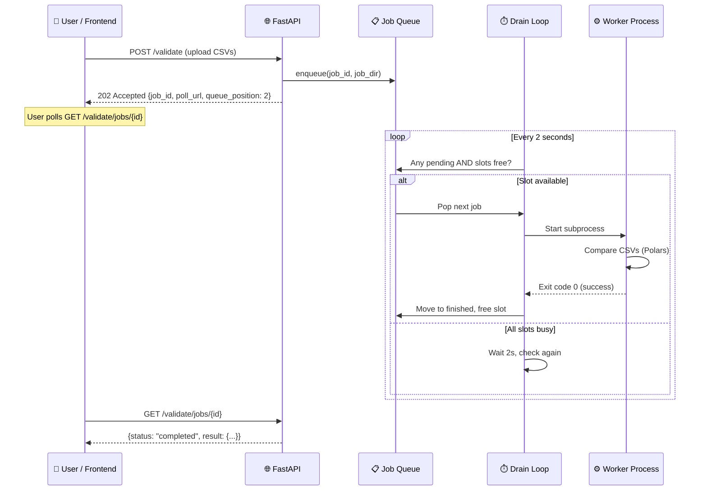
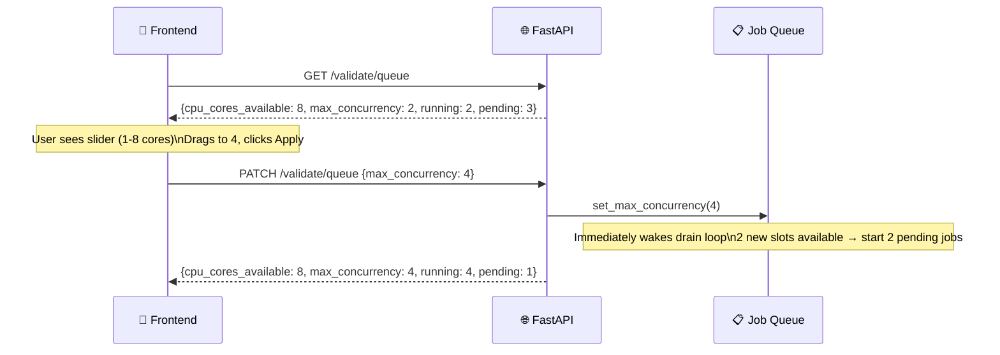
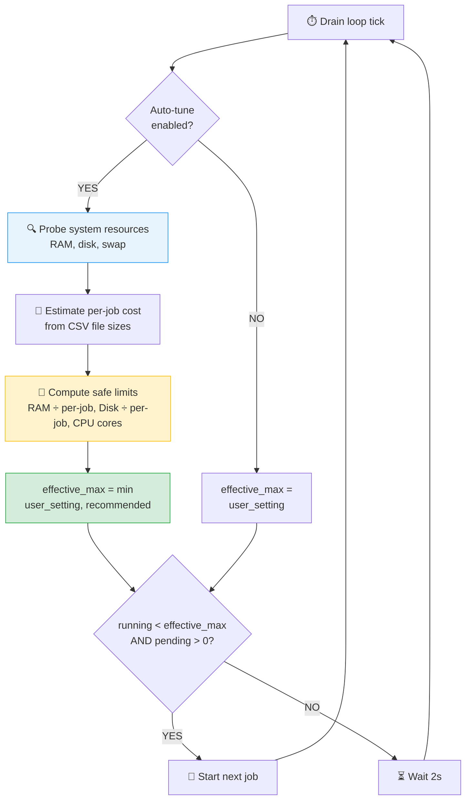

# Pegasus

Pegasus is a data validation and reconciliation platform that compares CSV datasets (source vs target), detects row-level mismatches, and provides structured reports for debugging and downstream automation. This repository contains the backend API (FastAPI), a React + Vite frontend UI, migration scripts, sample test data, and utilities to run validations locally or in CI.

## What I changed

- Expanded documentation to cover architecture, deployment, and developer workflows.
- Added Mermaid source diagrams under [docs/diagrams](docs/diagrams) so you can generate images locally.

## Project layout

```
Pegasus/
├── pegasus-backend/        # FastAPI backend service (Python)
├── pegasus-frontend/       # React + Vite frontend (JS/React)
├── docs/                   # Documentation and diagrams
│   └── diagrams/           # Mermaid source files for diagrams
├── test-data/              # Sample CSVs and generated datasets
└── scripts/                # Utility scripts (data generation, helpers)
```

## Quick start (dev)

Backend

```bash
cd pegasus-backend
python -m venv .venv
source .venv/bin/activate
pip install -r requirements.txt
cp .env.example .env            # create .env based on example
# set DATABASE_URL in .env (sqlite recommended for quick dev)
alembic -c alembic.ini upgrade head
uvicorn src.pegasus.main:app --reload --host 0.0.0.0 --port 8000
```

Notes:
- API root: http://localhost:8000
- Swagger: http://localhost:8000/docs
- **Custom Schema Setup (e.g. PostgreSQL):** If you use a custom database schema (configured via `DB_SCHEMA` in `.env`), you **must** manually create this schema in your database (e.g., `CREATE SCHEMA "Pegasus";` in PostgreSQL) before running `alembic` migrations. Failure to do so will result in `UndefinedTableError` or failed validation run saves.

Frontend

```bash
cd pegasus-frontend
npm install
npm run dev
```

Notes:
- Frontend dev server default: http://localhost:5173
- Configure the frontend to point to the backend base URL via environment variables in `pegasus-frontend` if needed.

## Architecture (high level)

- The backend exposes REST endpoints (FastAPI) to start and inspect validation runs.
- All validation jobs go through a **concurrency-limited job queue** — the queue decides when to start each job based on `max_concurrency` (how many validations can run in parallel).
- A **resource advisor** dynamically monitors available RAM, disk, and swap pressure and automatically caps concurrency to prevent the server from running out of resources.
- The core validation engine reads CSVs into Polars DataFrames, chooses a reconciliation strategy (auto, ordered_stream, sliding_window, hash_partition, external_sort), and streams mismatch results as NDJSON or stores them in the DB for later inspection.
- The frontend provides an interactive UI to submit validation jobs, monitor progress, view live resource stats, configure parallel concurrency, and inspect mismatch samples.

You can find the Mermaid sources for the architecture and dataflow diagrams here:

- System architecture: [docs/diagrams/system_architecture.mmd](docs/diagrams/system_architecture.mmd)
- Validation dataflow: [docs/diagrams/data_flow.mmd](docs/diagrams/data_flow.mmd)

If you prefer images, install Mermaid CLI and generate SVGs from these sources:

```bash
npm i -g @mermaid-js/mermaid-cli
mmdc -i docs/diagrams/system_architecture.mmd -o docs/diagrams/system_architecture.svg
mmdc -i docs/diagrams/data_flow.mmd -o docs/diagrams/data_flow.svg
```

---

## Parallel Validation & Job Queue

### The problem it solves

Without a queue, every `POST /validate` **immediately** spawns a worker process. If 5 users submit at the same time, 5 heavy CSV validations run simultaneously — each using significant CPU and RAM. On a 4-core / 8 GB server, this causes thrashing, swap pressure, and everything slows down.

### The solution: a job queue with `max_concurrency`

A **validation job queue** sits between the API and the worker spawner. It acts as a gatekeeper:

- Jobs are added to a **FIFO (first-in, first-out)** waiting line.
- A background **drain loop** checks every 2 seconds: "Are there waiting jobs AND free slots?"
- If yes → start the next job. If no → it waits until a running job finishes.
- `max_concurrency` = how many validation jobs are allowed to run **at the same time**.

### What is `max_concurrency`?

It's a single number: **the maximum number of validation workers that can execute in parallel**.

| `max_concurrency` | Behavior |
|---|---|
| `1` | One validation at a time (serial). Safest for low-RAM servers. |
| `2` (default) | Two validations run simultaneously. |
| `4` | Four parallel validations — requires ~4× the RAM/CPU. |
| Up to `32` | For powerful multi-core servers with plenty of RAM. |

> **Note:** This is NOT "cores per job." Each individual validation already uses multiple cores internally (via Polars and joblib). `max_concurrency` controls how many **separate validation jobs** overlap.

### How does the user set it?

Two layers work together — **manual control** and **automatic safety**:

1. The frontend calls `GET /api/v1/validate/queue` on page load.
2. The server responds with `cpu_cores_available`, current `max_concurrency`, and a **`resource_advisor`** object showing live RAM/disk/swap stats and a system-recommended concurrency value.
3. The user sees a **slider** in the UI showing their CPU cores, a "Use recommended (N)" shortcut button, and live resource cards (RAM available, Disk free, per-job estimates).
4. The user picks a value and clicks **Apply** → sends `PATCH /api/v1/validate/queue`.
5. The queue immediately uses the new limit. No server restart needed.
6. If **Auto-tune** is ON (default), the drain loop further caps the effective concurrency below the user's setting if the system detects low RAM, low disk, or high swap pressure. This prevents the server from running out of resources even if the user set it too high.

The env variable `PEGASUS_VALIDATION_MAX_CONCURRENCY` (default: 2) is only the **startup default** — users override it at runtime via the UI.

### How the queue works (step by step)

#### Step 1 — User submits a validation

```
POST /api/v1/validate  →  upload CSVs  →  queue.enqueue(job)
                                              ↓
                                         Returns 202 immediately
                                         Job is just sitting in a list
                                         NOTHING IS RUNNING YET
```

#### Step 2 — The drain loop decides when to start it

```python
# Runs every 2 seconds as a background task

# Step A: compute effective cap (auto-tune)
if auto_tune_enabled:
    snapshot = probe_system_resources()   # RAM, disk, swap
    effective_max = min(user_max_concurrency, snapshot.recommended)
else:
    effective_max = user_max_concurrency

# Step B: start jobs up to the effective cap
while pending_jobs AND running_count < effective_max:
    job = pending.pop_first()      # take the first waiting job
    start_worker(job)              # NOW spawn the subprocess
    move job to running dict
```

#### Step 3 — When a running job finishes

```
Worker process exits → drain loop detects it → removes from running
→ slot freed → next pending job starts automatically
```

### Walkthrough example

Suppose `max_concurrency = 2` and 4 validations are submitted rapidly:

```
Time 0s:   Job A submitted → pending:[A]   running:{}     → 0 < 2 ✓ → START A
                              pending:[]    running:{A}

Time 1s:   Job B submitted → pending:[B]   running:{A}    → 1 < 2 ✓ → START B  
                              pending:[]    running:{A,B}

Time 2s:   Job C submitted → pending:[C]   running:{A,B}  → 2 < 2 ✗ → WAIT
                              pending:[C]   running:{A,B}

Time 3s:   Job D submitted → pending:[C,D] running:{A,B}  → 2 < 2 ✗ → WAIT
                              pending:[C,D] running:{A,B}

Time 45s:  Job A finishes  →               running:{B}    → 1 < 2 ✓ → START C
                              pending:[D]   running:{B,C}

Time 60s:  Job B finishes  →               running:{C}    → 1 < 2 ✓ → START D
                              pending:[]    running:{C,D}

Time 90s:  All done.         pending:[]    running:{}
```

### Architecture diagram



### Queue data flow



### Concurrency control flow (user changes max_concurrency)



### Resource-Aware Auto-Tuning

The system doesn't just rely on the user picking a good number — it also **probes the machine in real time** and automatically prevents overload.

#### What gets measured

| Resource | How it's probed | Platform support |
|---|---|---|
| **Available RAM** | `/proc/meminfo` (MemAvailable) or Win32 `GlobalMemoryStatusEx` | Linux, Windows |
| **Total RAM** | `os.sysconf(SC_PHYS_PAGES)` or Win32 | Linux, Windows |
| **Disk free** | `shutil.disk_usage()` on the temp/spill directory | All |
| **Swap pressure** | `/proc/meminfo` (SwapTotal / SwapFree) | Linux only |

#### Per-job cost estimation

Each validation job's resource footprint is estimated from the actual CSV file sizes:

```
Per-job RAM  = 4 × (source.csv + target.csv bytes)
               Polars reads full file into memory, hash maps for
               partitioning, comparison DataFrames, mismatch buffers

Per-job Disk = 1.5 × (source.csv + target.csv bytes)
               Spill workspace writes NDJSON partitions during
               hash-partition or external-sort reconciliation
```

> If no jobs are queued yet, the system assumes a default of 200 MiB combined CSV size.
> For running jobs, it reads the actual `source.csv` / `target.csv` file sizes from the job directory.

#### The recommendation formula

```
usable_ram   = available_ram - 1 GiB reserve (for OS + Python runtime)
usable_disk  = available_disk - 500 MiB reserve

max_safe_by_ram  = currently_running + (usable_ram / per_job_ram)
max_safe_by_disk = currently_running + (usable_disk / per_job_disk)
max_safe_by_cpu  = logical_cpu_core_count

recommended = min(max_safe_by_ram, max_safe_by_disk, max_safe_by_cpu, 32)
```

When **auto-tune** is enabled (default), the drain loop computes:

```
effective_max = min(user_set_max_concurrency, recommended)
```

This means:
- If the user sets 8 but only 5 is safe → effective is 5 (jobs are held in queue)
- If the user sets 4 and 7 is safe → effective is 4 (user preference is respected)
- Running jobs are **never killed** — the cap only affects when queued jobs start

#### Auto-tune decision flow



#### Warnings

The resource advisor generates warnings surfaced in both the API response and the frontend UI:

| Condition | Warning message |
|---|---|
| Swap > 15% used | "Swap is X% in use — running more jobs may cause severe slowdown" |
| RAM > 80% used | "RAM is X% used (Y MiB free). Consider reducing max_concurrency" |
| Disk > 85% full | "Disk is X% full (Y GiB free). Large validations may fail during spill" |
| Single job > 50% RAM | "A single job may need ~X MiB but only Y MiB available" |

#### Frontend resource dashboard

The "⚡ Parallel Validation" panel in the UI shows:

- **3 resource cards**: RAM (available/total + per-job estimate), Disk (same), Safe limits (color-coded badges for RAM/Disk/CPU)
- **Warning banners**: Amber alerts for each active warning
- **"Use recommended (N)" button**: One-click to set the slider to the system's recommendation
- **Auto-tune checkbox**: Toggle resource-based dynamic capping ON/OFF
- **Summary text**: "Your server has N CPU cores, X GiB RAM, Y GiB disk free. The system recommends Z parallel jobs."

### Key files

| File | Purpose |
|---|---|
| `services/resource_advisor.py` | Probes RAM/disk/swap, estimates per-job cost, computes `recommended_max_concurrency` |
| `services/validation_job_queue.py` | The queue — pending deque, running dict, drain loop with auto-tune integration |
| `services/background_validation_runner.py` | Spawns the actual worker subprocess (`python -m pegasus.validation.job_worker`) |
| `api/v1/validation.py` | `GET/PATCH /validate/queue` endpoints, `POST /validate` calls `queue.enqueue()` |
| `core/config.py` | `PEGASUS_VALIDATION_MAX_CONCURRENCY` (startup default, overrideable at runtime) |
| `main.py` | Starts the drain loop on app startup, shuts it down on exit |
| `ValidationPanel.jsx` | Frontend: resource cards, concurrency slider, auto-tune toggle, warnings |

### API endpoints for queue control

| Method | Endpoint | Description |
|---|---|---|
| `GET` | `/api/v1/validate/queue` | Returns system resources, `resource_advisor` recommendation, job list |
| `PATCH` | `/api/v1/validate/queue` | Body: `{"max_concurrency": 4, "auto_tune_enabled": true}` — update settings at runtime |

Example response from `GET /api/v1/validate/queue`:

```json
{
  "max_concurrency": 4,
  "cpu_cores_available": 8,
  "auto_tune_enabled": true,
  "pending": 2,
  "running": 3,
  "finished": 15,
  "total_tracked": 20,
  "resource_advisor": {
    "system": {
      "total_ram_bytes": 16793714688,
      "available_ram_bytes": 6786662400,
      "total_ram_gib": 15.64,
      "available_ram_gib": 6.32,
      "total_disk_bytes": 255048544256,
      "available_disk_bytes": 95789342720,
      "total_disk_gib": 237.5,
      "available_disk_gib": 89.2,
      "cpu_cores": 8,
      "swap_pressure": 0.05
    },
    "per_job_estimate": {
      "ram_bytes": 838860800,
      "ram_mib": 800.0,
      "disk_bytes": 314572800,
      "disk_mib": 300.0
    },
    "running_jobs_estimated_ram_bytes": 2516582400,
    "limits": {
      "max_safe_by_ram": 7,
      "max_safe_by_disk": 12,
      "max_safe_by_cpu": 8
    },
    "recommended_max_concurrency": 7,
    "warnings": []
  },
  "jobs": [
    {"job_id": "abc-123", "state": "running", "started_at": 1715700000},
    {"job_id": "def-456", "state": "queued", "position": 0}
  ]
}
```

---

## Backend: key components

- `src/pegasus/main.py` — FastAPI app entrypoint, router registration, and job queue lifecycle.
- `src/pegasus/api/` — API route definitions and dependency wiring.
- `src/pegasus/core/` — configuration, DB connection, helpers.
- `src/pegasus/services/validation_job_queue.py` — concurrency-limited validation job queue with auto-tune.
- `src/pegasus/services/resource_advisor.py` — dynamic RAM/disk/swap probing and per-job cost estimation.
- `src/pegasus/services/background_validation_runner.py` — worker process spawner.
- `src/pegasus/validation/engine.py` — reconciliation engine core (strategy dispatcher).
- `src/pegasus/services/validation_service.py` — high-level orchestration of validation runs.
- `src/pegasus/models/` — SQLAlchemy models for `ValidationRun`, mismatch reports, and audit tables.
- `alembic/` — migration scripts; use `alembic -c alembic.ini upgrade head` to apply.

Environment variables of interest (set in `.env`):

```bash
# Database
DATABASE_URL=sqlite:///./pegasus.db

# Reconciliation strategy (auto|ordered_stream|sliding_window|hash_partition|external_sort)
PEGASUS_VALIDATION_RECONCILIATION_STRATEGY=auto

# Parallel validation (startup default — users can change at runtime via the UI)
PEGASUS_VALIDATION_MAX_CONCURRENCY=2

# Memory & partition tuning
PEGASUS_VALIDATION_EXTERNAL_MEMORY_THRESHOLD_BYTES=26214400
PEGASUS_VALIDATION_RECONCILIATION_PARTITION_BUCKETS=64
PEGASUS_VALIDATION_RECONCILIATION_CHUNK_ROWS=500000
```

## Frontend: key components

- `pegasus-frontend/src/App.jsx` — app shell and routes.
- `pegasus-frontend/src/components/ValidationPanel.jsx` — UI to run and monitor validation jobs, configure parallel concurrency.
- `pegasus-frontend/src/components/ValidationMismatchSections.jsx` — mismatch list and details.

Run and develop with HMR using `npm run dev`.

## APIs (common)

- `POST /api/v1/validate` — upload two CSVs and queue a validation job. Returns `202 Accepted` with `job_id` and `poll_url`.
- `POST /api/v1/validate/local` — queue validation for server-local file paths (no upload).
- `GET /api/v1/validate/jobs/{id}` — poll job status (queued → running → completed/failed).
- `GET /api/v1/validate/queue` — get queue stats, CPU cores available, and job list.
- `PATCH /api/v1/validate/queue` — update `max_concurrency` at runtime.

Refer to the backend code comments for the exact request/response shapes or open the interactive Swagger UI at `/docs`.

## Diagrams included (source)

- [docs/diagrams/system_architecture.mmd](docs/diagrams/system_architecture.mmd) — system components and interactions
- [docs/diagrams/data_flow.mmd](docs/diagrams/data_flow.mmd) — CSV ingestion → reconciliation strategies → mismatch generation

## Running tests

Backend

```bash
cd pegasus-backend
pytest -q
```

Frontend (if configured)

```bash
cd pegasus-frontend
npm test
```

## Troubleshooting & tips

- If migrations fail, ensure `DATABASE_URL` points to a writable DB file and run `alembic -c alembic.ini upgrade head`.
- For very large datasets, increase `VALIDATION_RECONCILIATION_PARTITION_BUCKETS` and ensure `VALIDATION_RECONCILIATION_TEMP_DIR` has enough disk space.
- Use the `test-data/` folder to try small and large generated files before running production workloads.

### Code Quality

- Backend: Follow PEP 8 style guide, write tests, use type hints
- Frontend: Use ESLint rules, keep components modular, test before committing

## Troubleshooting

### Backend Issues
- **Database connection error**: Check `DATABASE_URL` in `.env`
- **Port 8000 already in use**: Change port with `--port 9000`
- **Module import errors**: Activate virtual environment and reinstall dependencies

### Frontend Issues
- **Port 5173 already in use**: Vite will use next available port
- **npm dependencies error**: Delete `node_modules` and `package-lock.json`, then reinstall

### Combined Issues
- Ensure backend is running before starting frontend
- Check CORS settings if API calls fail
- Clear browser cache if frontend doesn't update

## Environment Configuration

### Backend `.env` file

```bash
# Database
DATABASE_URL=sqlite:///./pegasus.db

# API
API_TITLE=Pegasus API
API_VERSION=1.0.0
LOG_LEVEL=INFO

# CORS
ALLOWED_ORIGINS=["http://localhost:5173"]
```

### Frontend Vite Configuration

- Default port: `5173`
- Backend proxy: Configured to forward to `localhost:8000`
- Check `vite.config.js` for details

## Docker Support

### Build Backend Docker Image

```bash
cd pegasus-backend
docker build -t pegasus-backend .
```

### Run Backend Container

```bash
docker run -p 8000:8000 \
  -e DATABASE_URL=sqlite:///./pegasus.db \
  pegasus-backend
```

## Additional Resources

- [Developer Onboarding & Setup Guide](./docs/README.md) - Comprehensive step-by-step developer onboarding and runtime setup guide.
- [Backend README](./pegasus-backend/README.md) - Detailed backend documentation
- [Frontend README](./pegasus-frontend/README.md) - Detailed frontend documentation
- [Test Data](./test-data/) - Sample CSV files for testing; use [scripts/generate_validation_data.py](scripts/generate_validation_data.py) to generate large shuffled source/target pairs with missing, extra, and mismatched rows

## Tech Stack

### Backend
- FastAPI ^0.115.0
- SQLAlchemy ^2.0.36
- Polars ^1.0.0
- Alembic ^1.14.0
- Pydantic ^2.10.0

### Frontend
- React ^19.2.5
- Vite ^8.0.10
- ESLint ^10.2.1

