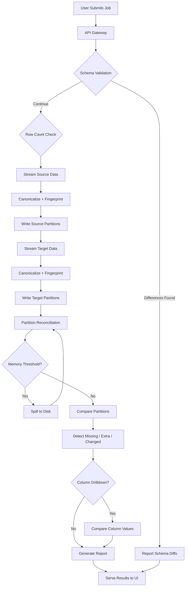

# Category-1 Enterprise Reconciliation Platform

Enterprise-grade tabular data reconciliation platform with external-memory processing, designed for datasets up to **1 billion rows** with minimal source system impact.

Category-1 validates that a **source** dataset and a **target** dataset (after migration, replication, or ETL) are consistent. All heavy computation — hashing, fingerprinting, partitioning, and comparison — runs inside the platform. Source systems only provide **schema**, **metadata**, and **streaming records**.

Target scale: **100M–1B rows**, **1000+ columns**, **40GB–1TB** datasets.

---

## Table of Contents

- [Quick Start](#quick-start)
- [Design Principles](#design-principles)
- [System Architecture](#system-architecture)
- [Validation Pipeline](#validation-pipeline)
- [Canonicalization](#canonicalization)
- [Record Identity & Fingerprinting](#record-identity--fingerprinting)
- [Partitioning Strategy](#partitioning-strategy)
- [External Memory Model](#external-memory-model)
- [Supported Data Sources](#supported-data-sources)
- [Job Lifecycle & API](#job-lifecycle--api)
- [Configuration](#configuration)
- [Project Structure](#project-structure)
- [Deployment](#deployment)
- [Additional Documentation](#additional-documentation)

---

## Quick Start

```bash
# Backend
cd category1-platform/backend
pip install -r requirements.txt
uvicorn category1.api.main:app --reload --port 8000

# Frontend (separate terminal)
cd category1-platform/frontend
npm install && npm run dev
```

Open http://localhost:3000 to access the UI. Interactive API docs: http://localhost:8000/docs

### Docker

```bash
cd category1-platform
docker compose up -d
```

- Backend: http://localhost:8000
- Frontend: http://localhost:3000

### Test

```bash
cd category1-platform/backend
python -m pytest tests/ -v
```

---

## Design Principles

| Principle | Description |
|-----------|-------------|
| **Source-Safe** | Source systems provide schema, metadata, and streaming records only — no hashing or aggregation on source |
| **Bounded Memory** | Memory usage scales with chunk size, not dataset size |
| **External Memory** | Disk spilling when memory thresholds are reached (default 75%) |
| **Deterministic Partitioning** | Platform-side hashing for reproducible, partition-local comparison |
| **Horizontal Scaling** | Stateless workers with partition-level parallelism in Kubernetes |

---

## System Architecture

### High-Level Data Flow

```
Source Adapter → Streaming Reader → Canonicalization → Partition Writer
  → Distributed Reconciliation Engine → Mismatch Detection → Reporting → Frontend UI
```

### Component Diagram

```
┌─────────────────────────────────────────────────────────────────────┐
│                         Frontend UI (React)                         │
│              Job Creation │ Progress │ Results │ Reports            │
└──────────────────────────────┬──────────────────────────────────────┘
                               │ REST API
┌──────────────────────────────▼──────────────────────────────────────┐
│                      API Gateway (FastAPI)                          │
│              Job Manager │ Schema Preview │ Report Serving          │
└──────────────────────────────┬──────────────────────────────────────┘
                               │
┌──────────────────────────────▼──────────────────────────────────────┐
│                   Reconciliation Engine                             │
│  ┌──────────┐  ┌──────────────┐  ┌─────────────┐  ┌────────────┐ │
│  │ Schema   │  │ Streaming    │  │ Partition   │  │ Mismatch   │ │
│  │ Validator│  │ Partitioner  │  │ Reconciler  │  │ Detector   │ │
│  └──────────┘  └──────────────┘  └─────────────┘  └────────────┘ │
└──────┬─────────────────┬─────────────────┬────────────────────────┘
       │                 │                 │
┌──────▼──────┐  ┌───────▼───────┐  ┌───────▼────────┐
│ Source      │  │ Canonicalizer │  │ Partition      │
│ Adapters    │  │ + Fingerprint │  │ Storage        │
│ (8 DBs +    │  │ Engine        │  │ (Local/S3)     │
│  8 formats) │  │               │  │                │
└─────────────┘  └───────────────┘  └────────────────┘
```

### Component Layers

| Layer | Component | Role |
|-------|-----------|------|
| **UI** | React + TypeScript + Vite | Job creation, progress tracking, results display |
| **API** | FastAPI + Uvicorn | Job manager, schema preview, report serving |
| **Engine** | `ReconciliationEngine` | Orchestrates the full validation pipeline |
| **Readers** | 8 DB adapters + 8 file formats | Streaming ingestion via cursors/iterators |
| **Core** | Canonicalizer, Fingerprint, Partitioner, MismatchDetector | All comparison logic |
| **Storage** | Local / S3 / SQLite | Partition files, spill files, reports |

### Technology Stack

| Component | Technology |
|-----------|-----------|
| API | FastAPI + Uvicorn |
| Frontend | React + TypeScript + Vite |
| Columnar I/O | Native in-house Parquet & ORC readers (`backend/category1/readers/native/`) |
| Avro | fastavro |
| Excel | openpyxl (read-only) |
| Work Queue | Redis |
| Object Storage | S3-compatible (boto3) |
| Container | Docker + Kubernetes |

---

## Validation Pipeline

The `ReconciliationEngine` (`backend/category1/core/reconciliation_engine.py`) orchestrates five phases. Progress is reported as: **5% → 15% → 40% → 55% → 95% → 100%**.



### Phase 1: Schema Validation (metadata only)

**No data rows are read.**

1. `source_reader.get_schema()` → `DatasetSchema`
2. `target_reader.get_schema()` → `DatasetSchema`
3. `SchemaValidator.validate(source, target)` → `SchemaValidationResult`

Checks performed (`backend/category1/core/schema_validator.py`):

- Column names present or missing on each side
- **Type harmonization** — e.g. `VARCHAR` → `string`, `NUMBER` → `decimal`
- Nullability mismatches
- Numeric precision and scale mismatches
- **Column mapping** — source column names can map to different target names

Difference types: `missing_in_target`, `extra_in_target`, `type_mismatch`, `nullable_mismatch`, `precision_mismatch`, `scale_mismatch`, `missing_target_column`.

Schema differences are recorded in the report; the pipeline continues to data reconciliation.

**Cost on source:** one metadata query.

### Phase 2: Row Count Validation (optional)

Enabled by default (`enable_row_count: true`). Skippable via config.

```
source_row_count = source_schema.row_count or source_reader.get_row_count()
target_row_count = target_schema.row_count or target_reader.get_row_count()
```

- **Parquet / ORC / BigQuery:** row count from file metadata (no full scan)
- **Databases:** single `COUNT(*)` query

### Phase 3: Streaming Partition Creation (source, then target)

Both sides are processed independently through the same pipeline.

```
FOR each chunk FROM reader(chunk_size):
    FOR each record IN chunk:
        identity     = canonicalize(key_columns) joined by "|"
        fingerprint  = SHA256(JSON(canonicalized compare_columns))
        partition_id = MD5(identity)[:4] as int % num_partitions
        WRITE to work_dir/{source|target}/partitions/part_{id:05d}.bin
```

**Partition file format** (binary):

```
[4-byte big-endian length][JSON: {k: identity_key, f: fingerprint, d: raw_data}]
```

| Property | Value |
|----------|-------|
| Memory | O(chunk_size × record_width) — bounded by chunk size |
| Disk | O(dataset_size) — full dataset written to partition files |
| Default chunk size | 10,000 rows (options: 1K, 5K, 10K, 50K) |
| Default partitions | 4096 (range: 1024–8192) |

After each chunk is written, memory is freed before the next chunk is read.

### Phase 4: Partition Reconciliation (external hash join)

For each active partition (union of source and target partition IDs):

```
BUILD ExternalHashTable FROM source partition
PROBE with target partition records:
    key NOT in source table              → EXTRA
    same key, different fingerprint      → CHANGED
    same key, same fingerprint           → MATCH
FOR keys in source NOT seen in target    → MISSING
```

Implemented in `MismatchDetector` (`backend/category1/core/mismatch_detector.py`) using `ExternalHashTable` (`backend/category1/core/external_memory.py`):

- 256 in-memory buckets
- Spills to disk (`bucket_XXXX.jsonl`) when a bucket exceeds 10,000 entries or memory hits 75% of limit
- Probe phase reads spilled buckets sequentially

This is the same **external hash join** algorithm used by database query optimizers.

| Mismatch Type | Meaning |
|---------------|---------|
| `missing` | In source, not in target |
| `extra` | In target, not in source |
| `changed` | Same identity key, different fingerprint |

### Phase 5: Column-Level Drilldown

Runs on **changed** records only when `enable_column_drilldown: true` (default).

```
FOR each compare_column:
    src_canon = canonicalize(source[col])
    tgt_canon = canonicalize(target[col])
    IF src_canon != tgt_canon:
        RECORD ColumnDifference(column, source_value, target_value)
```

Sample mismatches are capped at `sample_mismatch_limit` (default 1000).

### Phase 6: Report Generation

`ReportGenerator` writes `VALIDATION_RESULTS.md` to:

```
{work_dir}/{job_id}/reports/VALIDATION_RESULTS.md
```

Report sections:

1. **Summary** — source/target row counts, missing/extra/mismatched/matching counts
2. **Schema differences** — table of all schema diffs
3. **Sample mismatches** — up to 50 records with column drilldown tables
4. **Execution statistics** — duration, partitions/chunks processed, peak memory, disk spill, network I/O
5. **Partition statistics** — per-partition breakdown (first 100)
6. **Configuration** — chunk size, partitions, memory limit, key columns, key strategy

Download via `GET /api/jobs/{id}/report`.

---

## Canonicalization

All fingerprinting and comparison operates on **canonicalized** values (`backend/category1/core/canonicalization.py`).

| Rule | Behavior |
|------|----------|
| Nulls | `""`, `"NULL"`, `"null"`, `"None"`, `"NA"`, `"N/A"` → `__NULL__` |
| Whitespace | Configurable trim (default: on) |
| Case | Configurable sensitivity (default: case-sensitive) |
| Decimals | Strip commas, normalize precision, strip trailing zeros |
| Dates | Normalize to ISO `YYYY-MM-DD` |
| Timestamps | Normalize to ISO `YYYY-MM-DDTHH:MM:SS` |
| Integers | Strip commas, normalize |
| Booleans | `true` / `false` normalization |

Per-job overrides are supported via `ReconciliationJobConfig.canonicalization`.

Type harmonization maps heterogeneous database types to a common comparison type (e.g. `varchar2` → `string`, `datetime2` → `timestamp`).

---

## Record Identity & Fingerprinting

Configured via `key_strategy` and `key_columns` (`backend/category1/core/fingerprint.py`).

### Identity Strategies

| Strategy | Behavior |
|----------|----------|
| `primary` | Declared primary key columns |
| `composite` | Multiple key columns concatenated |
| `business` | User-defined business key |
| `user_defined` | Explicit key column list |
| `generated` | Hash all columns |
| `none` | Full-row hash (multiset semantics) |

Default key columns: first column of the schema if not specified.

### Fingerprint Computation

```
identity_key  = "|".join(canonicalize(key_columns))
fingerprint     = SHA256(JSON(canonicalized compare_columns, sort_keys=True))
partition_id    = int.from_bytes(MD5(identity_key)[:4], "big") % num_partitions
```

**Multiset semantics:** duplicate keys are handled independently — each occurrence is fingerprinted separately.

---

## Partitioning Strategy

**Why platform-side hashing?**

- Source systems may prohibit UDFs, hashing functions, or custom SQL
- Deterministic results regardless of source system
- Same partition assignment on source and target enables partition-local comparison

### Recommended Partition Counts

| Dataset Size | Partitions |
|-------------|------------|
| < 10M rows | 1024 |
| 10M–100M rows | 2048 |
| 100M–500M rows | 4096 |
| 500M–1B rows | 8192 |

Higher partition counts reduce per-partition memory but increase file count and merge overhead.

---

## External Memory Model

```
Memory Budget (configurable, e.g. 10GB per job)
├── In-Memory Hash Buckets (75% threshold → spill)
├── Spill Buffer (chunk accumulation → JSONL)
├── External Hash Table
│   ├── 256 in-memory buckets
│   └── Disk-backed bucket files (JSONL)
└── External Merge Sort
    ├── Sort runs (chunk_size records)
    └── K-way merge for ordered comparison
```

**MemoryMonitor** tracks RSS via `resource.getrusage()`. When usage reaches `spill_threshold_pct` (default 75%) of `memory_limit_mb`, hash buckets spill to disk.

**Bounded memory guarantee:** memory scales with `chunk_size` and `max_bucket_size`, not dataset size.

Default work directory: `/tmp/category1` (Docker: `/data/category1` via `CATEGORY1_WORK_DIR`).

---

## Supported Data Sources

### Databases (streaming cursors only)

Teradata, Hive, Oracle, Postgres, SQL Server, Snowflake, BigQuery, Redshift

All database adapters (`backend/category1/adapters/database.py`) use server-side cursors with `fetchmany(chunk_size)`. No hashing or aggregation on source. Read-only connections.

### File Formats

CSV, TSV, PSV, Fixed Width, Parquet, ORC, Avro, Excel

**Native columnar engine** (`backend/category1/readers/native/`): in-house Parquet and ORC parsers — no PyArrow or third-party columnar libraries.

| Format | Reader | Notes |
|--------|--------|-------|
| CSV / TSV / PSV | `readers/delimited.py` | Streaming line reader |
| Fixed Width | `readers/fixed_width.py` | Column position-based |
| Parquet | `readers/parquet_reader.py` + `readers/native/` | Row-group streaming; SNAPPY, GZIP, PLAIN, RLE, dictionary |
| ORC | `readers/orc_reader.py` + `readers/native/` | Stripe streaming |
| Avro | `readers/avro_reader.py` | fastavro |
| Excel | `readers/excel_reader.py` | openpyxl read-only |

All file readers implement `StreamingReader` — iterator-based, never loading full datasets.

---

## Job Lifecycle & API

### Status Flow

```
PENDING → SCHEMA_VALIDATION → PARTITIONING_SOURCE → PARTITIONING_TARGET
  → RECONCILING → REPORTING → COMPLETED
                                    ↓ (on error)
                                  FAILED
```

Jobs run asynchronously in a background thread via `JobManager` (`backend/category1/pipeline/job_manager.py`).

### Creating a Job

**Via UI:** Upload source and target files, configure key columns, chunk size, partitions, memory limit, and key strategy.

**Via file upload API:**

```bash
curl -X POST http://localhost:8000/api/jobs/upload \
  -F "source_file=@source.csv" \
  -F "target_file=@target.csv" \
  -F "key_columns=employee_id" \
  -F "file_format=csv" \
  -F "chunk_size=10000" \
  -F "num_partitions=4096" \
  -F "memory_limit_mb=1024"
```

**Via JSON API (database sources):**

```bash
curl -X POST http://localhost:8000/api/jobs \
  -H "Content-Type: application/json" \
  -d '{
    "source": {
      "source_type": "postgres",
      "host": "source-db.example.com",
      "database": "analytics",
      "schema_name": "public",
      "table": "employees",
      "credentials": {"user": "reader", "password": "secret"}
    },
    "target": {
      "source_type": "snowflake",
      "database": "DW",
      "schema_name": "PUBLIC",
      "table": "EMPLOYEES",
      "credentials": {"user": "reader", "password": "secret"}
    },
    "key_columns": ["employee_id"],
    "chunk_size": 10000,
    "num_partitions": 4096
  }'
```

### API Endpoints

| Endpoint | Method | Description |
|----------|--------|-------------|
| `/api/health` | GET | Health check |
| `/api/config/defaults` | GET | Chunk sizes, partition counts, formats, key strategies |
| `/api/jobs` | GET | List all jobs |
| `/api/jobs` | POST | Create job (JSON config) |
| `/api/jobs/upload` | POST | Create job with file upload |
| `/api/jobs/{id}` | GET | Get job result |
| `/api/jobs/{id}/summary` | GET | Get job progress summary |
| `/api/jobs/{id}/report` | GET | Download `VALIDATION_RESULTS.md` |
| `/api/jobs/{id}/cancel` | POST | Cancel a running job |
| `/api/jobs/{id}` | DELETE | Delete job and clean up work directory |
| `/api/schema/preview` | POST | Preview schema without running a job |

---

## Configuration

### Per-Job Settings (`ReconciliationJobConfig`)

| Field | Default | Description |
|-------|---------|-------------|
| `chunk_size` | 10000 | Rows per read chunk |
| `num_partitions` | 4096 | Hash partition count (1024–8192) |
| `memory_limit_mb` | 1024 | Memory budget per job |
| `enable_row_count` | true | Run Phase 2 row count check |
| `enable_column_drilldown` | true | Run Phase 5 column-level diff |
| `key_columns` | first column | Identity columns |
| `compare_columns` | all columns | Columns included in fingerprint |
| `column_mapping` | `{}` | Source → target column rename map |
| `canonicalization` | `{}` | Override canonicalization rules |
| `key_strategy` | `primary` | Record identity strategy |

### Platform Settings (`CATEGORY1_*` environment variables)

| Variable | Default | Description |
|----------|---------|-------------|
| `CATEGORY1_CHUNK_SIZE` | 10000 | Default rows per chunk |
| `CATEGORY1_NUM_PARTITIONS` | 4096 | Default partition count |
| `CATEGORY1_MEMORY_LIMIT_MB` | 1024 | Default memory budget |
| `CATEGORY1_SPILL_THRESHOLD_PCT` | 0.75 | Memory % before disk spill |
| `CATEGORY1_WORK_DIR` | /tmp/category1 | Working directory for jobs |
| `CATEGORY1_STORAGE_BACKEND` | local | `local`, `object`, or `sqlite` |
| `CATEGORY1_MAX_CONCURRENT_PARTITIONS` | 4 | Parallel partition workers |
| `CATEGORY1_SAMPLE_MISMATCH_LIMIT` | 1000 | Max mismatches stored in report |

---

## Project Structure

```
category1-platform/
├── backend/
│   └── category1/
│       ├── api/                  # FastAPI application (main.py)
│       ├── adapters/             # Database source adapters (8 DBs)
│       ├── core/
│       │   ├── reconciliation_engine.py   # Pipeline orchestrator
│       │   ├── schema_validator.py          # Phase 1
│       │   ├── canonicalization.py          # Value normalization
│       │   ├── fingerprint.py               # Identity + SHA256 fingerprint
│       │   ├── partitioner.py               # Partition read/write
│       │   ├── mismatch_detector.py         # Phase 4 + drilldown
│       │   └── external_memory.py           # Spill, hash table, merge sort
│       ├── readers/
│       │   ├── base.py             # StreamingReader interface
│       │   ├── delimited.py        # CSV, TSV, PSV
│       │   ├── fixed_width.py
│       │   ├── parquet_reader.py
│       │   ├── orc_reader.py
│       │   ├── avro_reader.py
│       │   ├── excel_reader.py
│       │   └── native/             # In-house Parquet & ORC parsers
│       ├── pipeline/               # JobManager
│       ├── workers/                # K8s partition workers + checkpointing
│       ├── reporting/              # VALIDATION_RESULTS.md generator
│       ├── storage/                # Local / S3 / SQLite backends
│       ├── models/                 # Pydantic schemas
│       └── config.py               # Platform configuration
├── frontend/                       # React + TypeScript UI
├── k8s/                            # Kubernetes manifests (HPA, workers, Redis)
├── docs/                           # Detailed guides (see below)
├── docker-compose.yml
└── README.md
```

---

## Deployment

### Local Development

See [Quick Start](#quick-start) above.

### Docker Compose

```bash
cd category1-platform
docker compose up -d
```

Environment defaults in `docker-compose.yml`:

- `CATEGORY1_WORK_DIR=/data/category1`
- `CATEGORY1_MEMORY_LIMIT_MB=1024`
- `CATEGORY1_NUM_PARTITIONS=1024`

### Kubernetes

Designed for horizontal scaling with stateless partition workers:

```
Job Coordinator (1 pod)
├── Enqueues partition tasks to Redis
└── Aggregates results

Partition Workers (N pods, HPA scaled)
├── Dequeue partition from Redis
├── Process single partition
├── Write checkpoint
└── Return stats to coordinator
```

See [KUBERNETES_GUIDE.md](docs/KUBERNETES_GUIDE.md) for full deployment instructions.

### Multi-Tenancy & Security

- Job isolation via UUID-scoped work directories
- Configurable memory limits per job
- Credentials passed per-job, never persisted
- Source connections use read-only cursors
- Work directory cleaned up on job deletion

---

## Design Trade-offs

| Decision | Benefit | Cost |
|----------|---------|------|
| External memory vs in-memory | Handles any dataset size | Disk I/O overhead |
| Platform-side hashing | Source-safe | Must read all data through platform |
| Partition files vs database | Simple, portable | Many small files at high partition counts |
| SHA256 fingerprints | Collision-resistant | CPU cost per record (acceptable in platform) |
| Sample mismatch limit | Bounded report size | Not all mismatches appear in report |

---

## Additional Documentation

| Document | Description |
|----------|-------------|
| [ARCHITECTURE.md](docs/ARCHITECTURE.md) | System architecture and component design |
| [CATEGORY1_DESIGN.md](docs/CATEGORY1_DESIGN.md) | Design decisions and trade-offs |
| [RECONCILIATION_FLOW.md](docs/RECONCILIATION_FLOW.md) | End-to-end pipeline flow with step-by-step pseudocode |
| [SCALING_GUIDE.md](docs/SCALING_GUIDE.md) | Horizontal and vertical scaling guidance |
| [PERFORMANCE_GUIDE.md](docs/PERFORMANCE_GUIDE.md) | Benchmark estimates and tuning |
| [OPERATIONS_GUIDE.md](docs/OPERATIONS_GUIDE.md) | Deployment and operations |
| [KUBERNETES_GUIDE.md](docs/KUBERNETES_GUIDE.md) | Kubernetes deployment guide |
| [readers/native/README.md](backend/category1/readers/native/README.md) | Native Parquet & ORC engine details |
