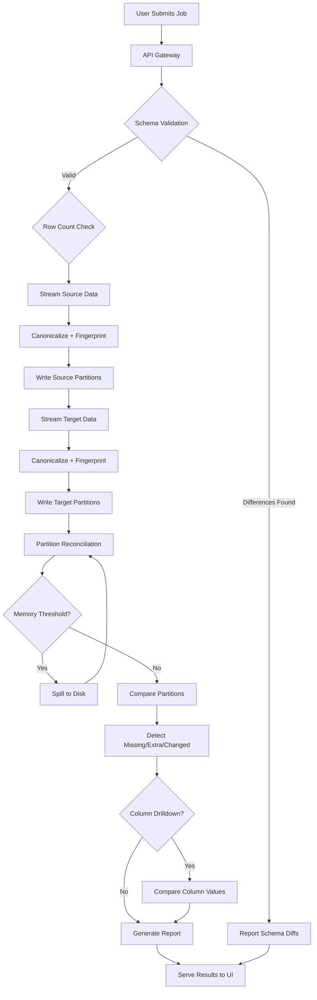

# Reconciliation Flow

## End-to-End Pipeline



## Detailed Step-by-Step

### Step 1: Job Creation
```
POST /api/jobs/upload
├── source_file (upload)
├── target_file (upload)
├── key_columns: "employee_id"
├── chunk_size: 10000
├── num_partitions: 4096
└── memory_limit_mb: 1024
```

### Step 2: Schema Validation (Phase 1)
```
Source Reader.get_schema() → DatasetSchema
Target Reader.get_schema() → DatasetSchema
SchemaValidator.validate(source, target) → SchemaValidationResult
```
- No data rows read
- Metadata-only comparison
- Type harmonization applied (e.g., VARCHAR → string, NUMBER → decimal)

### Step 3: Row Count (Phase 2, Optional)
```
source_reader.get_row_count()  → int | None
target_reader.get_row_count()  → int | None
```
- Uses metadata when available (Parquet, ORC, BigQuery)
- Falls back to COUNT(*) for databases
- Skippable via `enable_row_count: false`

### Step 4: Source Partitioning (Phase 3a)
```
FOR chunk IN source_reader.read_chunks(chunk_size):
    FOR record IN chunk:
        identity = fingerprint_engine.compute_identity_key(record, key_columns)
        fp = fingerprint_engine.compute_fingerprint(record, compare_columns)
        pid = fingerprint_engine.compute_partition_id(identity, num_partitions)
        partition_writer.write(PartitionRecord(identity, fp, pid, record))
    
    IF memory_monitor.should_spill():
        spill_buffer.flush()
```
Progress: 15% → 40%

### Step 5: Target Partitioning (Phase 3b)
Same as Step 4 but for target data.
Progress: 40% → 55%

### Step 6: Partition Reconciliation (Phase 4)
```
FOR partition_id IN active_partitions:
    source_path = work_dir/source/partitions/part_{id}.bin
    target_path = work_dir/target/partitions/part_{id}.bin
    
    # Build phase (external hash join)
    hash_table = ExternalHashTable(spill_dir)
    FOR record IN PartitionReader(source_path):
        hash_table.insert(record.identity_key, record.fingerprint, record.raw_data)
    hash_table.flush_all()
    
    # Probe phase
    FOR record IN PartitionReader(target_path):
        source_entry = hash_table.lookup(record.identity_key)
        IF source_entry IS NULL: → EXTRA
        ELIF source_entry.fingerprint != record.fingerprint: → CHANGED
        ELSE: → MATCH
    
    FOR key IN hash_table.all_keys NOT IN target_keys: → MISSING
```
Progress: 55% → 95%

### Step 7: Column Drilldown (Phase 5)
```
FOR each CHANGED record:
    FOR each compare_column:
        src_canon = canonicalizer.canonicalize(source[col])
        tgt_canon = canonicalizer.canonicalize(target[col])
        IF src_canon != tgt_canon:
            RECORD ColumnDifference(col, source_val, target_val)
```

### Step 8: Report Generation
```
ReportGenerator.generate(result) → VALIDATION_RESULTS.md
├── Summary table (missing/extra/mismatched/matching counts)
├── Schema differences
├── Sample mismatches (up to sample_mismatch_limit)
├── Execution statistics (time, memory, disk, network)
├── Partition statistics
└── Configuration used
```

## Memory Flow During Reconciliation

```
Chunk Read (bounded: chunk_size × row_width)
    ↓
Canonicalize + Fingerprint (in-place, no copy)
    ↓
Write to Partition File (immediate disk write)
    ↓
Free chunk memory
    ↓
[Next chunk...]

During Partition Compare:
Hash Bucket (bounded: max_bucket_size entries)
    ↓ (when full or memory threshold)
Spill Bucket to Disk (JSONL)
    ↓
Continue with empty bucket
```

## Concurrent Execution Model

In Kubernetes deployment:
```
Job Coordinator (1 pod)
├── Enqueues partition tasks to Redis
└── Aggregates results

Partition Workers (N pods, HPA scaled)
├── Dequeue partition from Redis
├── Process single partition
├── Write checkpoint
└── Return stats to coordinator
```

## Error Handling

| Error | Recovery |
|-------|----------|
| Source connection timeout | Retry with exponential backoff |
| Memory threshold exceeded | Automatic disk spill |
| Partition worker crash | Re-enqueue from checkpoint |
| Disk full | Fail job with clear error |
| Schema mismatch | Continue with warning (configurable) |
