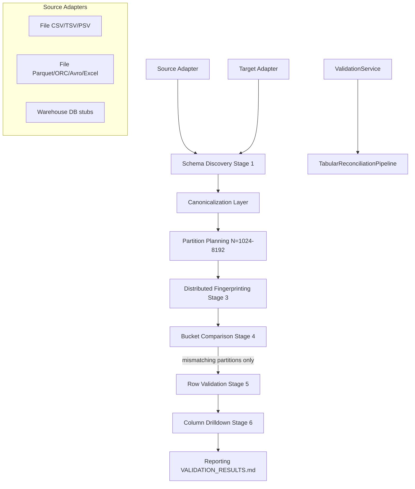
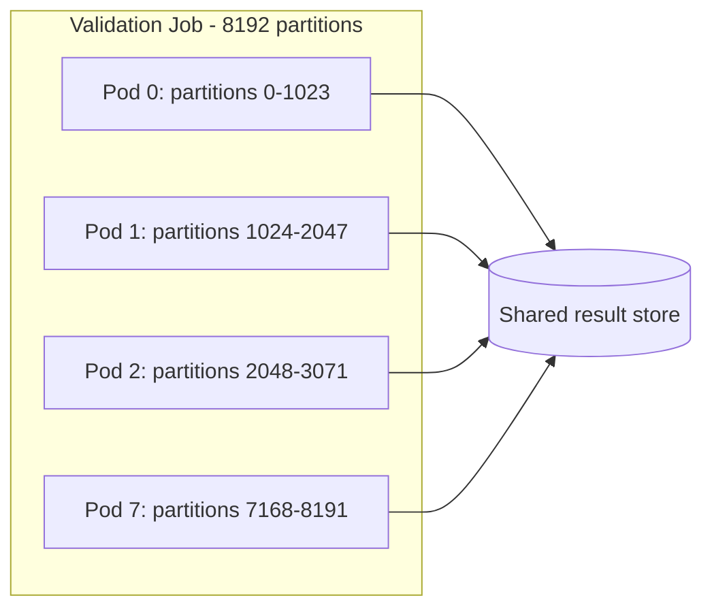

# Category 1 — Enterprise Tabular Reconciliation Architecture

> **Single product:** API and UI are Pegasus (`pegasus-backend`, `pegasus-frontend`). Extended design docs: [enterprise-tabular/](enterprise-tabular/README.md). Reference engine code: `pegasus-backend/reference/category1_engine/`.

## Design Principles

1. **Compute near data** — fingerprints and counts run at the source (SQL push-down or local streaming scan).
2. **Transfer summaries, not datasets** — Stage 3 moves `partition_id`, `row_count`, `partition_hash` only.
3. **Deterministic hash partitioning** — `partition_id = hash(record_key) % N` with shared algorithm on both sides.
4. **Multiset semantics** — duplicate keys are not assumed unique; identity engine uses composite SHA-256.
5. **Single tabular path** — `ValidationService` always invokes the six-stage pipeline for CSV/columnar full validation.

---

## End-to-End Pipeline



---

## Source Adapter Contract

Every adapter implements `TabularSourceAdapter`:

| Method | Purpose |
|--------|---------|
| `get_schema()` | Column names, types, nullability, precision, scale |
| `get_row_count()` | Count without full materialization |
| `stream_records()` | Bounded Polars batches; optional partition filter |
| `compute_partition_fingerprints()` | Near-data aggregation |
| `compute_row_fingerprints()` | Per-partition row hashes for drilldown |
| `push_down_supported_operations()` | Capability declaration |

### Implementations

| Adapter | File | Push-down |
|---------|------|-----------|
| Delimited files | `adapters/file_delimited.py` | Local streaming |
| Columnar files | `adapters/file_columnar.py` | Parquet lazy scan |
| Snowflake, BigQuery, … | `adapters/database/warehouses.py` | SQL templates (driver TBD) |

---

## Canonicalization

`CanonicalizationEngine` applies rules **before** fingerprinting:

| Rule | Config field |
|------|----------------|
| Whitespace trim / collapse | `trim_whitespace`, `collapse_internal_whitespace` |
| Case | `case_mode`: preserve \| lower \| upper |
| Null literals | `null_literals` → `__NULL__` |
| Dates / timestamps | `normalize_dates`, `normalize_timestamps`, `timezone` |
| Decimal equivalence | `decimal_rule` — e.g. `100` == `100.00` |
| Column rename | `column_mappings` |
| Type harmonization | `type_harmonization` |

Same business record → same canonical tuple → same SHA-256 row hash on any source system **when rules are aligned**.

---

## Record Identity

`RecordIdentityEngine` supports:

- Primary / composite / business / user-defined keys
- Generated keys (all columns)
- Row-hash fallback when no key exists
- `partition_bucket_from_uid_token()` aligned with legacy `uid_partition.py`

**Duplicates:** multiset semantics; duplicate keys produce duplicate fingerprints (not collapsed unless explicitly deduped in mapping).

---

## Partitioning

```
partition_id = hash(canonical_record_key) % N
```

| Preset | N |
|--------|---|
| small | 1024 |
| medium | 2048 |
| large | 4096 |
| xlarge | 8192 |

### Kubernetes model



`assign_partitions(partition_count=8192, worker_index=i, worker_count=8)` — stateless workers, checkpoint via `ReconciliationCheckpoint.extra`.

Environment variables (recommended):

```
PEGASUS_PARTITION_COUNT=8192
PEGASUS_WORKER_INDEX=2
PEGASUS_WORKER_COUNT=8
```

---

## Six-Stage Validation

| Stage | Action | Network |
|-------|--------|---------|
| 1 | Schema diff (names, types, nullability) | Schema metadata only |
| 2 | Row counts | Scalar integers |
| 3 | Partition fingerprints | O(N) summaries |
| 4 | Compare buckets; skip matches | None |
| 5 | Row fingerprints for mismatch buckets | Keys + hashes only |
| 6 | Column values for changed keys | Bounded row fetch |

---

## Fingerprinting

- **Algorithm:** SHA-256 (default), pluggable via `FingerprintAlgorithm`
- **Row:** length-prefixed UTF-8 cell values
- **Partition:** Merkle-style reduction over row hashes
- **Dataset:** aggregate of partition hashes (future: root in job metadata)

---

## Integration Points

### New entrypoint (file pairs)

```python
from pathlib import Path
from pegasus.validation.engine import run_tabular_file_pair
from pegasus.validation.pipeline import TabularPipelineConfig

result = run_tabular_file_pair(
    Path("source.csv"),
    Path("target.csv"),
    identity_columns=["order_id"],
    config=TabularPipelineConfig(partition_preset="medium"),
    report_path=Path("VALIDATION_RESULTS.md"),
)
```

### Legacy entrypoint (unchanged)

`ValidationService` → `run_tabular_validation_sync` → `TabularReconciliationPipeline` (all full tabular validation). Litmus mode is metadata-only (`validate_csv_litmus_sync`). Legacy `ReconciliationCoordinator` spill stack was removed.

### Service integration

`ValidationService._validate_csv_pair_sync` and `validate_columnar_pair_sync` always call `run_tabular_validation_sync`. JSON, fixed-width, and litmus modes are unchanged.

---

## Cross-Technology Examples

| Source | Target | Mechanism |
|--------|--------|-----------|
| Teradata ↔ Snowflake | Both `compute_partition_fingerprints` via SQL | Fingerprints only cross network |
| CSV ↔ Parquet | `FileDelimitedAdapter` + `FileColumnarAdapter` | Shared canonicalization + hash |
| Hive ↔ BigQuery | Warehouse SQL templates | Push-down GROUP BY partition |
| PostgreSQL ↔ Teradata | Dialect-specific `SHA2` / `HASHSHA256` | Same partition_id formula |

---

## Related Documentation

- [CATEGORY1_AUDIT.md](./CATEGORY1_AUDIT.md) — gap analysis and bottlenecks
- [CATEGORY1_PERFORMANCE_REPORT.md](./CATEGORY1_PERFORMANCE_REPORT.md) — scaling projections
- [file-type-detection-architecture.md](./file-type-detection-architecture.md) — ingest classification
