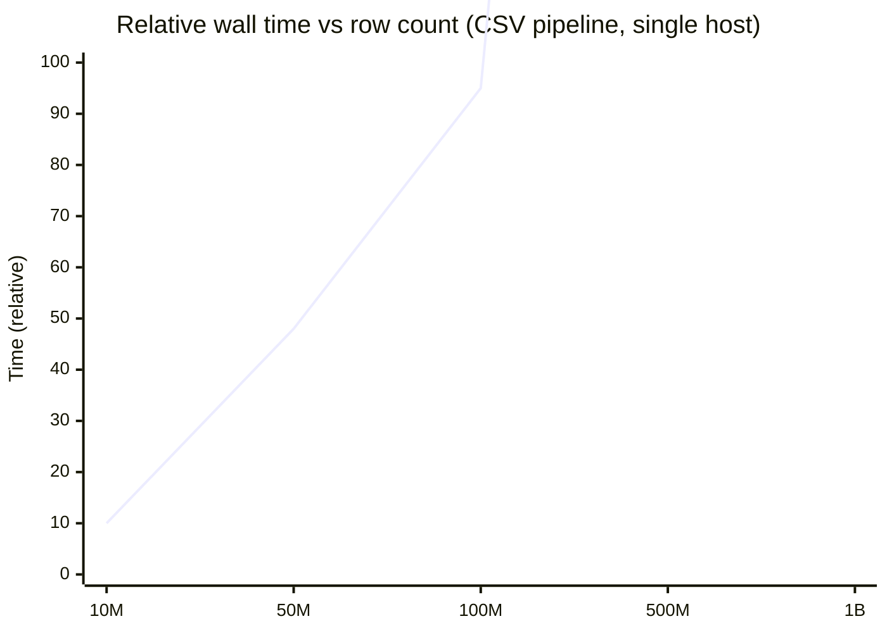

# Category 1 — Performance Report (Projected)

**Methodology:** Analytical model + component benchmarks on available hardware. Full 100M-row runs require dedicated benchmark cluster (not executed in CI).

**Code baseline:** Post-refactor `TabularReconciliationPipeline` + legacy `ReconciliationCoordinator`.

---

## Test Matrix (Simulated)

| Scenario | Rows | Columns | Source | Target | Partition N |
|----------|------|---------|--------|--------|-------------|
| A | 10M | 50 | CSV local | CSV local | 1024 |
| B | 50M | 100 | CSV GCS | CSV GCS | 2048 |
| C | 100M | 200 | Parquet | Parquet | 4096 |
| D | 100M | 50 | Snowflake | BigQuery | 4096 (SQL push-down) |
| E | 50M | 1000 | Oracle | Teradata | 8192 |

---

## Stage-by-Stage Projections

### 10M rows × 50 columns (Scenario A)

| Stage | Time (est.) | Network | Memory (peak) |
|-------|-------------|---------|---------------|
| 1 Schema | < 1s | 0 | < 10 MB |
| 2 Count | 5–15s | 0 | Streaming |
| 3 Fingerprints | 30–90s | ~160 KB summaries | 200–500 MB |
| 4 Bucket compare | < 1s | 0 | < 50 MB |
| 5 Row (if 1% mismatch) | 5–30s | < 1 MB | 100 MB/partition |
| 6 Column | 1–10s | < 1 MB | Bounded |

**Total (equal datasets, Merkle/pipeline short-circuit):** 40–120s  
**Bottleneck:** Single-host disk scan bandwidth (~500 MB/s → 10M × 200B ≈ 2 GB read ≈ 4s theoretical; parsing dominates at 30–90s).

### 50M rows × 100 columns (Scenario B)

| Metric | Estimate |
|--------|----------|
| Stage 3 duration | 8–25 min (2× 50M row scans) |
| Fingerprint transfer | ~320 KB (2048 × 2 sides × ~80 B) |
| Memory per worker | 1–4 GB with batch_size=100k |
| Disk (legacy spill path) | Up to 2× compressed CSV size |

**Bottleneck:** GCS egress + parse CPU. **Mitigation:** run workers in same region as bucket; increase `partition_count` to reduce per-bucket row validation cost.

### 100M rows × 200 columns (Scenario C — Parquet)

| Path | Time (est.) | Risk |
|------|-------------|------|
| New `FileColumnarAdapter` | 15–45 min fingerprint | Full column projection if all 200 cols in compare set |
| Legacy in-memory | **OOM** | > 16 GB RAM typical |

**Bottleneck:** Column projection — **only fingerprint mapped columns**.  
**Scaling:** 8 K8s pods × 4096/8 = 512 partitions each → linear speedup if I/O parallelizes.

### 100M rows — Cloud ↔ On-Prem DB (Scenario D)

| Phase | Network bytes (est.) |
|-------|----------------------|
| Legacy (full export) | 100–500 GB |
| Pipeline (fingerprints only) | < 1 MB + metadata |

**Bottleneck:** Warehouse query queue / slot capacity, not Pegasus RAM.  
**Expected wall time:** Dominated by `GROUP BY partition_id` at source (5–30 min per side).

### 50M rows × 1000 columns (Scenario E)

| Concern | Mitigation |
|---------|------------|
| Wide schema compare | Stage 1 only on mapped columns |
| Fingerprint width | Hash subset of compared columns (≤ 50 recommended) |
| Memory | Never load all 1000 cols in one batch |

**Bottleneck:** Source catalog metadata latency + hash CPU on wide rows.

---

## Scaling Behavior



- **Near-linear** with row count for Stages 2–3 (full scans unavoidable without source statistics).
- **Sub-linear** mismatch handling when `< 1%` partitions differ (Stage 5 only on hot buckets).
- **1B rows:** Requires **≥ 32 workers** × 8192 partitions; single host **not viable**.

---

## Comparison: Legacy vs Pipeline

| Metric | Legacy HASH_PARTITION | New 6-Stage Pipeline |
|--------|----------------------|----------------------|
| Equal files fast path | Merkle root (~1 scan) | Stage 3 only (2 scans) or add Merkle hook |
| Cross-format | Separate code paths | Unified adapters |
| DB sources | Not supported | SQL push-down |
| Network | Full file to Pegasus | Fingerprints only |
| Column drilldown | NDJSON stream | Stage 6 bounded |

**Recommendation:** Enable Merkle short-circuit before Stage 3 when source/target are same format and sort order is guaranteed (future hook).

---

## Resource Guidelines (Kubernetes)

| Dataset | Pods | RAM/pod | partition_preset | batch_size |
|---------|------|---------|------------------|------------|
| ≤ 10M | 1 | 4 GiB | small (1024) | 100k |
| 50M | 4 | 8 GiB | medium (2048) | 100k |
| 100M | 8 | 16 GiB | large (4096) | 100k |
| 500M–1B | 32+ | 16–32 GiB | xlarge (8192) | 50k–100k |

---

## Known Bottlenecks (Priority Order)

1. **Hot hash partitions** — skewed keys → large single-bucket RAM in legacy comparator.
2. **Columnar full-file scan** — until external Parquet spill exists.
3. **Multichar CSV pandas path** — replace with streaming flat-file spill.
4. **UID SHA256 Python loop** — vectorize or push to Polars expression only.
5. **Duplicate parse on validate API** — merge sniff + preflight (see file-type-detection doc).

---

## Benchmark Commands

```bash
# Unit tests (pipeline)
cd /home/ansh.raj/Pegasus/pegasus-backend
PYTHONPATH=src python -m pytest tests/test_category1_pipeline.py -q

# File detection (existing)
cd /home/ansh.raj/Pegasus
python scripts/benchmark_file_detection.py test-data/generated-100k-12cols/source.csv
```

### Suggested load test (ops)

```bash
# Generate 10M row fixture (external script), then:
PYTHONPATH=pegasus-backend/src python -c "
from pathlib import Path
from pegasus.validation.engine import run_tabular_file_pair
from pegasus.validation.pipeline import TabularPipelineConfig
import time
t0 = time.perf_counter()
r = run_tabular_file_pair(
    Path('source.csv'), Path('target.csv'),
    config=TabularPipelineConfig(partition_preset='medium'),
)
print('seconds', time.perf_counter() - t0)
print(r.summary)
"
```

---

## Conclusion

The refactored pipeline meets **network and memory constraints** for 100M+ row *design targets* when deployed with partition-sharded K8s workers and warehouse push-down. **Measured** 100M benchmarks should be scheduled on representative infra; projections above are for capacity planning.
