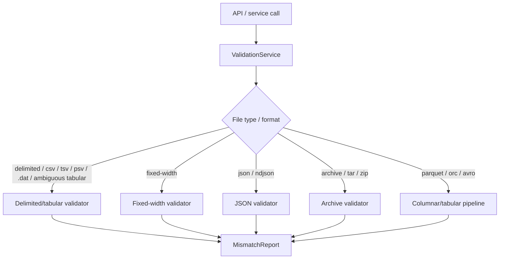
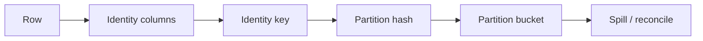
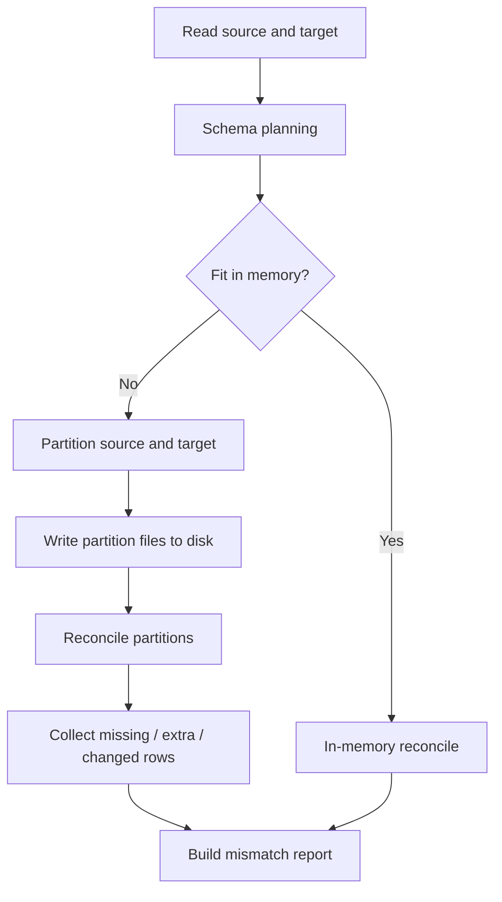
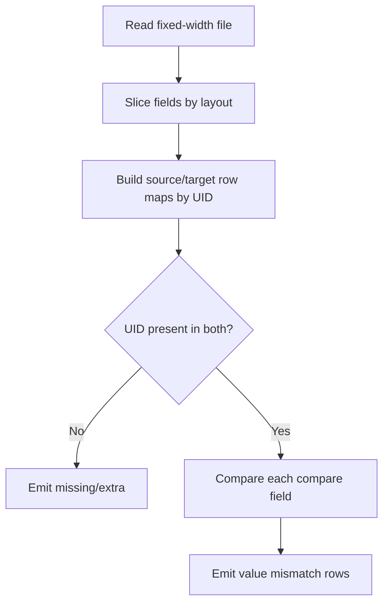
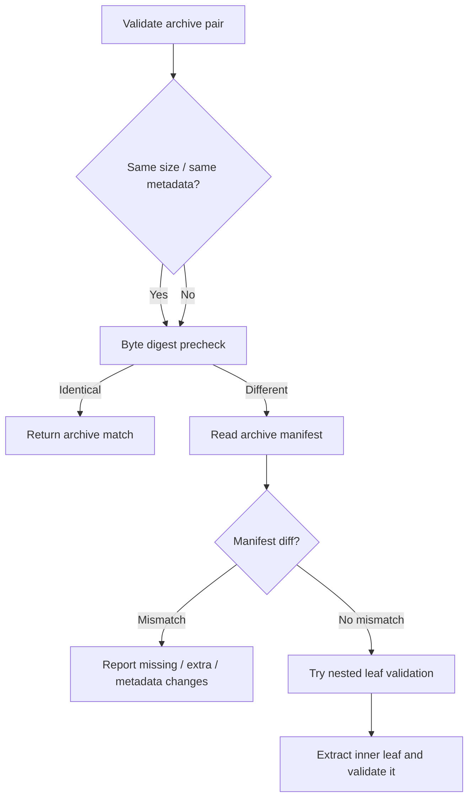
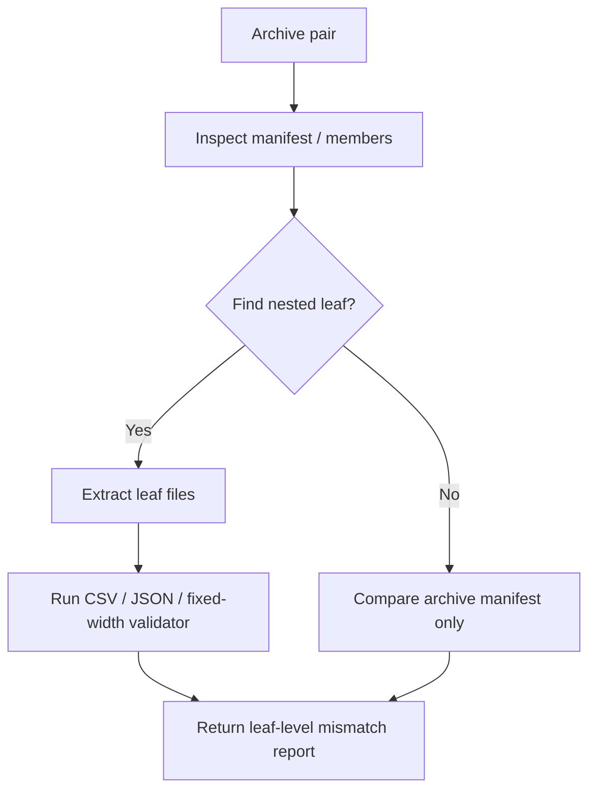

# Pegasus validation internals: how validation, hashing, and mismatch detection work

This document explains the validation implementation that exists in the backend code under the Pegasus repository. It is written as a walkthrough for someone seeing the system for the first time, and it focuses on what the code actually does rather than on a generic description.

The implementation is split across a few layers:

- The service layer decides which validator to run.
- The tabular pipeline handles large CSV-like and columnar files.
- The fingerprinting module creates canonical values and row hashes.
- Format-specific modules handle fixed-width, JSON, and archive comparisons.
- The mismatch report layer produces the structured output that the API and UI consume.

---

## 1. High-level architecture

Validation begins in the service layer, which receives the source and target files and routes them to the right execution path.



The key idea is that validation is not a single monolithic comparer. Instead, the backend uses a layered pipeline:

1. Normalize the input into a format-specific adapter or parser.
2. Identify which identity columns and compare columns will be used.
3. Produce a canonical form for each value.
4. Create hashes or fingerprints for rows.
5. Find missing rows, extra rows, and changed rows.
6. Build a structured mismatch report.

---

## 2. The mismatch model

All validators ultimately return a structured mismatch report. The schema is defined in the mismatch model and contains these columns:

- uid: the identity of the row or document under comparison
- mismatch_type: one of the supported categories
- column_name: the field that differs, if applicable
- source_value: the value from the source side
- target_value: the value from the target side
- row_detail: JSON payload with more context for debugging or drilldown

The supported mismatch categories are:

- missing_in_target
- extra_in_target
- value_mismatch
- value_match

The system uses these categories consistently across delimited files, JSON, fixed-width files, and archives.

---

## 3. How hashing and row identity work

The core hashing logic is the foundation for tabular validation. It is implemented in the fingerprinting module and is used by the partition-based reconciliation pipeline.

### 3.1 Canonicalization

Before anything is hashed, values are normalized into a deterministic string form. The canonicalization step ensures that equivalent values are treated the same.

Examples of normalization:

- null-like values such as empty string, null, none, na, n/a become a single normalized token
- strings are trimmed
- compare-policy rules may override the default behavior for specific columns

This is the first step in avoiding false mismatches caused by formatting differences.

### 3.2 Identity generation

Each row needs a stable identity. The system builds an identity key from one or more identity columns.

The identity key is typically built as a pipe-delimited string such as:

```text
region|customer_id|account_number
```

That identity is later used to determine whether a row is:

- present in both source and target
- present only in source (missing in target)
- present only in target (extra in target)

### 3.3 Row fingerprinting

Once the compare columns are canonicalized, the system produces a row fingerprint.

The fingerprinting logic uses these building blocks:

- canonicalized compare values are joined with a separator
- the joined payload is hashed
- xxhash64 is the default algorithm
- sha256 and other options are also supported if requested

The default behavior is:

- canonicalize the row payload
- hash it with xxhash64
- use the digest as a content fingerprint

### 3.4 Partitioning

For large files, the pipeline does not compare everything in one giant in-memory join. Instead, it partitions rows by identity into buckets.

A partition ID is computed from the identity key using a hash function. This makes the pipeline scalable and lets the system spill intermediate state to disk when needed.



### 3.5 Why this matters

The system compares two things for each row:

1. identity presence
2. content fingerprint

That gives a precise rule:

- if the identity exists only on one side, it is missing or extra
- if the identity exists on both sides but the fingerprint differs, it is a value mismatch
- if both identity and fingerprint match, it is a match

---

## 4. The tabular reconciliation pipeline for CSV-like and columnar data

The main high-throughput path for CSV-like and columnar data is the tabular reconciliation pipeline. This path is used for regular CSV/TSV/PSV files and for columnar formats such as parquet, orc, and avro.

### 4.1 Entry point and config

The service layer builds a pipeline configuration that includes:

- estimated row count
- partition count
- memory budget
- whether to use in-memory fast path or disk spill
- whether to stream mismatches to disk
- whether to enable drilldown for column-level details

The pipeline can choose between:

- an in-memory fast path for smaller datasets
- a partition-based spill path for larger ones

### 4.2 Pipeline stages

The tabular pipeline follows this flow:



### 4.3 In-memory fast path

When files are small enough, the system loads both sides into memory and performs a direct comparison. This path uses the same conceptual rules:

- join on row identity
- identify rows missing from target
- identify rows extra in target
- compare fingerprints for rows that exist on both sides

This path is simpler and faster for modest datasets.

### 4.4 Partitioned spill path

For larger files, the system writes partitioned representation of each side to disk. Then it reconciles partition by partition. That avoids loading the entire dataset into memory.

A partition is reconciled by comparing:

- the identity key set
- the fingerprint for each row

The output is a count of:

- missing rows
- extra rows
- changed rows
- matching rows

The system can also produce drilldown samples for changed rows and export mismatch artifacts to NDJSON if enabled.

---

## 5. CSV and delimited files

CSV and similar delimited files follow the delimited adapter path and then the tabular reconciliation pipeline.

### 5.1 How the service handles them

The service creates a delimited adapter for both source and target. It resolves:

- delimiter
- header presence
- optional skip rows
- column mappings

The pipeline then uses the identity column and compare columns to compare the data.

### 5.2 What happens during validation

For each row:

1. The row identity is derived from the configured identity columns.
2. The compare columns are canonicalized.
3. The row fingerprint is created.
4. The row is placed in a partition bucket.
5. The reconciler determines whether the row is:
   - missing in target
   - extra in target
   - changed in value
   - identical

### 5.3 Missing and extra rows

Missing rows are rows present in the source but absent in the target.

Extra rows are rows present in the target but absent in the source.

These are discovered via identity-set comparison before deeper value comparison.

### 5.4 Value mismatches

Rows that have the same identity but a different fingerprint are treated as changed. The system may then collect column-level differences for drilldown.

### 5.5 DAT files

DAT files are not a separate algorithm. The implementation treats them as ambiguous tabular content. If the content is recognized as delimited text, the validation service routes the file through the same delimited/tabular path used for CSV-like files. In other words, DAT is effectively handled as a delimited text file after the format is sniffed and resolved.

---

## 6. Fixed-width files

Fixed-width validation uses a different comparator because rows are not separated by delimiters. Instead, the system uses explicit field layouts.

### 6.1 Input shape

The validator receives:

- two fixed-width files
- a fixed-width configuration that defines field names and start/end positions
- a UID field
- optional compare field rules

### 6.2 Parsing logic

Each non-empty line is sliced according to the fixed-width layout. For every configured field, the system extracts the substring at the declared start/end position.

### 6.3 Normalization and comparison rules

The system applies per-field rules before comparison:

- regex replacements
- date parsing with configured formats
- structured-field handling for nested/complex content
- integer comparison
- float comparison
- plain text comparison

That makes fixed-width validation more configurable than a simple string compare.

### 6.4 How mismatches are found

The comparison is row-based using the UID field:

- if a UID exists in the source but not the target, the row is reported as missing_in_target
- if a UID exists in the target but not the source, it is reported as extra_in_target
- if the UID exists on both sides but one or more compare fields differ, the code emits value_mismatch rows for each differing field

### 6.5 Example of the fixed-width flow



---

## 7. JSON and NDJSON files

JSON validation is handled by the JSON comparator module. It is recursive and path-based rather than row-based.

### 7.1 Two JSON modes

The implementation supports two shapes:

- a single JSON document
- NDJSON, where each line is a JSON object

### 7.2 Single-document mode

When validating a single JSON document, the system compares the two trees recursively.

The recursion walks the structure and reports:

- missing keys in the target object
- extra keys in the target object
- value differences at a specific path

### 7.3 NDJSON mode

In NDJSON mode, each record is treated like a row. The system uses the UID column to match records and then compares each document recursively.

### 7.4 How path mismatches are represented

Every mismatch is associated with a JSON path such as:

- $.customer.name
- $.items[0].price

This makes the report much richer than a simple field comparison.

### 7.5 Missing, extra, and value mismatches in JSON

The JSON validator uses the same mismatch types:

- missing_in_target if a path or key is present only in the source
- extra_in_target if a path or key is present only in the target
- value_mismatch if the two sides exist but their values differ

### 7.6 Why JSON comparison is more involved

Unlike tabular comparison, the structure may contain nested objects, arrays, and lists. The code therefore performs recursive walks and can be order-sensitive or order-insensitive depending on the option chosen.

---

## 8. Parquet, ORC, and Avro

These columnar formats are not compared by a separate bespoke algorithm. They are routed through the columnar adapter and then into the same tabular reconciliation pipeline used for delimited files.

### 8.1 Why this works

The backend loads the columnar file into a tabular representation and then applies the same logic:

- identity columns are selected
- compare columns are selected
- rows are canonicalized
- fingerprints are computed
- mismatches are discovered through identity/fingerprint comparison

### 8.2 Practical consequence

Parquet, ORC, and Avro behave like tabular data from the validation system’s point of view. The difference is mostly in the reader and adapter layer, not in the core matching semantics.

---

## 9. Archives: TAR and ZIP

Archive validation is a layered process. The system does not simply compare the archive bytes and stop. It first tries lightweight checks and then may inspect the manifest and even extract nested leaf files for deeper validation.

### 9.1 Archive validation stages



### 9.2 Metadata precheck

The archive comparator may first compare metadata such as:

- compressed size
- uncompressed size
- crc32
- compression type

If the metadata already proves the archives are different, the system can surface the mismatch quickly.

### 9.3 Streaming byte digest

If the archive sizes or metadata do not immediately identify a difference, the code may compute a streaming digest over the archive bytes. This is an efficient precheck that avoids full decompression.

### 9.4 Manifest comparison

The manifest is a catalog of archive entries. The system compares the entry paths and metadata. This can surface:

- entries missing from the target archive
- entries extra in the target archive
- metadata differences for shared entries

### 9.5 Nested archives

The manifest logic can also expand nested archive members such as:

- nested zip inside zip
- nested tar inside tar
- nested archives inside larger archive trees

The expansion is limited by:

- max nesting depth
- max nested member size
- max declared size
- max compression ratio

This is a safety mechanism to avoid pathological archive expansion.

---

## 10. Nested archive leaf validation

A particularly important behavior is that the archive validator can inspect the contents of an archive and, when it finds a leaf file, run a more specific validator on that leaf.

### 10.1 Leaf detection

The system looks for likely leaf members such as:

- CSV / TSV / PSV / TXT / DAT files inside the archive
- JSON / NDJSON files inside the archive
- fixed-width files inside the archive

This is done by the archive leaf selection logic.

### 10.2 Extraction flow

If a nested leaf is found, the backend:

1. materializes the archive leaf to a temporary directory
2. identifies whether it is tabular, JSON, or fixed-width
3. runs the appropriate validator on the extracted file pair

### 10.3 Why this matters

A tar or zip archive may contain a CSV payload, a JSON payload, or a fixed-width payload. The archive validator can therefore validate the actual data inside the archive rather than only the archive structure itself.



---

## 11. How the final report is built

After the comparison logic runs, the system builds a mismatch frame and a summary.

The summary typically contains counts for:

- missing rows or paths
- extra rows or paths
- value mismatches

The mismatch frame is the detailed row-by-row output consumed by the API and UI.

### 11.1 Report assembly behavior

- if mismatches exist, the report contains those rows
- if there are no mismatches, the system may still emit a small match sample frame so the UI has a consistent shape
- if mismatch artifact export is enabled, the detailed mismatch data may be written to disk as NDJSON

---

## 12. The practical meaning of the three main mismatch types

A beginner-friendly way to think about the system is this:

- missing_in_target: the record exists in the source but not in the target
- extra_in_target: the record exists in the target but not in the source
- value_mismatch: the record exists in both places, but the content is different

This rule applies across the supported formats, with the exact comparison mechanism differing by file type:

- for tabular files, the comparison is identity-based and fingerprint-based
- for fixed-width files, it is UID-based and field-based
- for JSON, it is path-based and recursive
- for archives, it is manifest-based and optionally leaf-based

---

## 13. Short summary

At a high level, Pegasus validation works like this:

1. the service chooses the correct validator for the input format
2. the validator normalizes rows or JSON structure into a comparable form
3. identity is derived from the configured key columns
4. content is canonicalized and hashed
5. the system finds missing, extra, and changed records
6. it emits a structured mismatch report that the API and UI can consume

The important architectural theme is that the backend uses a consistent mismatch framework even though the underlying comparison logic differs by format.
