# Pegasus validation internals

This document explains how Pegasus validation actually works in the backend code. It is written as an implementation walkthrough, not as a generic product overview.

The important idea is that validation is layered:

1. the service layer picks the right validator
2. the validator normalizes the input into a comparable shape
3. identities are built from configured key columns or paths
4. compare values are canonicalized and hashed when needed
5. changed rows are rehydrated for column-level drilldown
6. the backend emits a structured mismatch report for the API and UI

## Chapters

1. [Chapter 1: What the backend returns](#chapter-1-what-the-backend-returns)
2. [Chapter 2: How the service chooses a validator](#chapter-2-how-the-service-chooses-a-validator)
3. [Chapter 3: Supported file types](#chapter-3-supported-file-types)
4. [Chapter 4: The core tabular idea](#chapter-4-the-core-tabular-idea)
5. [Chapter 5: How Pegasus decides which column is mismatching](#chapter-5-how-pegasus-decides-which-column-is-mismatching)
6. [Chapter 6: Tabular pipeline for CSV-like and columnar files](#chapter-6-tabular-pipeline-for-csv-like-and-columnar-files)
7. [Chapter 7: CSV, TSV, PSV, DAT, and other delimited files](#chapter-7-csv-tsv-psv-dat-and-other-delimited-files)
8. [Chapter 8: Fixed-width files](#chapter-8-fixed-width-files)
9. [Chapter 9: JSON and NDJSON files](#chapter-9-json-and-ndjson-files)
10. [Chapter 10: Parquet, ORC, and Avro](#chapter-10-parquet-orc-and-avro)
11. [Chapter 11: Archives: ZIP and TAR](#chapter-11-archives-zip-and-tar)
12. [Chapter 12: How the final API report is assembled](#chapter-12-how-the-final-api-report-is-assembled)
13. [Chapter 13: Practical meaning of the mismatch types](#chapter-13-practical-meaning-of-the-mismatch-types)
14. [Chapter 14: End-to-end example for tabular data](#chapter-14-end-to-end-example-for-tabular-data)
15. [Chapter 15: Complexity summary](#chapter-15-complexity-summary)
16. [Chapter 16: Short summary](#chapter-16-short-summary)
17. [Chapter 17: Visual validation maps](#chapter-17-visual-validation-maps)
18. [Chapter 18: Partition tables and chunked archive reading](#chapter-18-partition-tables-and-chunked-archive-reading)

---

## Chapter 1: What the backend returns

All validators eventually produce a `MismatchReport`. The shared schema is defined in [pegasus-backend/src/pegasus/validation/comparators/models.py](../pegasus-backend/src/pegasus/validation/comparators/models.py).

The mismatch frame contains these columns:

- `uid`: the row, record, path, or archive entry identity
- `mismatch_type`: the category of difference
- `column_name`: the compare field, JSON path, or metadata field that differs
- `source_value`: the source-side value for the mismatch cell
- `target_value`: the target-side value for the mismatch cell
- `row_detail`: JSON context used for drilldown or debugging

The shared mismatch categories are:

- `missing_in_target`
- `extra_in_target`
- `value_mismatch`
- `value_match`

Important detail: `value_mismatch` is a cell-level mismatch in the report, while `value_mismatch_rows` in summaries counts distinct UIDs that had at least one mismatching cell.

---

## Chapter 2: How the service chooses a validator

The API wires requests through `ValidationService`, which routes by file type and adapter. The routing surface is in [pegasus-backend/src/pegasus/services/validation_service.py](../pegasus-backend/src/pegasus/services/validation_service.py).

In practice, the backend splits input into these families:

- delimited/tabular files such as CSV, TSV, PSV, DAT, and ambiguous flat text
- columnar files such as Parquet, ORC, and Avro
- fixed-width files
- JSON and NDJSON
- archive files such as ZIP and TAR

The service does not use one monolithic comparator. It delegates to a format-specific path, then converges on the same mismatch model.

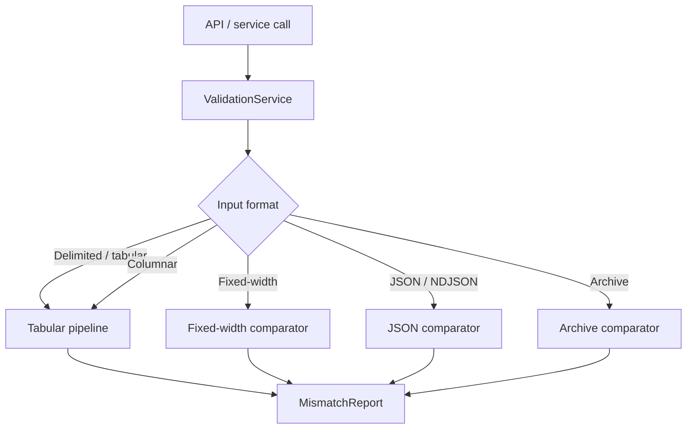
```mermaid
flowchart TD
    A[API / service call] --> B[ValidationService]
    B --> C{Input format}
    C -->|Delimited / tabular| D[Tabular pipeline]
    C -->|Columnar| D
    C -->|Fixed-width| E[Fixed-width comparator]
    C -->|JSON / NDJSON| F[JSON comparator]
    C -->|Archive| G[Archive comparator]

    D --> H[MismatchReport]
    E --> H
    F --> H
    G --> H
```

---

## Chapter 3: Supported file types

The backend can validate the following file families:

- delimited text files such as CSV, TSV, PSV, TXT, and DAT
- ambiguous flat files that are resolved as delimited text after sniffing
- columnar files such as Parquet, ORC, and Avro
- fixed-width text files
- JSON documents and NDJSON / JSONL streams
- archive files such as ZIP and TAR

The route chosen depends on the detected format and the adapter that can read it.

How that maps to the implementation:

- delimited and ambiguous flat files go through the tabular pipeline after delimiter/header resolution
- Parquet, ORC, and Avro are converted into a tabular representation and then sent through the same tabular reconciliation path
- fixed-width files use the fixed-width parser and field layout rules
- JSON and NDJSON use the JSON comparator and recursive path diffing
- ZIP and TAR use the archive comparator, with optional nested leaf validation when a payload file is found

Supported file types are therefore not just a list of extensions; they are a list of backend execution paths.

---

## Chapter 4: The core tabular idea

For CSV-like and columnar data, Pegasus compares rows in two stages:

1. identity matching tells the backend whether a row exists on both sides
2. fingerprint or drilldown comparison tells the backend whether the row content differs

That separation matters because a row can be present on both sides but still differ in only one field. The fingerprint catches the change cheaply; the drilldown step explains which column changed.

### 3.1 Canonicalization

Before hashing or comparing, the backend converts values into deterministic strings. The canonicalization logic lives in [pegasus-backend/src/pegasus/validation/pipeline/fingerprint.py](../pegasus-backend/src/pegasus/validation/pipeline/fingerprint.py).

The default normalization does the following:

- trims strings
- treats empty strings and null-like tokens such as `null`, `none`, `na`, and `n/a` as `__NULL__`
- lets compare-policy rules override the default behavior for specific fields

This is what prevents false mismatches caused by formatting differences alone.

Canonicalization happens in two related places:

- identity canonicalization, which is used to build the row key
- compare canonicalization, which is used to build the row fingerprint and the drilldown payload

Identity canonicalization is intentionally simple. The helper in `fingerprint.py` calls `canonical(record.get(c))` for each UID column, which means the identity path uses the default string normalization rules but does not apply compare-policy field mapping.

Compare canonicalization is more flexible. When a compare policy is active, the backend canonicalizes values using the logical field definition for that side:

- source-side values are normalized with the source mapping
- target-side values are normalized with the target mapping
- the canonicalized values are then joined with the field separator `\x1f` before hashing

That means the same logical compare field can be composed from different physical columns on the source and target side, but still land in the same fingerprint comparison.

Practical example:

- source column value ` 12 ` becomes `12`
- target column value `12.0` may become `12` if the compare policy or field rule normalizes it that way
- `null`, `None`, blank strings, and equivalent tokens become `__NULL__`

So canonicalization is not just trimming text. It is the normalization step that makes the row comparison deterministic across formatting differences, side-specific mappings, and null-like representations.

### 3.2 Identity generation

Each tabular row gets a stable identity key from one or more identity columns. The identity parts are canonicalized, then joined with a pipe character.

Example:

```text
region|customer_id|account_number
```

Identity is used only for row matching. It is not the same as the compare fingerprint.

### 3.2.1 Multiple UID columns

When more than one UID column is configured, Pegasus treats them as one composite identity rather than as separate matches.

The implementation behavior is:

- the configured UID columns are split on commas
- each UID column is canonicalized on its own
- the canonical parts are joined into a single identity key with `|`
- the same composite key is used on both source and target

That means a row is considered the same only if the full UID tuple matches.

Example:

```text
UID columns: region, customer_id, account_number
Identity key: region|customer_id|account_number
```

If `region` matches but `customer_id` does not, the row is not treated as the same row. It is a different identity entirely. This is what lets the validator handle compound business keys correctly.

For mapped compare fields, the UID columns are excluded from compare-field resolution, so they are used only for identity and not for mismatch drilldown.

### 3.3 Fingerprint generation

After the compare columns are canonicalized, Pegasus joins them with the field separator `\x1f` and hashes the result. The default algorithm is `xxhash64`, with `sha256`, `xxhash128`, and `crc64` supported as options.

The fingerprint answers one question: does this row’s compare payload match the opposite side?

### 3.4 Partitioning for scale

Large tabular jobs are not compared in one giant join. The pipeline partitions rows by identity hash and writes partitions to disk when needed.

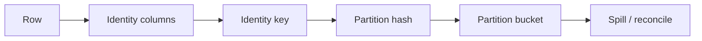
```mermaid
flowchart LR
    A[Row] --> B[Identity columns]
    B --> C[Identity key]
    C --> D[Partition hash]
    D --> E[Partition bucket]
    E --> F[Spill / reconcile]
```

The partition hash is based on the identity key, so identical identities always land in the same bucket.

The reason this exists is scale and memory control:

- the backend can stream through each input once instead of keeping the whole file in RAM
- each row is written to a stable bucket immediately after it is normalized and hashed
- later reconciliation only has to compare matching buckets, not the full dataset
- the work can be parallelized across partitions or partition waves

The partition count is chosen adaptively from the configured preset and the estimated input size. Larger jobs get more buckets, smaller jobs get fewer buckets, and the goal is to keep each partition small enough that the join and drilldown state fits inside the memory budget.

For unsorted inputs this is the critical point: the backend does not need rows to appear in the same physical order. The partition hash makes the row location deterministic from the UID, so source and target rows with the same identity are routed to the same bucket even if they arrive in different orders.

What is stored in a partition depends on the validation mode:

- at minimum, the identity key and row fingerprint are stored
- if fingerprint-only spill or lazy drilldown is enabled, compare payloads may also be stored for later lookup
- the spill files are the working set for reconciliation, not a copy of the original file format

So partitioning is not a sort step. It is a bounded hash-distribution step that turns a full-file compare into a set of smaller compare problems.

### 3.5 Hash storage cost

The row fingerprint itself is small. With the default `xxhash64` path, the digest is 8 bytes per row. Other algorithms change that cost:

- `xxhash64`: 8 bytes
- `xxhash128`: stored as an 8-byte truncated digest in this pipeline path
- `sha256`: 32 bytes

So the fingerprint payload alone costs approximately:

```text
hash_bytes ~= row_count × digest_size
```

Examples:

- 10 million rows with `xxhash64` needs about 80 MB just for raw digests
- 100 million rows with `xxhash64` needs about 800 MB just for raw digests
- 100 million rows with `sha256` needs about 3.2 GB just for raw digests

That is only the hash bytes. Real memory is higher because the pipeline also stores keys, joins, frame metadata, temporary partitions, and drilldown payloads.

---

## Chapter 5: How Pegasus decides which column is mismatching

This is the part most people care about.

The backend does not infer a mismatching column directly from the row fingerprint. The fingerprint only says that some compare value changed. The actual column attribution comes from a second pass over the changed rows.

### 4.1 The first pass only finds changed identities

For tabular data, the pipeline joins source and target by identity, then compares fingerprints.

- if an identity exists only in source, it becomes `missing_in_target`
- if an identity exists only in target, it becomes `extra_in_target`
- if an identity exists on both sides but the fingerprints differ, the row is marked changed

That first pass is cheap because it avoids column-by-column comparison for every row.

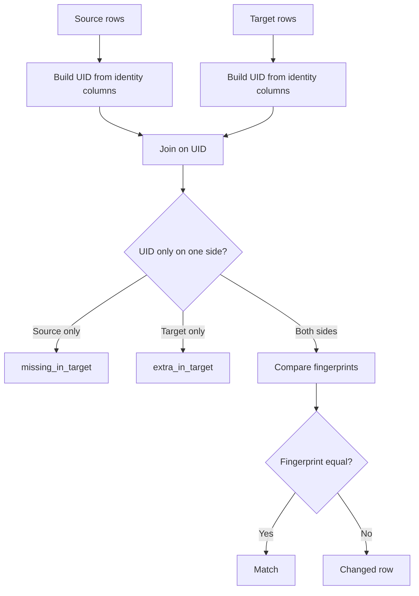
```mermaid
flowchart TD
    A[Source rows] --> B[Build UID from identity columns]
    C[Target rows] --> D[Build UID from identity columns]
    B --> E[Join on UID]
    D --> E
    E --> F{UID only on one side?}
    F -->|Source only| G[missing_in_target]
    F -->|Target only| H[extra_in_target]
    F -->|Both sides| I[Compare fingerprints]
    I --> J{Fingerprint equal?}
    J -->|Yes| K[Match]
    J -->|No| L[Changed row]
```

### 4.2 The second pass rehydrates compare columns

Once the pipeline has a list of changed identities, it fetches the original row values for only those identities and compares the compare columns one by one.

The drilldown path is implemented in [pegasus-backend/src/pegasus/validation/pipeline/in_memory.py](../pegasus-backend/src/pegasus/validation/pipeline/in_memory.py) for RAM jobs and in [pegasus-backend/src/pegasus/validation/pipeline/partition_reconcile.py](../pegasus-backend/src/pegasus/validation/pipeline/partition_reconcile.py) for spill jobs.

The key rule is:

- each compare column is checked independently
- if a column differs, a `ColumnDifference` is recorded
- each difference becomes a `value_mismatch` row with `column_name` set to that logical compare field

This second pass is the drilldown pass. It is where the backend stops talking about “the row changed” and starts talking about “this specific logical column changed.”

The same logical sequence applies in both memory modes:

- in-memory path: the changed rows are already in Polars frames, so drilldown compares the joined rows directly
- spill path: the changed keys are reloaded from partition artifacts or drilldown cache, then compared column by column

This is the answer to the common “is the file read twice?” question:

- the original source and target files are streamed once during partitioning
- only the matching partition artifacts are revisited during reconciliation
- only the changed keys are rehydrated for drilldown
- the full raw files are not scanned again for every mismatch

So the backend does not do a second full-file read of the original inputs. It does a second, much smaller read of partition spill data or drilldown cache entries for the identities that actually need explanation.

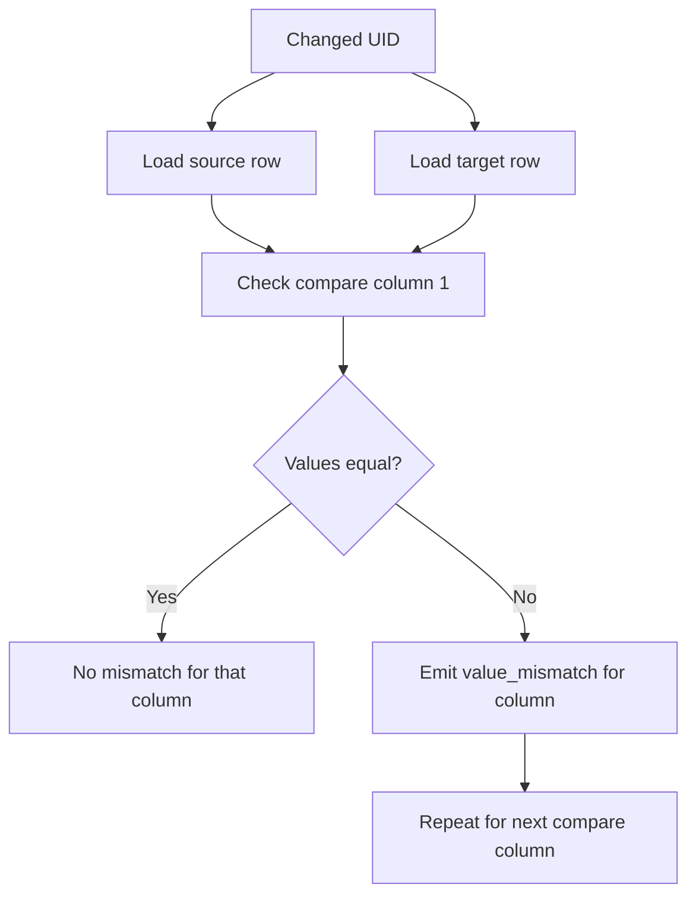
```mermaid
flowchart TD
    A[Changed UID] --> B[Load source row]
    A --> C[Load target row]
    B --> D[Check compare column 1]
    C --> D
    D --> E{Values equal?}
    E -->|Yes| F[No mismatch for that column]
    E -->|No| G[Emit value_mismatch for column]
    G --> H[Repeat for next compare column]
```

### 4.3 What `column_name` means in tabular output

In tabular validation, `column_name` is the logical compare key, not always the raw physical source column.

This matters when column mappings are used. The mapping resolver in [pegasus-backend/src/pegasus/validation/comparators/mapping_resolver.py](../pegasus-backend/src/pegasus/validation/comparators/mapping_resolver.py) can map one logical compare key to one or more physical source/target columns.

So the backend may compare:

- one physical column on both sides
- multiple physical columns that are joined into one logical compare key
- different source and target column names under a single logical field

When that happens, the mismatch report still uses the logical key as `column_name`.

### 4.4 How values are compared

The compare policy in [pegasus-backend/src/pegasus/validation/comparators/policy.py](../pegasus-backend/src/pegasus/validation/comparators/policy.py) can change how values are canonicalized and compared.

The policy supports:

- text normalization
- automatic date parsing for simple columns
- structured comparisons for nested values
- regex replacement and prefix stripping per side
- sensitive-field masking in the returned report

If a field mapping is configured, the policy compares the logical compare key by canonicalizing the source-side physical columns and the target-side physical columns separately, then comparing the canonical results.

### 4.5 How the drilldown payload is built

For each changed row, Pegasus stores `row_detail` so the API can show context.

- source-side details are stored under `source_record`
- target-side details are stored under `target_record`
- the record includes the UID plus the compare columns used for the drilldown

This is what lets the UI show not just that a row changed, but what the row looked like on each side.

### 4.6 Concrete example

If a row has identity `region|123|abc` and the compare columns are `name`, `status`, and `amount`:

1. the partition join says the UID exists on both sides
2. the fingerprints differ
3. the drilldown step loads the source and target row for that UID
4. the backend compares `name`, `status`, and `amount` independently
5. if only `status` changed, the report gets one `value_mismatch` row with `column_name = status`
6. if `status` and `amount` both changed, the report gets two `value_mismatch` rows for the same UID

That is how the backend knows which column changed.

---

## Chapter 6: Tabular pipeline for CSV-like and columnar files

The main high-throughput path is the tabular reconciliation pipeline in [pegasus-backend/src/pegasus/validation/pipeline/pipeline.py](../pegasus-backend/src/pegasus/validation/pipeline/pipeline.py).

### 5.1 Entry point and planning

The pipeline first resolves schema, row-count estimates, and compare columns. It also decides whether to use an in-memory fast path or spill to disk.

The configuration can control:

- memory budget
- auto in-memory threshold
- partition count
- whether column drilldown is enabled
- whether fingerprints should be written to spill files
- which fingerprint algorithm to use

### 5.2 In-memory fast path

If the datasets are small enough, the backend loads both sides into memory and uses Polars joins directly.

The in-memory path still follows the same logic:

- join by identity
- find missing and extra identities
- compare fingerprints for inner-joined rows
- optionally drill down to column differences

When drilldown is enabled, [pegasus-backend/src/pegasus/validation/pipeline/in_memory.py](../pegasus-backend/src/pegasus/validation/pipeline/in_memory.py) calls `_column_diffs_for_row` to compare compare columns one at a time.

### 5.3 Spill path

For larger datasets, the pipeline partitions source and target rows to disk, then reconciles partitions independently.

The partition reconciliation step:

- loads a partition frame
- renames identity and fingerprint columns to a common shape
- performs anti joins for missing and extra identities
- performs inner joins for changed identities
- compares fingerprints to identify changed rows

If drilldown is enabled, it rehydrates the changed keys and compares the compare columns to produce `ColumnDifference` entries.

The important detail is that reconciliation works on partition files, not on the original full-size inputs. Each partition file is a narrowed, already-hashed view of one bucket of rows. That is why the spill path can stay bounded even when the inputs are large and completely unsorted.

In practical terms, the spill workflow is:

1. stream source rows, canonicalize them, hash the identity, hash the compare payload, and write them into source partition files
2. stream target rows the same way into target partition files
3. compare the source and target partitions with the same partition id
4. mark missing and extra identities from anti joins
5. mark changed identities from fingerprint mismatches on inner joins
6. if drilldown is on, rehydrate only the changed identities and compare compare columns one by one

That means the expensive part is split into two cheaper parts: first the partitioning pass, then the per-partition reconcile pass.

### 5.4 Why fingerprints are not the final answer

The fingerprint is only a filter. It is fast, but it does not say which column changed. The drilldown step is what converts a changed row into explicit per-column mismatch rows.

This separation is deliberate:

- fingerprint comparison is cheap enough to run for every row
- column-by-column comparison is only needed for the subset of rows that actually changed
- that keeps the common case fast while still producing a detailed report for the UI and API

### 5.5 What happens when files are completely unsorted

Sorting is not required for validation.

The pipeline does not compare rows by physical position. It matches rows by identity key, then by fingerprint, and only then by per-column drilldown. So even if source and target are in completely different orders, the validator still finds the correct counterpart row by joining on the UID.

That means a row being number 10 in the source file and number 1,000,000 in the target file does not matter. Those row numbers are just the physical read order. The validator ignores physical position and instead uses the logical identity key built from the configured UID columns.

The practical lookup flow is:

1. read a source row
2. canonicalize its UID columns
3. build the identity key
4. hash that identity into a partition bucket
5. do the same for the target row
6. compare only the source and target rows that land in the same identity bucket

So the backend is not trying to find “row 10” in the target file. It is trying to find “the row with the same identity key” in the target partition.

That is why an input like this still works:

- source rows in random order
- target rows in a different random order
- duplicate row positions across files

As long as the UID columns produce the same identity key, the row is matched even if it appears in a totally different place in the file.

One caveat: if the same UID appears more than once on a side, that is no longer a clean one-to-one identity match. The code paths are built around stable identities, so duplicate UIDs make the result ambiguous and can inflate joins or produce duplicate mismatch rows.

### 5.6 How changed UIDs are loaded

When Pegasus needs to inspect a changed UID, it does not start from the top of the original file and scan linearly until it finds the row again.

The backend already did the expensive part during the initial streaming pass:

- each source row and target row was read once from the adapter
- each row was canonicalized, hashed, and assigned to a partition id
- the row was written into a partition file for that side

Later, reconciliation only opens the matching partition files:

- `partition_reconcile.py` compares the source and target partition files for that partition id
- `mismatch_export.py` collects the changed UIDs that need drilldown
- `drilldown_cache.py` loads only the requested UIDs from persisted drilldown frames when available

So the backend does not reload the complete 40 GiB again for each changed row. It reopens only the spill artifacts and drilldown lookups for the partition that contains that UID.

If lazy drilldown is enabled, the backend can avoid reading full payload rows for unrelated keys by using [pegasus-backend/src/pegasus/validation/pipeline/drilldown_cache.py](../pegasus-backend/src/pegasus/validation/pipeline/drilldown_cache.py). That cache stores only the identity plus the compare columns, and `values_for_keys()` filters to the changed keys before building row dictionaries.

If lazy drilldown is not enabled, the spill payload is scanned only for the current partition and only the keys requested for drilldown are materialized. That is still far smaller than rescanning the original input file.

If the job runs in the in-memory fast path, the answer is even simpler: both frames are already loaded in RAM, and the changed UID is resolved by a hash join on identity rather than a file rescan.

### 5.7 Drilldown versus partition reconcile

These two terms are easy to mix up, but they are different steps:

- partition reconcile decides which UIDs are missing, extra, changed, or matching inside one partition bucket
- drilldown decides which compare columns differ for the changed UIDs

Partition reconcile works at the row identity level. It uses the partition frame’s identity and fingerprint columns, so it can answer questions like “does this UID exist on both sides?” and “did the row fingerprint change?”

Drilldown works at the compare-field level. It needs the original compare values, either from the persisted drilldown cache or from the partition payload, so it can answer “which logical column changed?”

This is why the code separates `reconcile_partition_core()` from `_apply_drilldown_samples()` in [pegasus-backend/src/pegasus/validation/pipeline/partition_reconcile.py](../pegasus-backend/src/pegasus/validation/pipeline/partition_reconcile.py): first identify the changed keys, then explain them.

The drilldown path is also what makes the mismatch report useful for debugging. A row fingerprint alone would only say “something is different.” Drilldown turns that into the exact `column_name` plus the source and target values.

### 5.8 What 40 GB combined memory means in practice

The backend does not compute one exact RAM number for every dataset because the real peak depends on row width, column count, string cardinality, partition count, and whether drilldown is enabled. But it does have a clear operating mode:

- `validation_auto_in_memory_max_bytes` defaults to 256 MiB
- `TabularPipelineConfig.memory_budget_bytes` defaults to 1 GiB in the pipeline config
- `validation_memory_budget_bytes` in the service config defaults to 10 GiB

So a 40 GB combined source+target input is far above the in-memory thresholds and will go to spill/partitioned reconciliation.

For a rough partition-size estimate, the default tabular pipeline uses a `medium` partition preset of 2048 partitions. If the combined input is about 40 GiB, the average raw data per partition pair is roughly:

```text
40 GiB / 2048 ≈ 20 MiB per partition pair
```

That is only the raw split size before object overhead. The actual peak RAM is higher because each partition still needs frame metadata, hash tables, join state, and optional drilldown rows, but it is still bounded to one partition or one wave of partitions instead of the full 40 GB at once.

If you want a simple summary:

- in-memory fast path: not selected for 40 GB combined
- spill path: selected
- raw hash space: 8 bytes per row for `xxhash64`
- practical RAM: driven by a single partition, not the full dataset

### 5.8 Complexity for tabular validation

For tabular validation, let:

- $n$ = number of rows per side
- $c$ = number of compare columns
- $u$ = number of unique identity keys
- $p$ = number of partitions

The rough cost model is:

- identity canonicalization: $O(n)$
- fingerprint generation: $O(n \cdot c)$
- join and partition routing: about $O(n)$ average for hash-based matching
- drilldown for changed rows: $O(m \cdot c)$ where $m$ is the number of changed rows sampled or fully materialized

So the overall runtime is roughly:

$$
O(n \cdot c + m \cdot c)
$$

For unsorted inputs this does not become $O(n^2)$ because the backend does not scan for matching rows linearly; it uses identity hashing and joins.

The space cost is dominated by:

- partition files or in-memory frames
- hash keys and join state
- optional drilldown rows

So the space model is roughly:

$$
O(n \cdot c)
$$

for the full logical data volume, but the peak resident memory is reduced by partitioning and spill behavior.

---

## Chapter 7: CSV, TSV, PSV, DAT, and other delimited files

Delimited files use the tabular path after the adapter resolves the file layout.

### 6.1 What the adapter resolves

The delimited adapter determines:

- delimiter
- whether the file has headers
- how many rows to skip
- the effective column names
- whether synthetic names are needed for headerless data

DAT files are not a separate algorithm. If the content is recognized as delimited text, they flow through the same delimited/tabular path.

### 6.2 How mismatches are formed

For each row:

1. the identity is built from the configured identity columns
2. compare values are canonicalized
3. a row fingerprint is computed
4. the row is grouped into a partition bucket or in-memory join
5. the backend classifies the row as missing, extra, changed, or matching
6. changed rows are drilled down into individual columns

### 6.3 Missing and extra rows

Missing rows are found through identity-set comparison before any column comparison happens.

Extra rows are the same idea from the target side.

These rows do not get a `column_name` because the row itself is the mismatch, not a specific field.

### 6.4 Value mismatches

Rows that exist on both sides but differ in at least one compare column produce one `value_mismatch` record per differing column.

If the row differs in three columns, the report will contain three mismatch rows with the same UID and three different `column_name` values.

---

## Chapter 8: Fixed-width files

Fixed-width validation uses explicit field positions instead of delimiters.

### 7.1 Input shape

The fixed-width validator receives:

- two fixed-width files
- a layout that defines field names and character ranges
- a UID field
- optional compare rules for field-level normalization

### 7.2 Parsing logic

Each non-empty line is sliced by its field positions. The code then builds `source_by_uid` and `target_by_uid` maps.

### 7.2.1 How fixed-width knows column width

Fixed-width does not guess widths from the content. The width comes from the declared layout.

Each field definition provides start and end positions, so the backend knows exactly how many characters belong to the field. For example, if `username` is defined as columns 1 through 5, then the value is always read from that 5-character window.

That means if the file stores `00000` in the username slice, the validator reads the whole 5-character slice and then applies the configured comparison rule to it. If the field is shorter in the source text, the slice still exists logically in the layout and the parser will usually return padding or blank-equivalent content for that region.

The important point is:

- the field width is declared up front
- the parser does not infer it dynamically from the value text
- comparison happens on the extracted slice, not on visual spacing in the file

### 7.3 How the mismatch column is chosen

Fixed-width is simpler than tabular drilldown because each compare field is already explicit.

For each shared UID:

- the code transforms each compare field value
- the field values are compared with field-specific rules
- when a field differs, the report emits a `value_mismatch` row with `column_name = field.field_name`

So in fixed-width validation, the field name itself is the column attribution.

### 7.4 Comparison rules

The comparator can apply:

- regex replacement
- date parsing
- structured comparisons for nested content
- integer and float comparisons
- text comparisons
- sensitive-field masking

### 7.5 Fixed-width flow

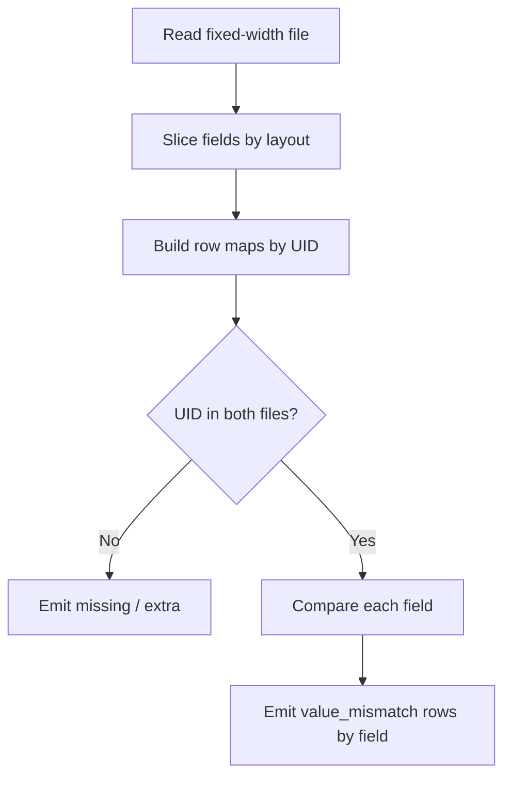
```mermaid
flowchart TD
    A[Read fixed-width file] --> B[Slice fields by layout]
    B --> C[Build row maps by UID]
    C --> D{UID in both files?}
    D -->|No| E[Emit missing / extra]
    D -->|Yes| F[Compare each field]
    F --> G[Emit value_mismatch rows by field]
```

---

## Chapter 9: JSON and NDJSON files

JSON validation is recursive and path-based.

### 8.1 Two modes

The JSON comparator supports:

- a single JSON document
- NDJSON, where each line is a JSON object

### 8.2 Single-document mode

In document mode, the comparator recursively walks both trees.

It emits:

- `missing_in_target` when a key or path exists only in the source
- `extra_in_target` when a key or path exists only in the target
- `value_mismatch` when both sides exist but differ

The implementation is in [pegasus-backend/src/pegasus/validation/json_compare.py](../pegasus-backend/src/pegasus/validation/json_compare.py).

### 8.3 How the column/path is chosen

For JSON, `column_name` is usually the JSON path. The helper that appends mismatches sets `column_name` to the current path string unless an explicit override is provided.

Examples:

- `$.customer.name`
- `$.items[0].price`

### 8.4 How recursive diffing works

The comparator checks nested dictionaries and lists separately.

- for dictionaries, it walks keys on both sides and recurses into shared keys
- for lists, it can compare by index or by unordered matching depending on the mode
- for scalar values, a differing pair becomes `value_mismatch`

### 8.5 NDJSON mode

In NDJSON mode, each line is treated like a row. The backend matches records by UID, then recursively compares the JSON payload for each matched record.

This means NDJSON can behave like tabular validation at the outer level and JSON diffing at the inner level.

---

## Chapter 10: Parquet, ORC, and Avro

Columnar formats are not compared with a separate bespoke diff algorithm. They are converted into a tabular representation and sent through the same tabular pipeline used for delimited files.

### 10.1 What changes and what does not

What changes:

- the reader and adapter layer
- how rows are loaded into memory or spill files

What does not change:

- identity matching
- compare-column canonicalization
- fingerprint generation
- drilldown behavior
- mismatch report structure

That is why Parquet, ORC, and Avro behave like tabular inputs from the validation engine’s point of view.

---

## Chapter 11: Archives: ZIP and TAR

Archive validation is layered. The backend can stop early on metadata or digest differences, or continue deeper into manifest and nested-leaf validation.

### 11.1 What kinds of ZIP and TAR are handled

The archive backend treats ZIP and TAR as container families, but it also recognizes the concrete archive forms that usually appear in practice:

- ZIP: standard `.zip` archives
- TAR: plain `.tar` archives
- compressed TAR: `.tar.gz`, `.tgz`, `.tar.bz2`, and `.tar.xz`

So the backend is not just saying “zip” or “tar” in the abstract. It is reading the actual container type and, for TAR, the compression wrapper around it.

### 11.2 What is inside those archives

ZIP and TAR are only the outer container. The backend then inspects the members inside them and decides whether the archive contains a payload that can be validated more deeply.

The nested member types it knows how to recognize include:

- tabular payloads such as CSV, TSV, PSV, TXT, and DAT
- JSON and NDJSON payloads
- fixed-width payloads
- nested archives again, such as ZIP inside ZIP or TAR inside ZIP

In other words:

- a ZIP file may contain a CSV, a JSON document, a fixed-width file, or another archive
- a TAR file may contain the same kinds of payloads
- the validator then chooses the right inner validator for that leaf file

### 11.3 Archive support matrix

The archive layer supports these top-level container formats:

- `.zip`
- `.tar`
- `.tgz`
- `.tar.gz`
- `.tar.bz2`
- `.tar.xz`

The important detail is that `.tgz` and `.tar.gz` are treated as TAR containers after archive-format normalization.

Not supported as first-class top-level archive validators:

- `.7z`
- `.rar`
- a reversed name like `.gz.tar`

Those formats may still appear in nested-member detection logic or as names inside archive manifests, but the backend does not have a dedicated top-level validation path for them.

### 11.4 First checks

The archive comparator may inspect:

- compressed size
- uncompressed size
- CRC32 or CRC32C
- MD5 or content digest when available

If those checks already prove the archives differ, the backend can emit a fast mismatch.

### 11.5 Manifest comparison

If the byte-level precheck does not settle the answer, the comparator reads the archive manifest and compares entry paths and metadata.

That can produce:

- `missing_in_target` for absent entries
- `extra_in_target` for unexpected entries
- `value_mismatch` for entry metadata differences such as digest or size

### 11.6 How archive column names work

In archive comparison, `column_name` is usually a manifest or metadata field. For example, a digest mismatch may use `content_digest`.

### 11.7 Nested archives and leaf validation

The archive code can also inspect nested archive members and, if a leaf file is recognized, hand it off to the correct validator.

Possible leaf types include:

- CSV / TSV / PSV / TXT / DAT
- JSON / NDJSON
- fixed-width data

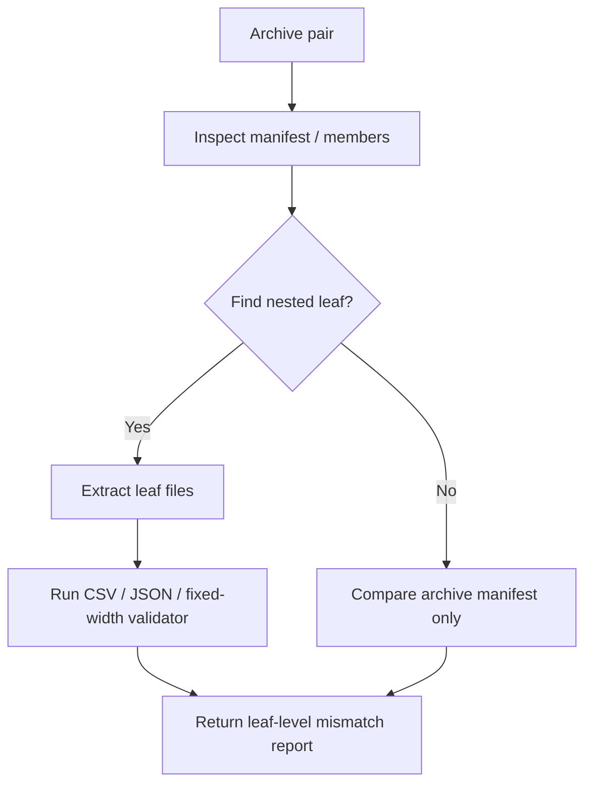
```mermaid
flowchart TD
    A[Archive pair] --> B[Inspect manifest / members]
    B --> C{Find nested leaf?}
    C -->|Yes| D[Extract leaf files]
    D --> E[Run CSV / JSON / fixed-width validator]
    C -->|No| F[Compare archive manifest only]
    E --> G[Return leaf-level mismatch report]
    F --> G
```

### 11.8 Safety limits

Nested expansion is bounded by limits such as:

- maximum nesting depth
- maximum nested member size
- maximum declared size
- maximum compression ratio

That keeps archive inspection from exploding on pathological inputs.

### 11.9 Complexity for archive validation

Let $e$ be the number of archive entries and $d$ be the nesting depth.

- metadata precheck: $O(1)$ per archive pair
- manifest comparison: $O(e)$
- nested-leaf discovery: about $O(e)$ per archive level, bounded by depth limits
- leaf validation: follows the complexity of the extracted leaf type

So archive validation is typically:

$$
O(e + \text{leaf validation cost})
$$

with safety bounds preventing unbounded recursive expansion.

---

## Chapter 12: How the final API report is assembled

After validation completes, the backend builds the API response from the mismatch report and summary counters.

The summary includes counts for:

- missing rows or paths
- extra rows or paths
- value mismatches

The API layer also computes a per-column breakdown for value mismatches when the result set is small enough.

### 12.1 Per-column aggregation in the API

The API can populate `value_mismatch_by_column`, which is a count of value mismatches grouped by `column_name`.

That aggregation is controlled by `validation_value_mismatch_column_stats_max_rows` in [pegasus-backend/src/pegasus/core/config.py](../pegasus-backend/src/pegasus/core/config.py).

If the number of value-mismatch rows is too large, the backend skips per-column aggregation to avoid extra memory use.

### 12.2 Sample groups

The API can also return mismatch sample groups so the UI has a small preview set for each category.

For value mismatches, the sample rows usually include:

- UID
- mismatch type
- column name
- source value
- target value
- row detail

### 12.3 When there are no mismatches

If the result is a full match, the backend may still emit a small match sample frame so the response shape stays consistent.

### 12.4 Complexity for API aggregation

The API-side aggregation is linear in the number of returned mismatch rows.

- summary counts: $O(r)$ where $r$ is mismatch row count
- per-column counts: $O(r)$
- sample grouping: about $O(r)$

So the response-building work is usually dominated by the size of the mismatch output, not by the original source file size.

---

## Chapter 13: Practical meaning of the mismatch types

A simple way to read the report is:

- `missing_in_target`: the record exists in source but not in target
- `extra_in_target`: the record exists in target but not in source
- `value_mismatch`: the record exists on both sides, but one field or path differs
- `value_match`: the record matched, usually used for sample or preview output

This meaning is consistent across formats, but the comparison mechanism differs:

- tabular files use identity + fingerprint + drilldown
- fixed-width files use UID + field comparison
- JSON uses recursive path diffing
- archives use entry metadata and optional leaf validation

---

## Chapter 14: End-to-end example for tabular data

If you want the shortest mental model for how the backend finds a mismatching column, it is this:

1. read the source and target rows
2. build the UID from the identity columns
3. canonicalize the compare columns
4. hash the compare payload to get a fingerprint
5. join source and target by UID
6. if the UID is on only one side, emit missing or extra
7. if the UID is on both sides but the fingerprint differs, mark the row changed
8. rehydrate the original row values for that UID
9. compare each compare column one by one
10. emit one `value_mismatch` row per differing column

That is how Pegasus knows which column changed instead of only knowing that the row changed.

---

## Chapter 15: Complexity summary

This is the short version of the scaling behavior.

### 15.1 Tabular and columnar

- runtime: roughly $O(n \cdot c)$ plus drilldown on changed rows
- space: roughly $O(n \cdot c)$ logical volume, but bounded peak memory through partitioning
- unsorted inputs: handled by hashing and joins, not by positional scanning

### 15.2 Fixed-width

- runtime: roughly $O(n \cdot c)$ because each UID row is compared field by field
- space: roughly $O(n)$ for UID maps plus mismatch output

### 15.3 JSON and NDJSON

- runtime: roughly $O(s)$ where $s$ is the size of the JSON tree or records visited, plus path recursion and list matching cost
- space: roughly $O(d)$ recursion depth for tree walk, plus the output rows

### 15.4 Archives

- runtime: roughly $O(e)$ for manifest work plus the cost of any extracted leaf validation
- space: bounded by manifest size, extracted leaf size, and safety limits

### 15.5 Practical 40 GB note

This section gives a worked estimate instead of a summary.

Assume:

- combined source + target size = 40 GiB
- total rows across both sides = 100,000,000
- total columns = 12
- fingerprint algorithm = `xxhash64`
- partition preset = `medium` = 2048 partitions

#### 15.5.1 Average raw row size

First compute the average raw bytes per row:

$$
\frac{40 \times 2^{30}}{100,000,000} = \frac{42,949,672,960}{100,000,000} = 429.4967296 \text{ bytes/row}
$$

So the average row is about 429.5 bytes across the combined source and target dataset.

If the 12 columns are evenly distributed, the average raw bytes per column are:

$$
\frac{429.4967296}{12} = 35.79139413 \text{ bytes/column/row}
$$

That is only an average. Real columns will be uneven, but it is good enough for a planning estimate.

#### 15.5.2 Hash storage

With `xxhash64`, each row fingerprint is 8 bytes.

So the raw fingerprint storage is:

$$
100,000,000 \times 8 = 800,000,000 \text{ bytes}
$$

Convert that to MiB:

$$
\frac{800,000,000}{2^{20}} = 762.939453125 \text{ MiB}
$$

So the fingerprints alone take about 763 MiB for 100 million total rows.

If you meant 100 million rows per side rather than total across both sides, double that to about 1.49 GiB of raw digest storage.

#### 15.5.3 Partition sizing

With 2048 partitions, the average rows per partition are:

$$
\frac{100,000,000}{2048} = 48,828.125 \text{ rows/partition}
$$

The average raw bytes per partition pair are:

$$
\frac{40 \times 2^{30}}{2048} = 20,971,520 \text{ bytes}
$$

$$
= 20 \text{ MiB}
$$

If the data is split evenly between source and target, that is about 10 MiB per side per partition on average.

#### 15.5.4 UID and compare payload estimate

If the 12 columns are split as 2 UID columns and 10 compare columns, then the average bytes per row are:

$$
2 \times 35.79139413 = 71.58278826 \text{ bytes}
$$

$$
10 \times 35.79139413 = 357.9139413 \text{ bytes}
$$

Per partition, that becomes approximately:

$$
71.58278826 \times 48,828.125 \approx 3,495,000 \text{ bytes}
$$

$$
357.9139413 \times 48,828.125 \approx 17,456,520 \text{ bytes}
$$

So one average partition pair carries about:

- 3.33 MiB of UID payload
- 16.65 MiB of compare payload
- 0.37 MiB of fingerprint bytes

which sums back to about 20 MiB of raw partition data.

#### 15.5.5 Peak RAM estimate

The pipeline does not need to hold the full 40 GiB in memory at once because it spills partitions and reconciles them in waves.

A rough working-set estimate for one partition pair is:

$$
\approx \text{source partition} + \text{target partition} + \text{join overhead} + \text{drilldown overhead}
$$

If we treat the raw partition pair as 20 MiB, then a conservative multiplier of 2x to 4x for join tables, frame overhead, and intermediate buffers gives:

$$
20 \text{ MiB} \times 2 = 40 \text{ MiB}
$$

$$
20 \text{ MiB} \times 4 = 80 \text{ MiB}
$$

So a practical per-partition working set is often in the rough range of 40 to 80 MiB, before any unusually large mismatch export or drilldown expansion.

#### 15.5.6 Why the job still does not fit in RAM as a whole

Even though a single partition is small, the whole job is not just one partition. The backend still has to:

- maintain partition metadata
- read and write partition files
- build joins or hashes for each partition
- keep drilldown rows for changed keys
- assemble the final mismatch output

That is why the correct conclusion for a 40 GiB combined job is:

- do not expect the in-memory fast path
- expect spill-based reconciliation
- expect the full dataset to live on disk, not in RAM

#### 15.5.7 Concrete planning answer

For a 40 GiB combined source + target dataset with 100 million total rows and 12 columns:

- raw average row size: about 429.5 bytes
- raw average column size: about 35.8 bytes
- raw fingerprint storage: about 763 MiB
- average partition pair size at 2048 partitions: 20 MiB
- rough peak RAM per partition pair: about 40 to 80 MiB
- overall job memory use: dominated by spill files and partition processing, not by holding all 40 GiB in memory

#### 15.5.8 Scaling the same math to 10 GiB and 20 GiB

If the row shape stays the same, the math scales linearly with size.

Using the 40 GiB case as the baseline:

- 10 GiB is one quarter of 40 GiB, so it has about 25,000,000 total rows
- 20 GiB is one half of 40 GiB, so it has about 50,000,000 total rows
- 40 GiB is the baseline, so it has about 100,000,000 total rows

##### 10 GiB case

- total rows: 25,000,000
- fingerprint storage: $25,000,000 \times 8 = 200,000,000$ bytes, about 190.7 MiB
- average partition pair size: $10 \text{ GiB} / 2048 \approx 5 \text{ MiB}$
- rough peak RAM per partition pair: about 10 to 20 MiB

##### 20 GiB case

- total rows: 50,000,000
- fingerprint storage: $50,000,000 \times 8 = 400,000,000$ bytes, about 381.5 MiB
- average partition pair size: $20 \text{ GiB} / 2048 \approx 10 \text{ MiB}$
- rough peak RAM per partition pair: about 20 to 40 MiB

##### 40 GiB case

- total rows: 100,000,000
- fingerprint storage: $100,000,000 \times 8 = 800,000,000$ bytes, about 762.9 MiB
- average partition pair size: $40 \text{ GiB} / 2048 \approx 20 \text{ MiB}$
- rough peak RAM per partition pair: about 40 to 80 MiB

##### 15.5.9 Assumptions used in the per-format estimates

The numbers below are planning estimates for validation work, not exact byte-for-byte measurements.

They assume:

- the source and target files are completely unsorted
- the backend uses identity hashing and joins rather than positional scanning
- `2048` partitions are used for the large spill path
- the disk figures are additional validation working disk, not the original input files already stored on disk
- mismatch output is small compared with the input size

Because the files are unsorted, the validator does not need a sort buffer. It pays for hash tables, partition files, extracted leaves, and drilldown lookups instead.

##### 15.5.10 Tabular, CSV-like, PSV, TSV, and DAT

These are the base numbers for the hash-join pipeline.

| Combined input size | Average partition pair | Rough peak RAM | Additional temp disk |
| --- | ---: | ---: | ---: |
| 10 GiB | about 5 MiB | about 10 to 20 MiB | about 10 to 11 GiB |
| 20 GiB | about 10 MiB | about 20 to 40 MiB | about 20 to 22 GiB |
| 40 GiB | about 20 MiB | about 40 to 80 MiB | about 40 to 44 GiB |

The disk number is higher than the raw input because the backend writes normalized partition spill files, join state, and drilldown artifacts. The job still stays bounded because only one partition wave is active at a time.

##### 15.5.11 Fixed-width

Fixed-width jobs use the same identity-and-drilldown idea, but they do not pay delimiter-sniffing overhead.

| Combined input size | Average partition pair | Rough peak RAM | Additional temp disk |
| --- | ---: | ---: | ---: |
| 10 GiB | about 5 MiB | about 8 to 15 MiB | about 10 to 11 GiB |
| 20 GiB | about 10 MiB | about 15 to 30 MiB | about 20 to 22 GiB |
| 40 GiB | about 20 MiB | about 30 to 60 MiB | about 40 to 44 GiB |

The width itself is not inferred from the content. Because the layout is declared up front, fixed-width validation tends to be a little lighter on parser overhead than free-form delimited text, but the spill footprint is still broadly similar.

##### 15.5.12 JSON and NDJSON

JSON is the least uniform case because the memory profile depends on whether Pegasus is comparing NDJSON rows or a single recursive JSON document.

For NDJSON / JSONL, the numbers are usually close to the tabular path.

| Combined input size | Average partition pair | Rough peak RAM | Additional temp disk |
| --- | ---: | ---: | ---: |
| 10 GiB | about 5 MiB | about 12 to 25 MiB | about 10 to 12 GiB |
| 20 GiB | about 10 MiB | about 25 to 50 MiB | about 20 to 24 GiB |
| 40 GiB | about 20 MiB | about 50 to 100 MiB | about 40 to 48 GiB |

For a single large JSON document, use the higher end of the memory range because the recursive tree can keep more nested structure alive while the diff walks the object graph.

##### 15.5.13 Parquet, ORC, and Avro

These columnar formats are converted into a tabular representation before reconciliation, so their memory behavior is close to the base tabular pipeline.

| Combined input size | Average partition pair | Rough peak RAM | Additional temp disk |
| --- | ---: | ---: | ---: |
| 10 GiB | about 5 MiB | about 10 to 20 MiB | about 10 to 12 GiB |
| 20 GiB | about 10 MiB | about 20 to 40 MiB | about 20 to 24 GiB |
| 40 GiB | about 20 MiB | about 40 to 80 MiB | about 40 to 48 GiB |

The disk is a little higher than the raw size estimate because the reader expands columnar data into row-oriented validation artifacts and then writes partitioned spill files.

##### 15.5.14 ZIP, TAR, and nested archives

Archive validation has two different modes:

- manifest-only comparison, where the backend checks archive entries and metadata
- nested leaf validation, where extracted files are handed to the inner validator

For manifest-only work, memory is tiny compared with the file size, and the additional temp disk is usually just the archive manifest and metadata frame.

| Combined archive size | Rough peak RAM | Additional temp disk |
| --- | ---: | ---: |
| 10 GiB | a few MiB | about 0.1 to 0.5 GiB |
| 20 GiB | a few MiB | about 0.1 to 0.5 GiB |
| 40 GiB | a few MiB | about 0.1 to 0.5 GiB |

For nested leaf validation, the archive must first be expanded into a leaf payload, and then that leaf is validated using its own file-type rules. In practice, the temp disk requirement is:

temp disk is roughly archive size + extracted leaf size + leaf spill

So if an archive expands to roughly 2x its compressed size, a planning estimate is:

| Combined archive size | Rough peak RAM | Additional temp disk |
| --- | ---: | ---: |
| 10 GiB | about 10 to 25 MiB for the active leaf partition | about 20 to 30 GiB |
| 20 GiB | about 20 to 50 MiB for the active leaf partition | about 40 to 60 GiB |
| 40 GiB | about 40 to 100 MiB for the active leaf partition | about 80 to 120 GiB |

Nested archives add another layer of extraction, so the real disk requirement can be higher if the inner archive also expands significantly. The safety limits in the archive extractor keep that from becoming unbounded, but they do not remove the need for enough temporary disk.

##### 15.5.15 Quick cross-format summary

If you want one short planning rule, use this:

- tabular, fixed-width, Parquet, ORC, Avro, and NDJSON: expect roughly the input size again on temporary disk, plus a small overhead for partitioning and drilldown
- single-document JSON: expect a similar disk profile, but a higher and less predictable memory peak
- ZIP and TAR without leaf validation: expect very small disk and memory overhead
- ZIP, TAR, and nested archives with leaf validation: expect archive size plus extracted-leaf size on disk, then apply the leaf validator’s own memory profile

##### Practical reading

The key pattern is:

- disk and partition volume scale linearly with file size
- fingerprint bytes scale linearly with row count
- peak RAM does not scale to the full dataset because only one partition wave is active at a time

So the overall answer is not “40 GiB in RAM.” It is “40 GiB on disk, partitioned into about 20 MiB logical chunks, with a working set sized to one chunk plus join/drilldown overhead.”

If you want the short version in one line: the row-level math is manageable, but the full 40 GiB dataset is far above the in-memory thresholds, so the backend must spill and reconcile partition by partition.

---

## Chapter 16: Short summary

Pegasus validation works by routing each input format into a specialized comparator, but every comparator ultimately feeds the same mismatch report model.

For tabular data, the important sequence is:

1. identity match
2. fingerprint compare
3. column drilldown
4. mismatch report assembly

For the other formats, the same idea applies with different mechanics:

- fixed-width uses explicit field slices
- JSON uses recursive paths
- archives use entry metadata and optional leaf validation

The architectural theme is consistent: fast coarse matching first, then precise column/path attribution only for the records that need it.

---

## Chapter 17: Visual validation maps

This chapter gives a structured visual view of how Pegasus validates each supported file family. The diagrams show the backend flow from input selection to mismatch output.

### 17.1 Global validation flow

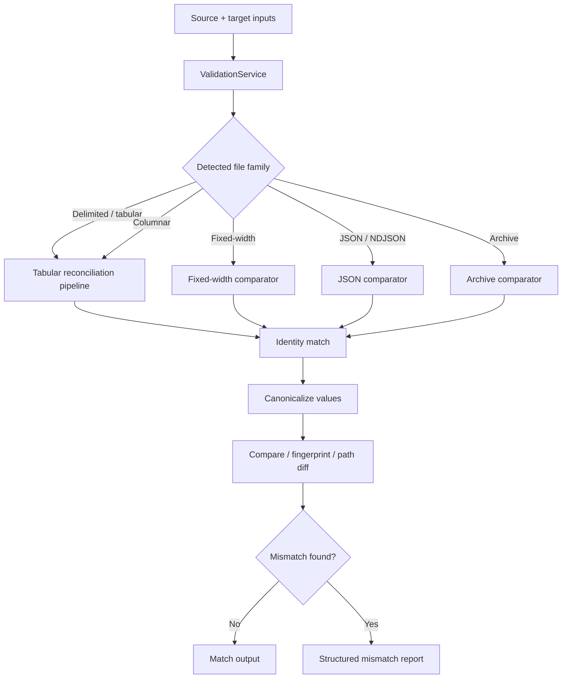
```mermaid
flowchart TD
    A[Source + target inputs] --> B[ValidationService]
    B --> C{Detected file family}
    C -->|Delimited / tabular| D[Tabular reconciliation pipeline]
    C -->|Columnar| D
    C -->|Fixed-width| E[Fixed-width comparator]
    C -->|JSON / NDJSON| F[JSON comparator]
    C -->|Archive| G[Archive comparator]

    D --> H[Identity match]
    E --> H
    F --> H
    G --> H

    H --> I[Canonicalize values]
    I --> J[Compare / fingerprint / path diff]
    J --> K{Mismatch found?}
    K -->|No| L[Match output]
    K -->|Yes| M[Structured mismatch report]
```

### 17.2 Delimited and tabular files

This covers CSV, TSV, PSV, DAT, and other tabular text inputs.

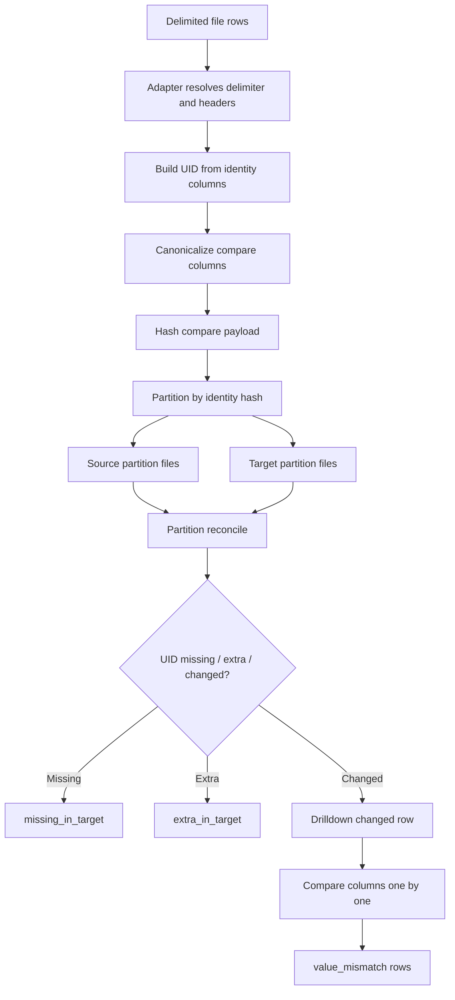
```mermaid
flowchart TD
    A[Delimited file rows] --> B[Adapter resolves delimiter and headers]
    B --> C[Build UID from identity columns]
    C --> D[Canonicalize compare columns]
    D --> E[Hash compare payload]
    E --> F[Partition by identity hash]
    F --> G[Source partition files]
    F --> H[Target partition files]
    G --> I[Partition reconcile]
    H --> I
    I --> J{UID missing / extra / changed?}
    J -->|Missing| K[missing_in_target]
    J -->|Extra| L[extra_in_target]
    J -->|Changed| M[Drilldown changed row]
    M --> N[Compare columns one by one]
    N --> O[value_mismatch rows]
```

### 17.3 Fixed-width files

Fixed-width validation uses declared field positions instead of delimiters.

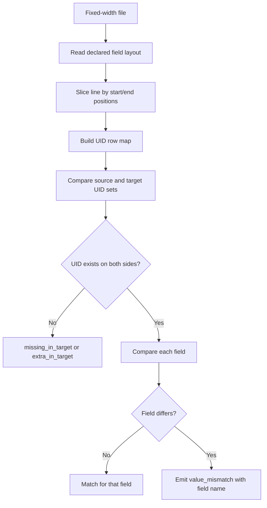
```mermaid
flowchart TD
    A[Fixed-width file] --> B[Read declared field layout]
    B --> C[Slice line by start/end positions]
    C --> D[Build UID row map]
    D --> E[Compare source and target UID sets]
    E --> F{UID exists on both sides?}
    F -->|No| G[missing_in_target or extra_in_target]
    F -->|Yes| H[Compare each field]
    H --> I{Field differs?}
    I -->|No| J[Match for that field]
    I -->|Yes| K[Emit value_mismatch with field name]
```

### 17.4 JSON and NDJSON files

JSON validation is path-based and recursive.

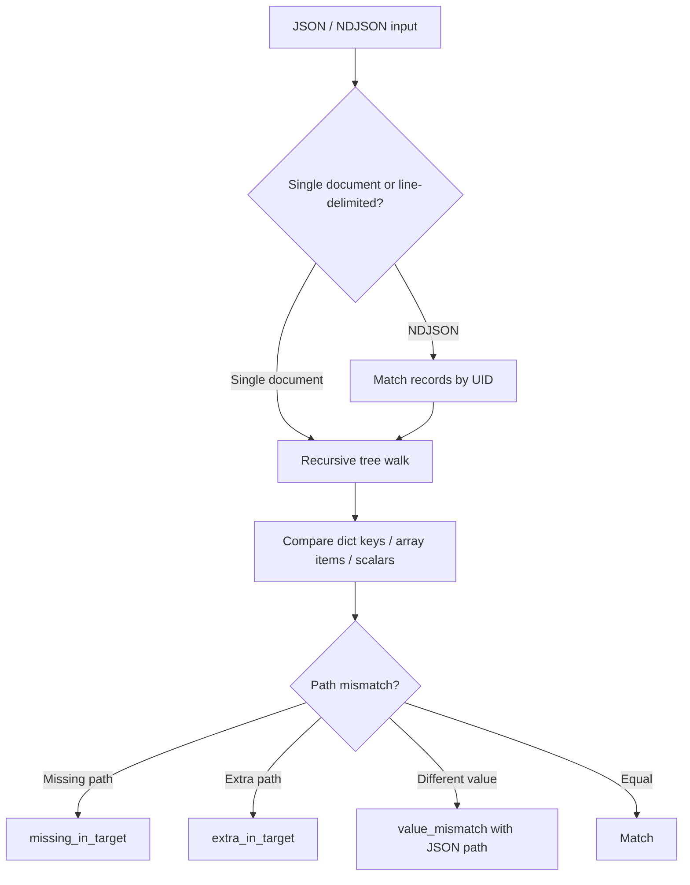
```mermaid
flowchart TD
    A[JSON / NDJSON input] --> B{Single document or line-delimited?}
    B -->|Single document| C[Recursive tree walk]
    B -->|NDJSON| D[Match records by UID]
    D --> C
    C --> E[Compare dict keys / array items / scalars]
    E --> F{Path mismatch?}
    F -->|Missing path| G[missing_in_target]
    F -->|Extra path| H[extra_in_target]
    F -->|Different value| I[value_mismatch with JSON path]
    F -->|Equal| J[Match]
```

### 17.5 Parquet, ORC, and Avro

These formats are converted into tabular rows and then follow the same partitioned reconciliation path as delimited files.

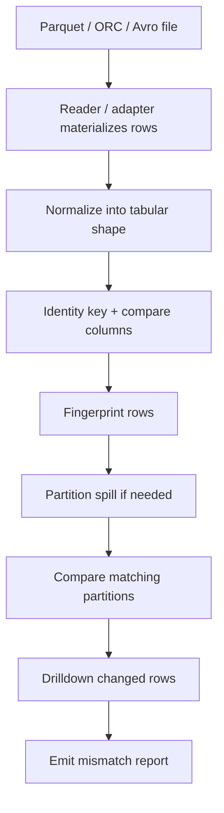
```mermaid
flowchart TD
    A[Parquet / ORC / Avro file] --> B[Reader / adapter materializes rows]
    B --> C[Normalize into tabular shape]
    C --> D[Identity key + compare columns]
    D --> E[Fingerprint rows]
    E --> F[Partition spill if needed]
    F --> G[Compare matching partitions]
    G --> H[Drilldown changed rows]
    H --> I[Emit mismatch report]
```

### 17.6 ZIP and TAR archives

Archive validation first compares archive metadata, then optionally validates the extracted leaf file.

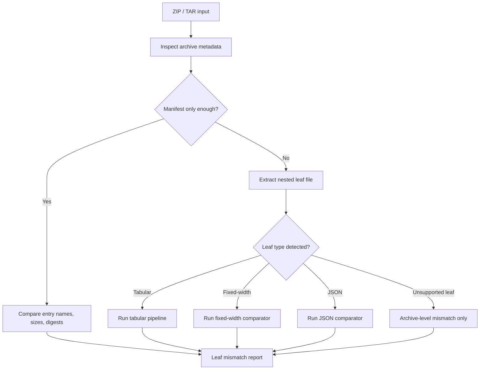
```mermaid
flowchart TD
    A[ZIP / TAR input] --> B[Inspect archive metadata]
    B --> C{Manifest only enough?}
    C -->|Yes| D[Compare entry names, sizes, digests]
    C -->|No| E[Extract nested leaf file]
    E --> F{Leaf type detected?}
    F -->|Tabular| G[Run tabular pipeline]
    F -->|Fixed-width| H[Run fixed-width comparator]
    F -->|JSON| I[Run JSON comparator]
    F -->|Unsupported leaf| J[Archive-level mismatch only]
    G --> K[Leaf mismatch report]
    H --> K
    I --> K
    D --> K
    J --> K
```

### 17.7 Nested archives

Nested archives are handled by recursively materializing the inner archive until Pegasus reaches a supported leaf type or hits a safety limit.

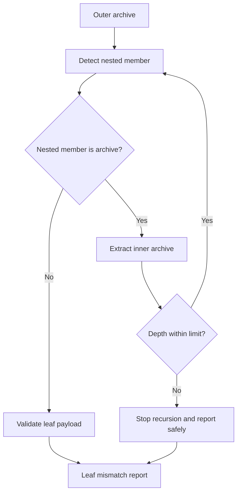
```mermaid
flowchart TD
    A[Outer archive] --> B[Detect nested member]
    B --> C{Nested member is archive?}
    C -->|No| D[Validate leaf payload]
    C -->|Yes| E[Extract inner archive]
    E --> F{Depth within limit?}
    F -->|No| G[Stop recursion and report safely]
    F -->|Yes| B
    D --> H[Leaf mismatch report]
    G --> H
```

### 17.8 One-line reading guide

Use the diagrams this way:

- if the file is row-oriented text, follow the tabular diagram
- if the file is fixed-width, follow the slicing diagram
- if the file is JSON, follow the recursive path diagram
- if the file is Parquet, ORC, or Avro, follow the materialize-then-tabular diagram
- if the file is ZIP or TAR, follow the archive-and-leaf diagram
- if the archive contains another archive, follow the nested recursion diagram

---

## Chapter 18: Partition tables and chunked archive reading

This chapter explains two concrete implementation details that are easy to miss from the high-level flow:

- how partition files are built for the spill path
- how ZIP, TAR, and nested archives are read in chunks without pulling the whole file into memory

### 18.1 How partition tables are made

The partition tables are the spill files written by [pegasus-backend/src/pegasus/validation/pipeline/spill.py](../pegasus-backend/src/pegasus/validation/pipeline/spill.py).

Each row is turned into a compact binary record containing:

- the identity key
- the row fingerprint
- optionally, the compare-column payload for drilldown

The writer does not build one giant table. It keeps a small buffer per partition id and flushes each buffer when it grows past the threshold.

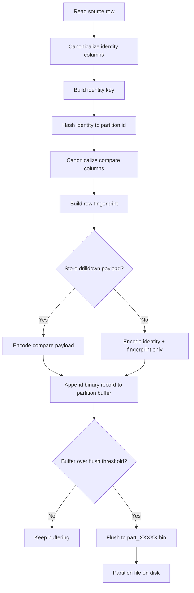
```mermaid
flowchart TD
    A[Read source row] --> B[Canonicalize identity columns]
    B --> C[Build identity key]
    C --> D[Hash identity to partition id]
    D --> E[Canonicalize compare columns]
    E --> F[Build row fingerprint]
    F --> G{Store drilldown payload?}
    G -->|Yes| H[Encode compare payload]
    G -->|No| I[Encode identity + fingerprint only]
    H --> J[Append binary record to partition buffer]
    I --> J
    J --> K{Buffer over flush threshold?}
    K -->|No| L[Keep buffering]
    K -->|Yes| M[Flush to part_XXXXX.bin]
    M --> N[Partition file on disk]
```

The on-disk format is intentionally compact:

- records are binary, not JSON
- each record stores the identity string and an 8-byte fingerprint
- if drilldown is enabled, the compare values are stored in column order for later lookup

That means the partition files are not copies of the input file format. They are validation working files made specifically for fast matching and later drilldown.

### 18.2 How partition buckets are named and matched

The bucket name comes from the partition id, not from the physical row number.

In the spill path, Pegasus computes:

- the identity key from the UID columns
- a partition id from that identity key and the configured partition count
- a file name from that partition id

The partition id is an integer in the range `0..num_partitions-1`. The file name is written with zero padding so the buckets sort cleanly on disk:

- `source/part_00000.bin`
- `source/part_00001.bin`
- `source/part_00042.bin`
- `target/part_00042.bin`
- `target/part_02047.bin`

The exact bucket count comes from the adaptive partition planner and the config preset. Larger jobs get more buckets; smaller jobs get fewer buckets. The important part is that the same identity key always produces the same partition id on both source and target.

### 18.2.1 How the bucket count is chosen

The planner does not blindly use the maximum partition count for every file. It estimates the job size first and then picks a bucket count that is large enough to spread the work out, but not so large that most buckets are empty.

The selection rules are:

- estimate the row count from the input size and column count
- choose a target rows-per-partition value based on the estimated row count
- cap the bucket count using the file-size tier
- respect the requested partition count as an upper bound when one is configured

The code applies these planning tiers:

- very small jobs: keep the bucket count low enough to avoid overhead from empty partitions
- medium jobs: allow more buckets so each bucket stays small
- large jobs: allow a much higher bucket cap so the spill files stay manageable

In the implementation, the row target changes with scale:

- small jobs aim for about 2,000 rows per bucket
- medium jobs aim for about 10,000 rows per bucket
- very large jobs aim for about 5,000 rows per bucket once the estimated row count is high enough

The size caps also change by input size:

- up to about 4 MiB of combined input, the planner keeps the bucket count at or below 16
- up to about 32 MiB, it keeps the bucket count at or below 64
- up to about 128 MiB, it keeps the bucket count at or below 256
- beyond that, the bucket count can grow up to the larger file-size cap

That means small files do not get a huge number of buckets. The planner prefers fewer buckets and fewer files because the cost of many empty partitions would be higher than the benefit.

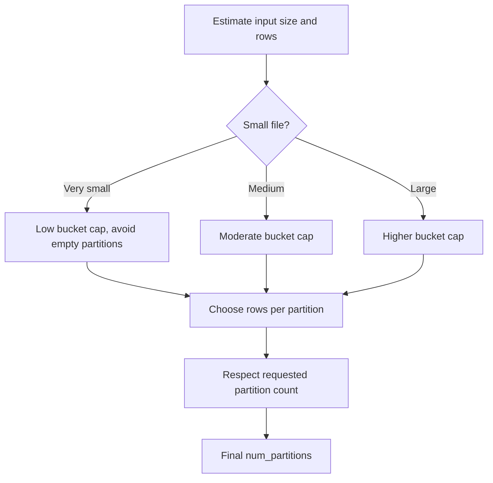
```mermaid
flowchart TD
    A[Estimate input size and rows] --> B{Small file?}
    B -->|Very small| C[Low bucket cap, avoid empty partitions]
    B -->|Medium| D[Moderate bucket cap]
    B -->|Large| E[Higher bucket cap]
    C --> F[Choose rows per partition]
    D --> F
    E --> F
    F --> G[Respect requested partition count]
    G --> H[Final num_partitions]
```

The practical effect is that a tiny dataset might only use a handful of buckets, while a large dataset can use hundreds or thousands. The planner is trying to keep the work balanced without creating a lot of empty `part_XXXXX.bin` files.

### 18.2.2 How both sides still land in the same bucket

Once the final `num_partitions` is chosen, both source and target use the same partition count and the same identity hash function.

That gives the routing rule:

```text
partition_id = hash(identity_key) mod num_partitions
```

Because the source and target rows with the same UID generate the same identity key, they also generate the same partition id.

So the bucket is shared by construction:

- source row hashes to bucket 42
- target row with the same UID hashes to bucket 42
- both rows are written under the same `source/part_00042.bin` and `target/part_00042.bin` pair

This is the core reason unsorted validation works. Pegasus is not trying to remember where the row was in the original file; it is trying to put the same logical row from both sides into the same bucket.

```mermaid
flowchart TD
    A[UID columns] --> B[Canonicalize identity parts]
    B --> C[Join into identity key]
    C --> D[partition_id(identity, num_partitions)]
    D --> E{Partition id}
    E --> F[source/part_00042.bin]
    E --> G[target/part_00042.bin]
```

The reason source and target land in the same bucket is simple: both sides run the same identity canonicalization and the same hash function with the same partition count. If the identity key is identical, the bucket id is identical.

That gives Pegasus an architectural guarantee:

- rows with the same UID never need a global scan to find each other
- source and target rows with the same identity can be compared inside one bucket
- unsorted input still works because bucket routing replaces positional matching

You can think of the bucket as a rendezvous point for one identity hash range, not as a physical row-order group.

### 18.3 What a partition file contains

For the default spill path, one partition file is built from the rows whose identity hash landed in that bucket.

Conceptually it looks like this:

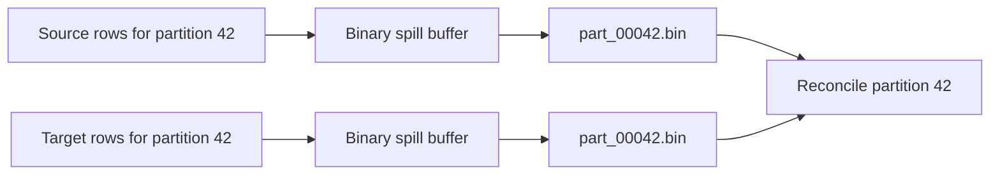
```mermaid
flowchart LR
    A[Source rows for partition 42] --> B[Binary spill buffer]
    C[Target rows for partition 42] --> D[Binary spill buffer]
    B --> E[part_00042.bin]
    D --> F[part_00042.bin]
    E --> G[Reconcile partition 42]
    F --> G
```

The partition file lets Pegasus compare only rows that can actually match each other. That is why partitioning is so important for unsorted inputs: the same UID always hashes to the same partition bucket, so the source and target versions of that row meet again later in the same `part_XXXXX.bin` pair.

### 18.4 How partition reconcile reads those files

During reconciliation, Pegasus opens the source and target partition files for the same partition id and compares them directly.

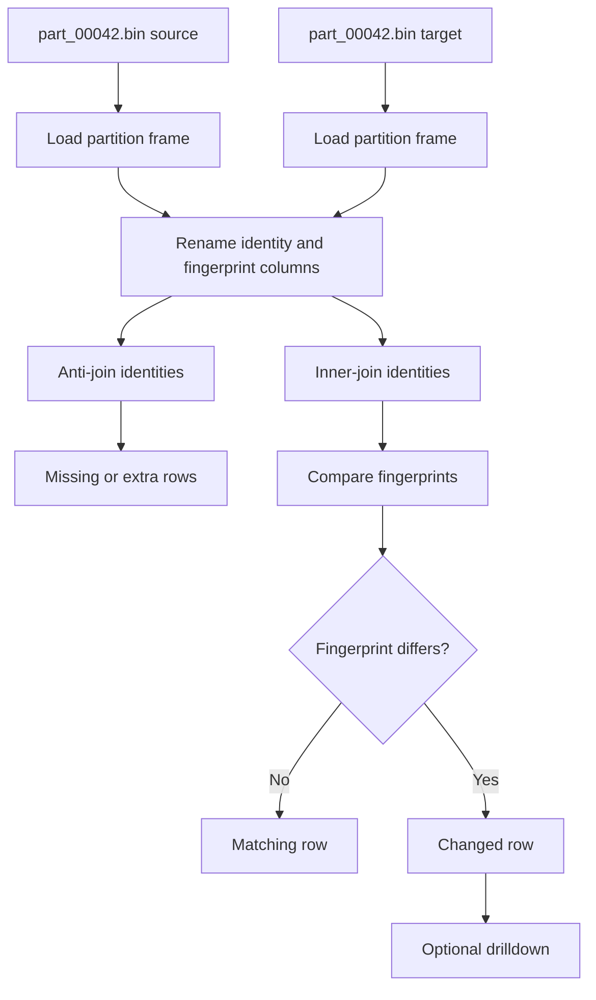
```mermaid
flowchart TD
    A[part_00042.bin source] --> B[Load partition frame]
    C[part_00042.bin target] --> D[Load partition frame]
    B --> E[Rename identity and fingerprint columns]
    D --> E
    E --> F[Anti-join identities]
    E --> G[Inner-join identities]
    F --> H[Missing or extra rows]
    G --> I[Compare fingerprints]
    I --> J{Fingerprint differs?}
    J -->|No| K[Matching row]
    J -->|Yes| L[Changed row]
    L --> M[Optional drilldown]
```

If drilldown is enabled, the changed keys are then rehydrated from the cached compare payload or from the spill payload itself. That second read is limited to the changed keys, not the whole file.

### 18.5 How ZIP and TAR are read without loading the whole archive

ZIP and TAR validation does not open the whole archive as a single in-memory object. The backend reads archive metadata first, then streams member data when it needs a nested payload.

For ZIP and TAR members, the code reads files in small chunks, typically 1 MiB at a time, and writes only the selected member to a temporary work file if it is going to be validated as a nested leaf.

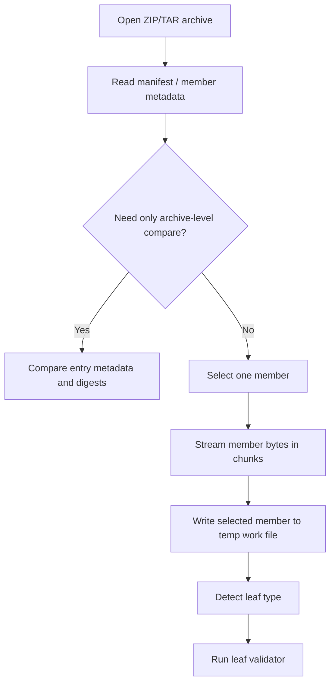
```mermaid
flowchart TD
    A[Open ZIP/TAR archive] --> B[Read manifest / member metadata]
    B --> C{Need only archive-level compare?}
    C -->|Yes| D[Compare entry metadata and digests]
    C -->|No| E[Select one member]
    E --> F[Stream member bytes in chunks]
    F --> G[Write selected member to temp work file]
    G --> H[Detect leaf type]
    H --> I[Run leaf validator]
```

The important detail is that the backend does not build a giant in-memory buffer for the whole archive. It only streams the selected member, chunk by chunk, into a bounded temporary file when extraction is needed.

### 18.6 How nested archives are handled without unzipping everything

Nested archives are also bounded. The extractor stops after a small number of levels and only follows members that look like supported archives or supported leaf types.

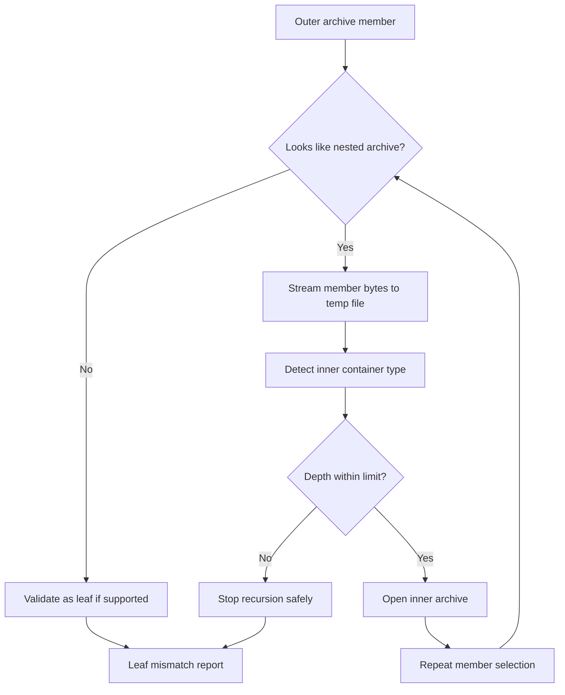
```mermaid
flowchart TD
    A[Outer archive member] --> B{Looks like nested archive?}
    B -->|No| C[Validate as leaf if supported]
    B -->|Yes| D[Stream member bytes to temp file]
    D --> E[Detect inner container type]
    E --> F{Depth within limit?}
    F -->|No| G[Stop recursion safely]
    F -->|Yes| H[Open inner archive]
    H --> I[Repeat member selection]
    I --> B
    C --> J[Leaf mismatch report]
    G --> J
```

That means Pegasus does not “unzip everything” first. It only materializes the next member it needs, then recurses if that member itself is another archive. The recursion is bounded by depth and member-size limits, so the backend keeps control over memory and disk use.

### 18.7 Why this keeps memory bounded

The main reason this approach scales is that the backend stores only the current working slice:

- partitioning keeps only one row’s normalized representation at a time before flushing to disk
- reconciliation loads one partition at a time instead of the whole dataset
- archive extraction reads members in chunks instead of buffering the entire archive
- nested archive recursion stops at a small maximum depth

So the answer to “how do we read chunks out of ZIP/TAR/nested files without bringing the whole file into memory?” is:

1. read archive metadata first
2. pick the member you need
3. stream that member in small blocks
4. write only the selected member to a temporary work file if needed
5. recurse only into that selected member, never the entire archive tree at once

This is the same design principle as partition reconciliation: only materialize the small piece needed for the current step.
