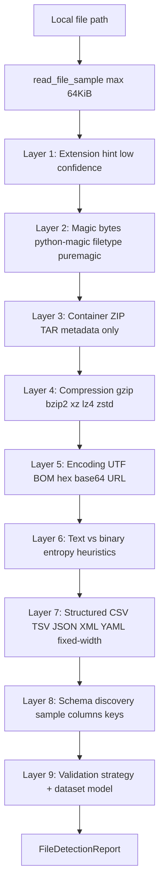

# File Type Detection Architecture

Pegasus validates datasets from databases, object stores, and local paths. Validation logic must run on **dataset models**, not file extensions. The `pegasus.validation.file_detection` package implements a bounded, multi-layer pipeline that identifies file type, container, compression, encoding, structure, schema hints, and validation strategy—without reading entire files.

## Goals

| Requirement | How we meet it |
|-------------|----------------|
| Never read whole files for detection | Single prefix read, max **64 KiB** |
| Handle 100GB+ files | `read_file_sample()` uses `open().read(cap)` only |
| Hundreds of concurrent users | Stateless, no global caches; O(64KB) per call |
| Horizontal scale / K8s | Pure functions; safe in stateless workers |
| Backward compatibility | Existing `file_format` + `delimiter` API unchanged; detection is additive |

## Pipeline



## Canonical dataset models

All outputs map to one of:

1. **tabular** — CSV, TSV, PSV, fixed-width (Pegasus validators)
2. **hierarchical** — JSON / JSONL
3. **container** — ZIP, TAR, nested archives (inspect only; no auto-extract in validation yet)
4. **binary_asset** — Parquet, ORC, compressed blobs, unsupported columnar
5. **database** — Reserved for JDBC/warehouse connectors (not file-based)
6. **unknown** — Low confidence; do not assume format

## Confidence scoring

Every layer returns:

```json
{
  "detected_type": "csv",
  "confidence": 0,
  "evidence": ["..."],
  "metadata": {}
}
```

Confidence is **0–100**. Extension hints cap around **25–40**. Magic signatures **85–98**. When layers disagree, warnings are attached to the report (e.g. `.csv` extension but JSON body).

## Layer details

### Layer 1 — Extension (`layers/extension.py`)

Hints only. Never trusted alone.

### Layer 2 — Magic bytes (`layers/magic_bytes.py`)

Order of attempt:

1. Built-in signature table (gzip, zip, parquet `PAR1`, etc.)
2. **python-magic** (libmagic) when installed
3. **filetype** pure-Python fallback
4. **puremagic** fallback

Reads `prefix_8k` at most.

### Layer 3 — Container (`layers/container.py`)

- ZIP: `zipfile` metadata listing (no extract)
- TAR: `tarfile.getmembers()` listing
- 7z/RAR: magic identification; deep listing deferred
- Limits: `max_entries=1000`, nested archive flag, depth reserved for future recursive walk

### Layer 4 — Compression (`layers/compression.py`)

Detects gzip, bzip2, xz, lz4, zstd. Suggests **decompress_first** strategy.

### Layer 5 — Encoding (`layers/encoding.py`)

UTF BOMs, UTF-8 validity ratio, UTF-16 heuristics, hex/base64/URL-encoded prefixes. Encoded samples can be decoded (small window) and magic detection re-run.

### Layer 6 — Text vs binary (`layers/text_binary.py`)

Printable ratio, null-byte ratio, Shannon entropy.

### Layer 7 — Structured format (`layers/structured.py`)

Sample-based: JSON, JSONL, XML, YAML heuristics, delimiter consistency, fixed-width line-length uniformity.

### Layer 8 — Schema discovery (`layers/schema_discovery.py`)

Tabular column names/types from first rows; JSON top-level keys; JSONL key union—all from the 64 KiB window only.

### Layer 9 — Strategy (`layers/strategy.py`)

Maps to Pegasus-compatible hints:

| Strategy | Meaning |
|----------|---------|
| `csv` | Run existing CSV validation path |
| `fixed-width` | Fixed-width validator |
| `json` | JSON document compare |
| `decompress_first` | Reject / ask user to decompress |
| `transcode_first` | UTF-16 etc. |
| `container` | Archive — inspect entries |
| `unsupported` | Parquet/ORC/etc. not yet ingested |
| `unknown` | Insufficient confidence |

## Integration points

| Location | Role |
|----------|------|
| `GET /api/v1/validate/local/detect` | Full report for UI / ops |
| `csv_preflight.preflight_bridge` | Shared gzip/UTF-16 checks (8-byte prefix) |
| `coerce_local_validate_fields()` | Unchanged; optional `suggest_format_override()` for future auto-routing |

## Performance characteristics

| Operation | Complexity | Memory |
|-----------|------------|--------|
| `read_file_sample` | O(64KB) I/O | O(64KB) |
| Magic / encoding / text | O(64KB) CPU | O(64KB) |
| ZIP listing | O(entries) metadata | O(entries) names |
| Full CSV validation (unchanged) | May scan millions of rows | Separate concern |

### Prior bottlenecks (audit summary)

1. **No unified detection** — format was user-declared only.
2. **Duplicate parsing** on validate path: delimiter sniff (512 KiB) → preflight (50k rows) → schema (10k rows) → reconcile.
3. **JSON** — full-file `read_bytes()`.
4. **gzip** — detected but not decompressed (by design).

Detection does **not** remove duplicate validation parses yet; it adds a cheap upfront classifier. Consolidating sniff + preflight remains a follow-up.

## Dependencies

```
python-magic   # prefers libmagic1 system package
filetype       # pure Python fallback
puremagic      # secondary fallback
```

Install libmagic on Debian/Ubuntu: `apt-get install libmagic1`. Pipeline works without it via signatures + filetype.

## Benchmarking

```bash
cd /home/ansh.raj/Pegasus
python scripts/benchmark_file_detection.py \
  test-data/generated-100k-12cols/source.csv \
  test-data/entity-inference/unknown-entity/ledgerx_28052026_171700_source.csv
```

Compares **legacy** (extension allowlist + declared format) vs **pipeline** (64 KiB multi-layer). Results are written to stdout; store output in CI or release notes for before/after tracking.

## API example

```http
GET /api/v1/validate/local/detect?path=/data/report.csv&file_format=csv
```

Response includes `dataset_model`, `suggested_file_format`, per-layer `confidence`/`evidence`, and `warnings`.

## Completed extensions

| Gap | Implementation |
|-----|----------------|
| Auto-routing | `coerce_local_validate_fields_with_detection()`, `file_format=auto`, settings `validation_auto_detect_format` |
| Archive extract | `archive_extract.materialize_validation_path()` with depth/size/entry limits; `validation_auto_extract_archives` |
| Delimiter merge | `delimiter_bridge.resolve_auto_delimiter()` reuses detection prefix + structured delimiter hints |
| Parquet/ORC/Avro/Excel | `readers/columnar_reader.py`, `validate_columnar_pair_sync()`, `is_columnar_run()` |
| Plugin registry | `file_detection/plugins/registry.py` — `register_format_plugin()` for extensions |

## Configuration

| Setting | Default | Purpose |
|---------|---------|---------|
| `PEGASUS_VALIDATION_AUTO_DETECT_FORMAT` | `true` | Resolve `file_format=auto` from detection |
| `PEGASUS_VALIDATION_AUTO_EXTRACT_ARCHIVES` | `true` | Decompress gzip/bzip2; extract first tabular zip/tar member |
| `PEGASUS_VALIDATION_ARCHIVE_MAX_EXTRACT_BYTES` | 512 MiB | Per-member uncompressed cap |

## Future work

- Recursive nested archive walk (depth-limited) beyond first tabular member
- External-memory reconciliation for large Parquet pairs (today: in-memory columnar path)
- Cloud path auto-detect at download time (GCS/S3)
