# Pegasus File Type Detection — Comprehensive Technical Reference

> **Audience:** Engineers, operators, and technical users who need to understand exactly how Pegasus identifies file types before validation.  
> **Scope:** Backend pipeline (`pegasus.validation.file_detection`), cloud profiling, archive materialization, display labels, frontend rendering, and validation routing.  
> **Package root:** `pegasus-backend/src/pegasus/validation/file_detection/`

This is the **detailed** reference. A shorter overview lives in [file-type-detection-architecture.md](file-type-detection-architecture.md).

---

## Table of contents

### Part I — Context and architecture
1. [The problem Pegasus solves](#1-the-problem-pegasus-solves)
2. [Legacy vs multi-layer detection](#2-legacy-vs-multi-layer-detection)
3. [System architecture overview](#3-system-architecture-overview)
4. [Core data structures](#4-core-data-structures)

### Part II — Sampling and I/O
5. [Bounded file sampling](#5-bounded-file-sampling)
6. [Local vs cloud sampling paths](#6-local-vs-cloud-sampling-paths)

### Part III — The nine detection layers
7. [Layer pipeline overview](#7-layer-pipeline-overview)
8. [Layer 1 — Extension hints](#8-layer-1--extension-hints)
9. [Layer 2 — Magic bytes and MIME](#9-layer-2--magic-bytes-and-mime)
10. [Layer 3 — Container / archive metadata](#10-layer-3--container--archive-metadata)
11. [Layer 4 — Compression](#11-layer-4--compression)
12. [Layer 5 — Encoding and transforms](#12-layer-5--encoding-and-transforms)
13. [Layer 6 — Text vs binary](#13-layer-6--text-vs-binary)
14. [Layer 7 — Structured format heuristics](#14-layer-7--structured-format-heuristics)
15. [Layer 8 — Schema discovery](#15-layer-8--schema-discovery)
16. [Layer 9 — Strategy and dataset model](#16-layer-9--strategy-and-dataset-model)

### Part IV — Display labels and archives
17. [Format display chains](#17-format-display-chains)
18. [Archive walking and nested containers](#18-archive-walking-and-nested-containers)
19. [Archive materialization for validation](#19-archive-materialization-for-validation)

### Part V — Integration
20. [Local validation integration](#20-local-validation-integration)
21. [Cloud (GCS) profiling integration](#21-cloud-gcs-profiling-integration)
22. [Frontend wizard integration](#22-frontend-wizard-integration)
23. [Delimiter detection bridge](#23-delimiter-detection-bridge)

### Part VI — Reference
24. [Complete format catalog](#24-complete-format-catalog)
25. [Worked examples (step-by-step)](#25-worked-examples-step-by-step)
26. [Edge cases, conflicts, and limitations](#26-edge-cases-conflicts-and-limitations)
27. [Configuration and dependencies](#27-configuration-and-dependencies)
28. [API reference](#28-api-reference)
29. [Plugin extension system](#29-plugin-extension-system)
30. [Testing and accuracy suite](#30-testing-and-accuracy-suite)
31. [Future work and known gaps](#31-future-work-and-known-gaps)
32. [Source file index](#32-source-file-index)

---

# Part I — Context and architecture

## 1. The problem Pegasus solves

Pegasus validates **datasets** — pairs of source and target files that should contain equivalent business data. Validation engines differ by shape:

| Dataset shape | Validator behavior |
|---------------|-------------------|
| Delimited rows (CSV/TSV/PSV) | Column mapping, row reconciliation, delimiter-aware parsing |
| Fixed-width records | Column boundary inference, positional compare |
| JSON / JSONL | Hierarchical key mapping, document diff |
| Parquet / ORC / Avro / Excel | Columnar schema compare, row counts |
| Archives (ZIP/TAR) | Entry manifest compare, optional inner tabular extraction |

**The routing decision must be based on file content, not filename.**

### Real-world filename lies

Enterprise exports routinely mislabel files:

```
report.csv          → actually gzip-compressed CSV
export.dat          → comma-delimited tabular data
payroll.verizon     → fixed-width layout (vendor extension)
table.warehouse     → Parquet with non-standard suffix
payload.xyz         → JSON object
bundle.zip          → ZIP containing nested TAR containing CSV
```

If Pegasus trusted extensions alone, it would:

1. Feed binary gzip bytes into a CSV parser → parse errors or garbage
2. Treat fixed-width `.dat` as plain text → no column mapping
3. Skip archive traversal → compare ZIP bytes as if they were rows
4. Miss JSON inside `.csv` files → silent wrong validation path

### What detection produces

For every inspected file, the system emits a **`FileDetectionReport`** containing:

- **`dataset_model`** — high-level category (`tabular`, `hierarchical`, `container`, `binary_asset`, `unknown`)
- **`suggested_file_format`** — canonical Pegasus token (`csv`, `json`, `fixed-width`, `parquet`, …)
- **`suggested_delimiter`** — when tabular (`,`, `\t`, `|`)
- **`validation_strategy`** — what Pegasus should do next (`csv`, `decompress_first`, `container`, …)
- **Nine layer results** — each with `detected_type`, `confidence` (0–100), `evidence[]`, `metadata{}`
- **`warnings[]`** — e.g. extension/content mismatch

---

## 2. Legacy vs multi-layer detection

### Legacy path (extension only)

**Function:** `infer_file_format_from_path()` in `file_format.py`

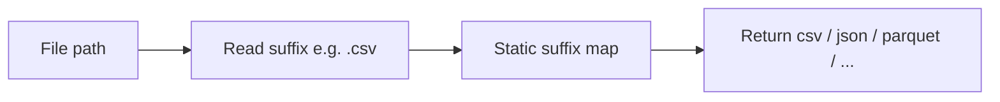

| Property | Value |
|----------|-------|
| Disk I/O | **None** |
| Latency | ~0.01 ms |
| Accuracy when extension = content | Good |
| Accuracy when extension ≠ content | **Poor** |
| Archive awareness | None |
| Compression awareness | None |

**Suffix map (legacy):**

| Suffix | Inferred format |
|--------|-----------------|
| `.csv`, `.tsv` | `csv` |
| `.parquet`, `.pq` | `parquet` |
| `.orc` | `orc` |
| `.avro` | `avro` |
| `.xlsx`, `.xls` | `excel` |
| `.json`, `.ndjson` | `json` |
| *(anything else with auto/csv request)* | defaults to `csv` |

### Multi-layer path (current)

**Function:** `detect_file()` in `pipeline.py`

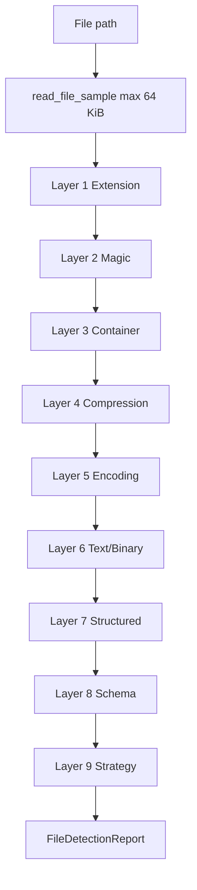

| Property | Value |
|----------|-------|
| Disk I/O | ≤ 64 KiB prefix + 4-byte suffix (Parquet) |
| Latency | Low milliseconds (dominated by I/O + optional zip listing) |
| Accuracy | Content-first; extension is weak hint |
| Archive awareness | ZIP/TAR metadata listing |
| Compression awareness | gzip, bzip2, xz, zstd, lz4 signatures |

### When each path runs

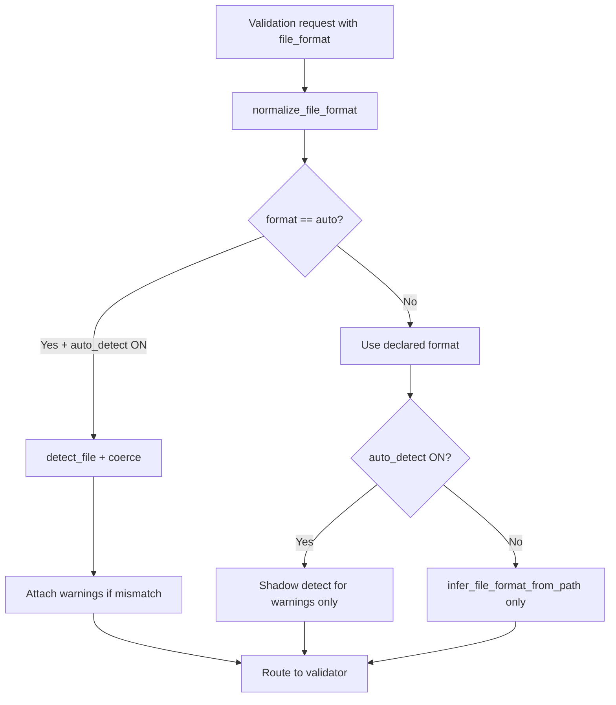

---

## 3. System architecture overview

### Component map

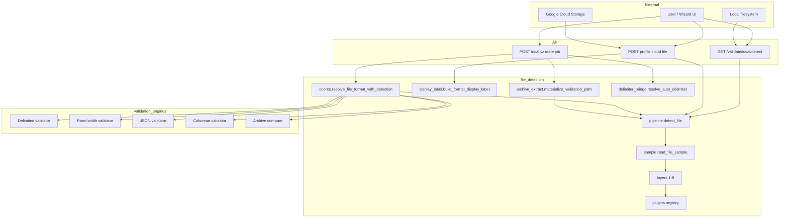

### Package directory structure

```
pegasus/validation/file_detection/
├── __init__.py              # Public exports: detect_file, coerce helpers
├── pipeline.py              # Orchestrator: runs all layers
├── sample.py                # Bounded prefix read
├── types.py                 # DetectionStage, FileDetectionReport
├── coerce.py                # file_format=auto resolution
├── display_label.py         # UI chains: zip -> csv
├── archive_extract.py       # Decompress / extract for validation
├── delimiter_bridge.py      # Reuse structured delimiter hints
├── layers/
│   ├── extension.py         # Layer 1
│   ├── magic_bytes.py       # Layer 2
│   ├── container.py         # Layer 3
│   ├── compression.py       # Layer 4
│   ├── encoding.py          # Layer 5
│   ├── text_binary.py       # Layer 6
│   ├── structured.py        # Layer 7
│   ├── schema_discovery.py  # Layer 8
│   └── strategy.py          # Layer 9
└── plugins/
    └── registry.py          # Custom format plugins
```

---

## 4. Core data structures

### DetectionStage

Every layer returns the same shape:

```python
@dataclass
class DetectionStage:
    detected_type: str      # e.g. "csv", "gzip", "zip", "unknown"
    confidence: int         # 0–100
    evidence: list[str]     # human-readable reasons
    metadata: dict[str, Any] # machine-readable extras
```

**Design intent:** Operators and UI can show *why* a format was chosen. Automated tests assert on `detected_type` and `confidence` thresholds.

### FileDetectionReport

```python
@dataclass
class FileDetectionReport:
    path: str
    file_size_bytes: int
    bytes_read: int
    dataset_model: str
    mime_type: str | None
    suggested_file_format: str | None
    suggested_delimiter: str | None
    warnings: list[str]
    extension: DetectionStage | None
    magic_bytes: DetectionStage | None
    container: DetectionStage | None
    compression: DetectionStage | None
    encoding: DetectionStage | None
    text_binary: DetectionStage | None
    structured_format: DetectionStage | None
    schema_hint: DetectionStage | None
    validation_strategy: DetectionStage | None
```

### Report field relationships

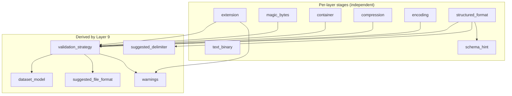

---

# Part II — Sampling and I/O

## 5. Bounded file sampling

**Module:** `sample.py`  
**Function:** `read_file_sample(path, max_bytes=65536)`

### Constants

| Constant | Value | Used by |
|----------|-------|---------|
| `MAX_SAMPLE_BYTES` | 65,536 (64 KiB) | Default cap |
| `PREFIX_8K` | 8,192 | Magic bytes, encoding |
| `PREFIX_4K` | 4,096 | Container, compression |

### Read algorithm

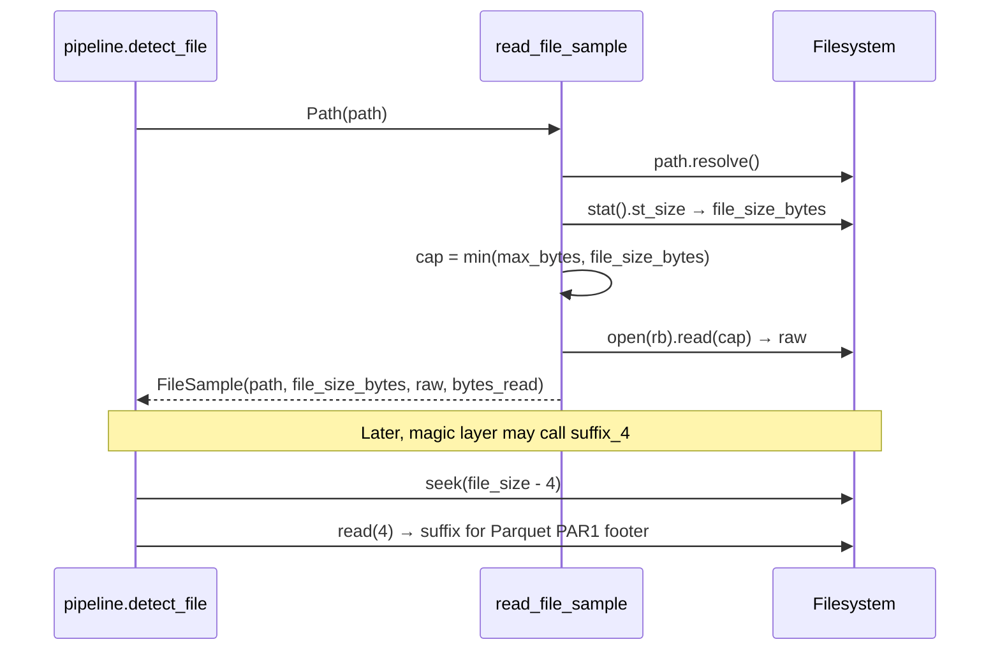

### FileSample properties

| Property | Definition |
|----------|------------|
| `raw` | Actual bytes read from offset 0 |
| `bytes_read` | `len(raw)` — may be 0 for empty files |
| `prefix_4k` | `raw[:4096]` |
| `prefix_8k` | `raw[:8192]` |
| `suffix_4` | **Separate I/O:** last 4 bytes of file |

### Byte layout diagram (typical 100 GB CSV)

```
File on disk (100 GB)
├──────────────────────────────────────────────────────────────┐
│ OFFSET 0                                                     │
│ ┌──────────────── 64 KiB MAX ─────────────────┐              │
│ │ id,name,score                               │  ← raw       │
│ │ 1,alice,90                                  │              │
│ │ 2,bob,85                                    │              │
│ │ ... (up to 65536 bytes)                     │              │
│ └─────────────────────────────────────────────┘              │
│                                                              │
│ ... (99.99 GB not read for detection) ...                    │
│                                                              │
│ OFFSET file_size-4                                           │
│ └─ suffix_4 (only used for Parquet footer magic) ─┘          │
└──────────────────────────────────────────────────────────────┘
```

### Why 64 KiB is enough for most formats

| Format | What detection needs | Typically in first 64 KiB? |
|--------|---------------------|---------------------------|
| CSV/TSV | Header + several data rows for delimiter consistency | Yes |
| JSON document | Start of object/array for `json.loads` | Yes |
| JSONL | First 2+ lines | Yes |
| Fixed-width | 20 lines of uniform width | Yes |
| gzip/zip | Magic bytes at offset 0 | Yes (2–4 bytes) |
| Parquet | `PAR1` header + footer magic | Header yes; footer via `suffix_4` |
| ZIP listing | Central directory may be at end | **Partial:** `zipfile` opens whole file for listing* |

\* Container layer opens the full file path for `ZipFile` metadata, but does not read all bytes into RAM — the OS handles seek/read.

---

## 6. Local vs cloud sampling paths

### Local file

```
User path → detect_file(Path) → read_file_sample(local path) → layers
```

### GCS object

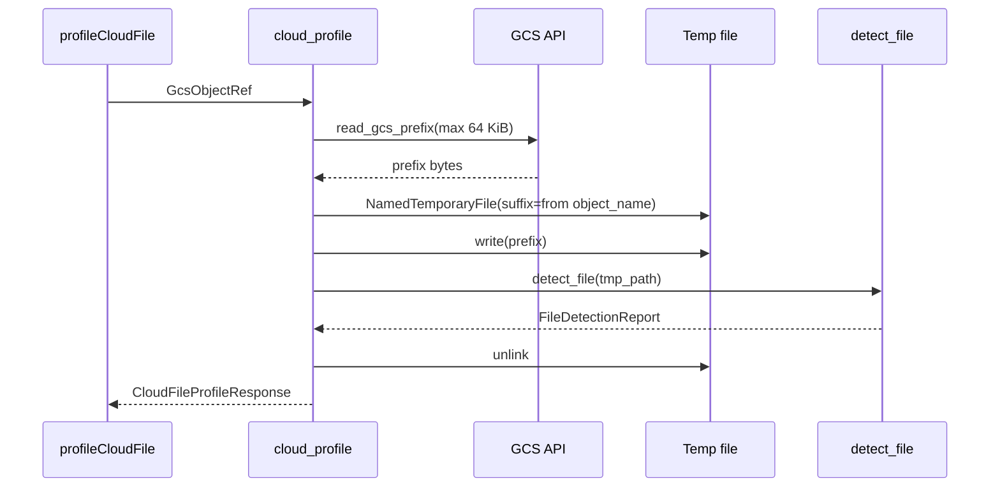

**Important:** The temp file preserves the object suffix (e.g. `.csv`, `.dat`) so **Layer 1 extension** sees the correct filename hint.

### Adapter-based detection

`detect_format_from_adapter()` supports:

| Adapter | Sample source |
|---------|---------------|
| `FileDelimitedAdapter` | `detect_file(adapter.path)` — full local path |
| `GcsDelimitedAdapter` | `_ensure_prefix_bytes(64 KiB)` → temp file |

---

# Part III — The nine detection layers

## 7. Layer pipeline overview

Layers run **sequentially** in `pipeline.detect_file()`. Each layer receives the `FileSample` plus outputs from earlier layers where needed.

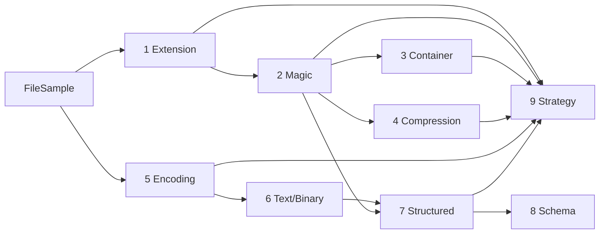

### Layer dependency matrix

| Layer | Primary input | Uses other layers |
|-------|---------------|-------------------|
| 1 Extension | `sample.path.suffix` | — |
| 2 Magic | `prefix_8k`, `suffix_4` | — |
| 3 Container | `prefix_4k` | magic |
| 4 Compression | `prefix_4k` | magic |
| 5 Encoding | `prefix_8k` | re-invokes magic on decoded hex/b64 |
| 6 Text/Binary | `raw` | encoding |
| 7 Structured | `raw` (as text) | text_binary, magic |
| 8 Schema | `raw` | structured |
| 9 Strategy | all stages | user_format_hint |

### Confidence philosophy

```
┌─────────────────────────────────────────────────────────────┐
│  HIGH TRUST (85–98)  Magic signatures, Parquet, ZIP, gzip   │
│  MEDIUM (60–84)      Structured CSV/JSON, UTF-8 validity    │
│  LOW (20–40)         Extension hints, ambiguous text        │
│  MINIMAL (5–15)      unknown / no match                     │
└─────────────────────────────────────────────────────────────┘
```

**Golden rule:** Extension alone never exceeds ~35 confidence. Content layers at ≥70 beat extension.

---

## 8. Layer 1 — Extension hints

**Module:** `layers/extension.py`  
**Function:** `detect_extension(sample)`  
**Philosophy:** *The filename is a clue, not a verdict.*

### Decision flowchart

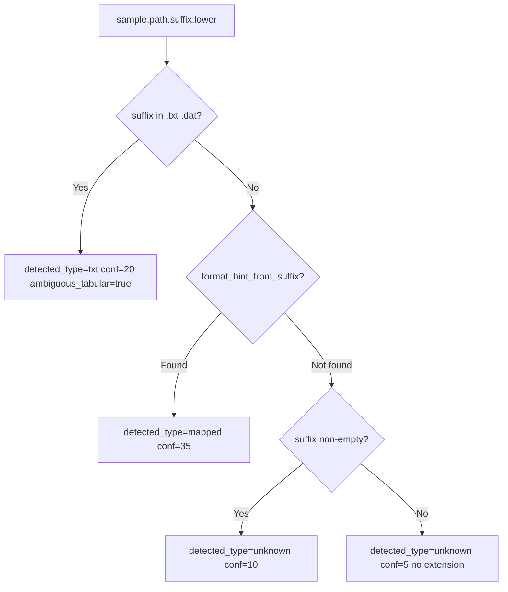

### Complete suffix mapping table

| Suffix | `detected_type` | Confidence | Notes |
|--------|-----------------|------------|-------|
| `.csv` | `csv` | 35 | |
| `.tsv` | `csv` | 35 | TSV distinguished later in Layer 7 |
| `.parquet`, `.pq` | `parquet` | 35 | |
| `.orc` | `orc` | 35 | |
| `.avro` | `avro` | 35 | |
| `.xlsx`, `.xls` | `excel` | 35 | |
| `.json`, `.ndjson` | `json` | 35 | |
| `.txt`, `.dat` | `txt` | 20 | `ambiguous_tabular: true` — **must** sniff content |
| `.psv` | *(unmapped)* | 10 | Layer 7 detects `\|` |
| `.fw`, `.fixed` | *(unmapped)* | 10 | Layer 7 detects fixed-width |
| `.zip`, `.gz`, `.tar` | *(unmapped)* | 10 | Layer 2+ detect via magic |
| *(no suffix)* | `unknown` | 5 | |

---

## 9. Layer 2 — Magic bytes and MIME

**Module:** `layers/magic_bytes.py`  
**Function:** `detect_magic_bytes(sample)`

### Master decision flowchart

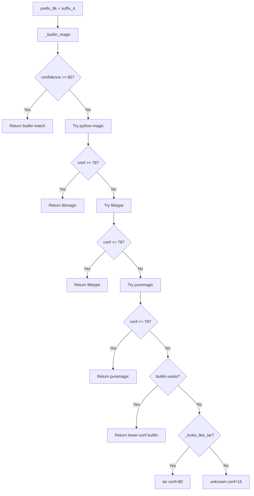

### Parquet dual-magic diagram

```
┌──────────────────────────────────────────┐
│ PAR1  │  column data ...                 │ PAR1 │
│ ^^^^                                       ^^^^ │
│ prefix_8k                              suffix_4 │
└──────────────────────────────────────────┘
```

### Built-in signatures (complete)

| Bytes | Type | Conf |
|-------|------|------|
| `\x1f\x8b` | gzip | 92 |
| `BZh` | bzip2 | 90 |
| `\xfd7zXZ\x00` | xz | 90 |
| `\x28\xb5\x2f\xfd` | zstd | 90 |
| `\x04\x22\x4d\x18` | lz4 | 88 |
| `PK\x03\x04` / `PK\x05\x06` / `PK\x07\x08` | zip | 90–95 |
| `\x37\x7a\xbc\xaf\x27\x1c` | 7z | 95 |
| `Rar!\x1a\x07` | rar | 95 |
| `PAR1` | parquet | 98 |
| `ORC` | orc | 95 |
| `Obj\x01` | avro | 90 |
| PNG/PDF/JSON/XML/BOM/OLE signatures | various | 50–98 |

TAR: `ustar` at byte offset 257.

---

## 10. Layer 3 — Container metadata

**Module:** `layers/container.py`

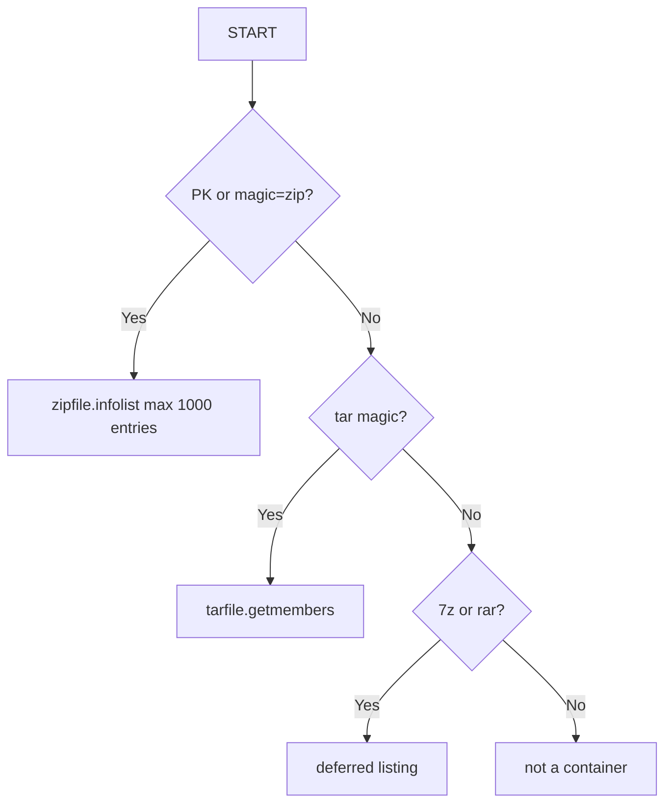

ZIP corrupt → `zip` conf=60. Nested hint when entry ends with `.zip`, `.tar`, `.gz`, `.7z`, `.rar`.

---

## 11. Layer 4 — Compression

Detects gzip, bzip2, xz, zstd, lz4. Attaches `strategy_hint: decompress_first`.

| Type | Auto-decompress in validation? |
|------|-------------------------------|
| gzip | Yes |
| bzip2 | Yes |
| xz, zstd, lz4 | Detected only |

---

## 12. Layer 5 — Encoding

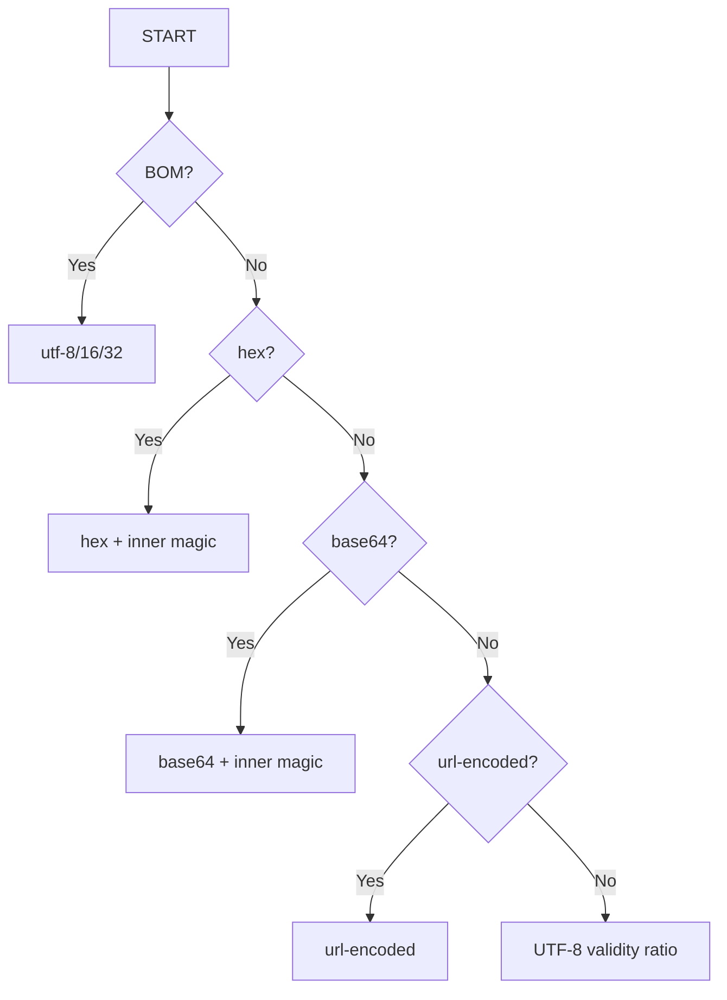

UTF-16/32 → `transcode_first` in metadata.

---

## 13. Layer 6 — Text vs binary

Uses null-byte ratio, printable ratio, Shannon entropy. Binary samples skip CSV/JSON heuristics unless magic identifies parquet/orc/avro/png/pdf.

---

## 14. Layer 7 — Structured format

Priority: JSON → XML → YAML → fixed-width → delimited (`,` `\t` `|`).

JSONL: ≥2 consecutive valid JSON lines. Fixed-width: uniform line length >20, no commas, double-spaces in gaps.

---

## 15. Layer 8 — Schema hints

Header columns for tabular; top-level keys for JSON; deferred for fixed-width.

---

## 16. Layer 9 — Strategy

Merges candidates by confidence. Routes to `tabular`, `hierarchical`, `container`, `binary_asset`, or `unknown`. Emits extension/content mismatch warnings.

---

# Part IV — Display labels and archives

## 17. Format display chains

**Module:** `display_label.py`  
**Function:** `build_format_display_label(report, path, object_name)`

Users see chains like `zip -> gzip -> tar -> csv`. Backend uses ` -> ` as separator; frontend renders `→`.

### Chain resolution architecture

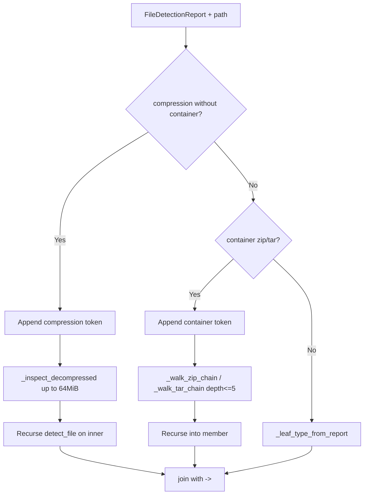

### Leaf type resolution priority

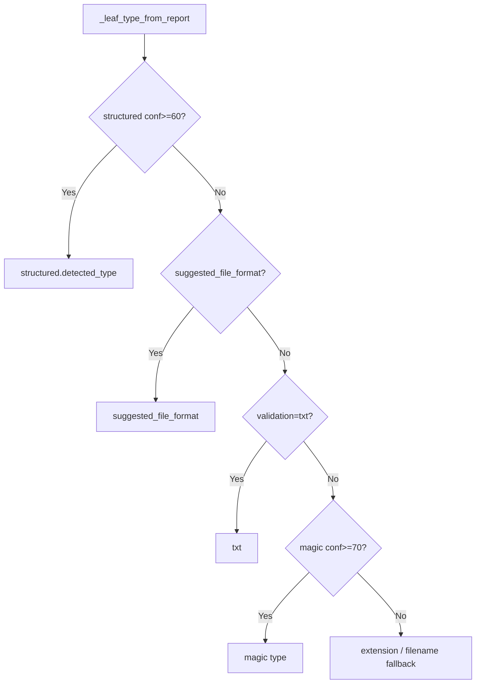

### Ambiguous suffix display rules

When content is delimited but suffix is `.dat` or `.txt`:

| Content detected | Filename | Display label |
|------------------|----------|---------------|
| csv/tsv/psv | `export.dat` | `dat` (not `csv`) |
| csv/tsv/psv | `data.txt` | `txt` or `csv` depending on path |
| fixed-width | `payroll.dat` | `fixed-width` |

### Frontend rendering (`formatDisplayLabel.ts`)

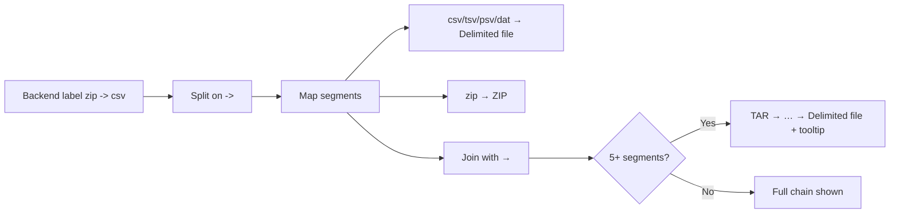

Component: `FormatDetectionChainLabel.tsx` — tooltip shows collapsed middle segments.

---

## 18. Archive walking and nested containers

### Member pick algorithm (`_pick_archive_member`)

When a ZIP/TAR has multiple files, which one is inspected?

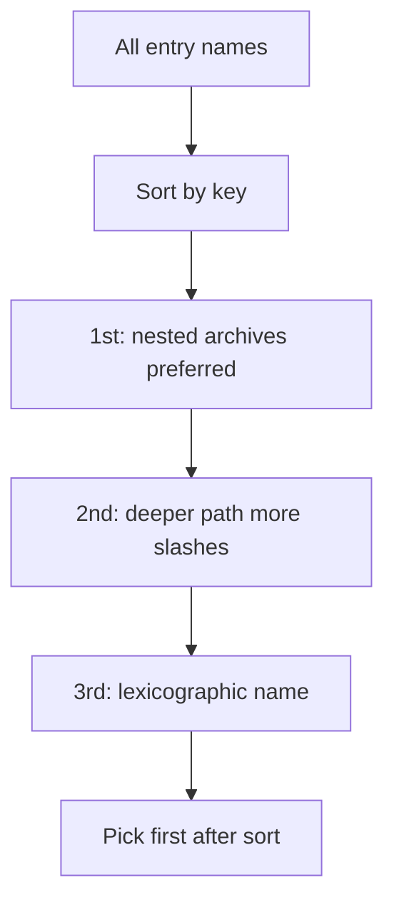

**Priority tuple:** `(is_archive_member, -depth, name)`

Example archive:

```
bundle.zip
├── readme.txt          ← skipped (not archive, shallow)
├── data.csv            ← tabular but not nested
└── inner/nested.zip    ← PICKED (nested archive, deeper path)
    └── (contains csv inside — walked on next recursion)
```

### Recursion depth limits

| Module | Max depth | Purpose |
|--------|-----------|---------|
| `display_label.py` | 5 | UI chain resolution |
| `archive_extract.py` | 3 | Validation materialization |
| `MAX_INNER_EXTRACT_BYTES` | 64 MiB | Display label decompress |
| `validation_archive_max_extract_bytes` | 512 MiB default | Validation extract |

### Filename fallback when archive unreadable

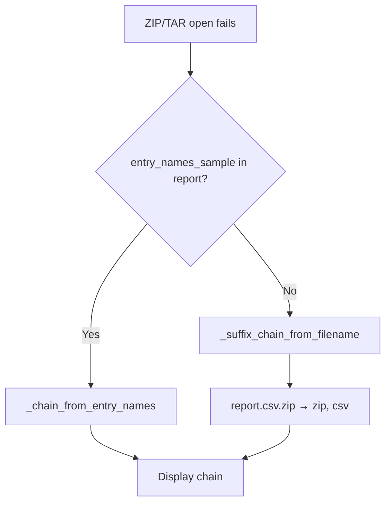

### Test fixture naming convention

Object names like `generated_tar_containing_zip_containing_csv_file` parse to:

```
tar -> zip -> csv
```

Parser: `_chain_from_containing_segment()` splits on `_containing_`.

### Suffix chain peeling (`_suffix_chain_from_filename`)

For `export.csv.gz.tar.verizon`:

```
Step 1: peel .verizon (vendor ext) if unknown
Step 2: peel .tar  → chain [tar]
Step 3: peel .gz   → chain [gzip, tar]
Step 4: peel .csv  → chain [gzip, tar, csv]
Result: gzip -> tar -> csv
```

---

## 19. Archive materialization for validation

**Module:** `archive_extract.py`  
**Function:** `materialize_validation_path(path, work_dir, settings)`

Converts outer container/compression into a path validators can read.

### Materialization flowchart

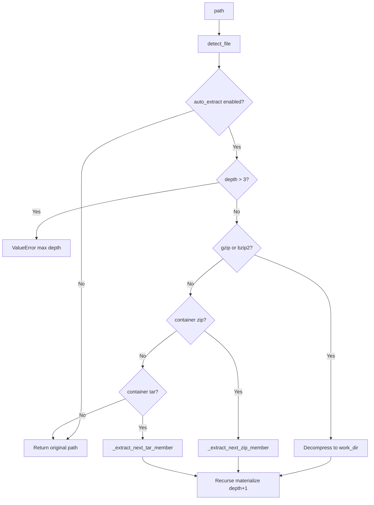

### Member extraction priority (`_member_priority`)


### Size limits during extract

- Each member checked against `validation_archive_max_extract_bytes`
- Streaming copy in 1 MiB chunks
- Over-limit → member skipped or error on decompress

### Related: `archive_leaf.py`

`materialize_archive_tabular_leaf()` forces extraction (`force=True`) to find deepest tabular leaf for archive validation workflows.

---

# Part V — Integration

## 20. Local validation integration

### End-to-end sequence

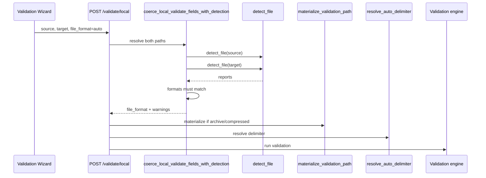

### `resolve_file_format_with_detection` logic

| Input | `validation_auto_detect_format` | Result |
|-------|--------------------------------|--------|
| `auto` | true | Detection wins if strategy conf ≥ 55 |
| `auto` | false | Legacy `infer_file_format_from_path` |
| `csv` (explicit) | true | Declared format used; shadow detect for warnings |
| `csv` (explicit) | false | Declared format only |

### Pair consistency rule

Source and target are detected **independently**. If resolved formats differ:

```
ValueError: Source and target file formats differ after detection:
  source='json', target='csv'
```

---

## 21. Cloud (GCS) profiling integration

**Module:** `cloud_profile.py`

### Profile building paths

```mermaid
flowchart TD
    REF[GcsObjectRef] --> EMPTY{size=0?}
    EMPTY -->|Yes| EPROF[file_format=empty]
    EMPTY -->|No| ARCH{archive zip/tar?}
    ARCH -->|Yes| APROF[build_archive_profile]
    ARCH -->|No| COL{columnar?}
    COL -->|Yes| CPROF[build_columnar_profile]
    COL -->|No| JSON{json detected?}
    JSON -->|Yes| JPROF[build_delimited_profile + json_preview]
    JSON -->|No| DPROF[build_delimited_profile]
```

### Archive profile label richness

Three label sources compete; **deepest chain wins**:

```mermaid
flowchart LR
    A[format_display_label_from_archive_members] --> PICK[_pick_richest_format_label]
    B[infer_format_chain_from_object_name] --> PICK
    C[build_format_display_label fallback] --> PICK
    PICK --> UI[CloudFileProfileResponse.file_format]
```

### `resolve_cloud_pair_file_format`

Resolution order for GCS pairs when `declared` is `auto` or `csv`:

1. Explicit `json` / `fixed-width` declarations → honored immediately
2. Extension inference must match between source/target
3. Columnar detection on both (prefix sample)
4. JSON detection on both
5. Default → `csv`

---

## 22. Frontend wizard integration

### Validation saga default

`Validation.saga.ts` submits jobs with `file_format: 'auto'` — detection runs on backend.

### Wizard step routing

```mermaid
flowchart TD
    FS[File Selection] --> MO[Mapping Overview]
    MO --> ARCH{Both profiles archive?}
    ARCH -->|Yes| AV[Archive Validation Step]
    ARCH -->|No| JSON{JSON profiles?}
    JSON -->|Yes| JM[JSON Parent Mapping]
    JSON -->|No| FW{Fixed-width?}
    FW -->|Yes| FWSTEP[Fixed-width layout step]
    FW -->|No| MAP[Column mapping]
```

### Profile fields used

| Field | UI usage |
|-------|----------|
| `file_format` | Display chain (`FormatDetectionChainLabel`) |
| `suggested_file_format` | Routing (`csv`, `json`, `fixed-width`, `zip`, …) |
| `dataset_model` | Archive vs tabular vs hierarchical |
| `archive_entries_sample` | Build nested chain via `resolveArchiveFormatChain` |
| `delimiter` | Shown in overview |
| `json_preview` | JSON overview snippet |

### Archive format helpers (`archiveFormat.ts`)

- `profileLooksArchive()` — `dataset_model === 'container'` or format suggests zip/tar
- `archiveUsesTabularValidation()` — archive contains tabular leaf
- `resolveWizardArchiveMode()` — manifest vs tabular-inner validation

---

## 23. Delimiter detection bridge

**Module:** `delimiter_bridge.py`

```mermaid
flowchart TD
    START[source_path + target_path] --> DET[detect_file source]
    DET --> HINT{suggested_delimiter AND structured conf>=70?}
    HINT -->|Yes| USE[Return delimiter strategy=file_detection_structured]
    HINT -->|No| LINES[read_file_sample 64KiB both paths]
    LINES --> SHARED[resolve_shared_auto_delimiter 30 lines]
    SHARED -->|fail| FALL[detect_delimiter up to 512KiB sniff]
```

**Why two reads?** Detection uses 64 KiB; legacy delimiter sniff uses up to **512 KiB** and 500 lines — bridge prefers detection when confident to avoid duplicate large reads.

---

# Part VI — Reference

## 24. Complete format catalog

### Category A — Validated tabular

| Format | Detection layers | Validator | Display |
|--------|------------------|-----------|---------|
| CSV | L7 delimiter `,` | Delimited engine | Delimited file |
| TSV | L7 delimiter `\t` | Delimited engine | Delimited file |
| PSV | L7 delimiter `\|` | Delimited engine | Delimited file |
| Fixed-width | L7 uniformity | Fixed-width engine | Fixed Width |
| Semicolon CSV | Extension only* | Delimited if user declares csv | Delimited file |

\*Content sniff may miss `;` — use explicit delimiter or future enhancement.

### Category B — Validated hierarchical

| Format | Detection | Notes |
|--------|-----------|-------|
| JSON document | L7 `json.loads` | Single object or array |
| JSONL / NDJSON | L7 variant=jsonl | Line-delimited objects |

### Category C — Validated columnar

| Format | Magic | Route |
|--------|-------|-------|
| Parquet | PAR1 | columnar_reader |
| ORC | ORC | columnar_reader |
| Avro | Obj\x01 | columnar_reader |
| Excel xls | OLE magic | columnar_reader |
| Excel xlsx | ZIP-based OOXML | columnar_reader |

### Category D — Containers (inspect / compare)

| Format | Listing | Validation |
|--------|---------|------------|
| ZIP | Full metadata | Archive manifest compare; optional inner extract |
| TAR / tar.gz / .tgz | Full metadata | Same |
| 7z | Magic only | Limited |
| RAR | Magic only | Limited |

### Category E — Compression wrappers

| Format | Detected | Auto-handled |
|--------|----------|--------------|
| gzip | L2+L4 | Yes → decompress |
| bzip2 | L2+L4 | Yes → decompress |
| xz | L2+L4 | Detect only |
| zstd | L2+L4 | Detect only |
| lz4 | L2+L4 | Detect only |

### Category F — Detected, not validated

| Format | Outcome |
|--------|---------|
| XML | unknown + warning |
| YAML | unknown + warning |
| HTML | Often xml-like |
| Markdown | txt |
| PNG, PDF, GIF, WEBP, BMP | binary / unknown |
| SQLite | binary / unknown |
| Plain text | txt |

### Category G — Empty files

| Condition | file_format | dataset_model |
|-----------|-------------|---------------|
| 0 bytes | `empty` | null or container |

---

## 25. Worked examples (step-by-step)

### Example 1: Plain CSV

**File:** `sales.csv` — `id,name\n1,alice\n`

| Layer | Result |
|-------|--------|
| Extension | csv, 35 |
| Magic | unknown, 15 |
| Encoding | utf-8, 85 |
| Text/Binary | text, 82 |
| Structured | csv, 85, delimiter=`,` |
| Strategy | csv, tabular |

**Final:** `suggested_file_format=csv`, `suggested_delimiter=,`

---

### Example 2: Gzip disguised as CSV

**File:** `report.csv` — bytes start with `\x1f\x8b`

| Layer | Result |
|-------|--------|
| Extension | csv, 35 |
| Magic | gzip, 92 |
| Compression | gzip, 95 |
| Text/Binary | binary, 90 |
| Structured | skipped |
| Strategy | decompress_first |

**Warning:** `extension suggests 'csv' but content suggests 'gzip'`  
**Display label (after walk):** `gzip -> csv`

---

### Example 3: Comma-delimited `.dat`

**File:** `export.dat`

| Layer | Result |
|-------|--------|
| Extension | txt, 20, ambiguous_tabular=true |
| Structured | csv, 85 |
| Strategy | csv, tabular |

**Display:** `dat` (suffix preserved for UI)

---

### Example 4: Fixed-width `.verizon`

**File:** `payroll.verizon` — uniform-width lines, double-space gaps

| Layer | Result |
|-------|--------|
| Extension | unknown, 10 |
| Structured | fixed-width, 70 |
| Strategy | fixed-width, tabular |

---

### Example 5: JSON in `.xyz` file

| Layer | Result |
|-------|--------|
| Extension | unknown, 10 |
| Magic | json, 55 |
| Structured | json, 90 |
| Strategy | json, hierarchical |

Content wins over meaningless extension.

---

### Example 6: ZIP containing CSV

**File:** `bundle.zip`

| Layer | Result |
|-------|--------|
| Magic | zip, 95 |
| Container | zip, 92, entries: [data.csv] |
| Strategy | container |

**Display:** `zip -> csv` (after archive walk)  
**Materialization:** extracts `data.csv` to temp dir before validation

---

### Example 7: Nested `zip -> zip -> csv`

```
outer.zip
└── mid.zip
    └── data.csv
```

Display walker recurses: picks `mid.zip` first (nested), then `data.csv`.

**Display:** `zip -> zip -> csv`

---

### Example 8: `gzip -> tar -> csv` (.tgz export)

**File:** `bundle.tgz`

| Layer (outer) | gzip + tar detection |
| Display chain | `gzip -> tar -> csv` |
| Materialization | decompress gzip → extract tar member → csv path |

---

### Example 9: Parquet with `.warehouse` suffix

| Layer | Result |
|-------|--------|
| Extension | unknown, 10 |
| Magic | parquet, 98 (PAR1) |
| Strategy | parquet, binary_asset |

---

### Example 10: JSONL / NDJSON

**File:** `stream.ndjson`

```
{"id":1}
{"id":2}
```

| Layer | Result |
|-------|--------|
| Extension | json, 35 |
| Structured | json, 85, variant=jsonl |
| Strategy | json, hierarchical |

---

### Example 11: Plain unstructured `.txt`

**File:** `notes.txt` — prose, no delimiters

| Layer | Result |
|-------|--------|
| Extension | txt, 20, ambiguous |
| Structured | unknown, 25 |
| Strategy | txt, unknown |

---

### Example 12: Empty file

| Field | Value |
|-------|-------|
| bytes_read | 0 |
| dataset_model | unknown |
| All layers | low confidence / empty sample |

---

### Example 13: User declares `csv`, file is JSON

| Setting | Behavior |
|---------|----------|
| file_format=csv | **csv used** for validation |
| auto_detect ON | Warning logged if detection conf ≥ 70 says json |

---

### Example 14: `file_format=auto` both paths

```
resolve_file_format_with_detection(source, "auto") → json
resolve_file_format_with_detection(target, "auto") → json
→ job runs JSON validation
```

---

### Example 15: Mismatched auto detection

```
source → csv
target → json
→ ValueError, HTTP 400
```

---

## 26. Edge cases, conflicts, and limitations

### Conflict matrix

| Scenario | Winner | Warning? |
|----------|--------|----------|
| .csv + gzip body | gzip / decompress_first | Yes |
| .csv + JSON body | json | Yes |
| .txt + CSV structure | csv | No |
| .dat + fixed-width | fixed-width | No |
| .tsv extension + comma content | csv (structured) | Possible |
| magic=text + structured=csv | csv (magic suppressed) | No |
| declared csv + detected gzip | csv (explicit) | Yes (shadow) |

### Known limitations (detailed)

| # | Limitation | Impact | Mitigation |
|---|------------|--------|------------|
| 1 | 64 KiB window | Late headers missed | Declare format explicitly |
| 2 | No `;` delimiter probe | EU CSV may misdetect | User delimiter override |
| 3 | ZIP central directory at EOF | Rare edge for truncated downloads | Re-download / profile retry |
| 4 | 7z/RAR no listing | Shallow container info | Filename fallback |
| 5 | xz/zstd/lz4 no auto-decompress | Manual decompress required | Ops preprocessing |
| 6 | Multi-member ZIP | Only one member extracted | Archive manifest validation |
| 7 | Duplicate I/O | 64KiB detect + 512KiB delimiter sniff | Delimiter bridge reduces this |
| 8 | HTML → xml heuristic | Markup mislabeled | Declare format |
| 9 | xlsx detected as zip at L2 | Routed correctly at L9 | — |
| 10 | Cloud prefix-only | Suffix via temp file name | Full object name preserved |

---

## 27. Configuration and dependencies

### Environment variables

| Variable | Default | Effect |
|----------|---------|--------|
| `PEGASUS_VALIDATION_AUTO_DETECT_FORMAT` | `true` | Enable `auto` resolution + mismatch warnings |
| `PEGASUS_VALIDATION_AUTO_EXTRACT_ARCHIVES` | `true` | gzip/bzip2 decompress; zip/tar extract |
| `PEGASUS_VALIDATION_ARCHIVE_MAX_EXTRACT_BYTES` | 536870912 (512 MiB) | Per-member extract cap |

### Python packages

```
python-magic   # optional; requires system libmagic1
filetype       # pure Python fallback
puremagic      # secondary fallback
```

```bash
# Debian/Ubuntu
apt-get install libmagic1
```

Pipeline functions **without** libmagic using built-in signatures + filetype + puremagic.

---

## 28. API reference

### `GET /api/v1/validate/local/detect`

**Query parameters:**

| Param | Required | Description |
|-------|----------|-------------|
| `path` | Yes | Absolute local file path |
| `file_format` | No | User hint passed to Layer 9 |

**Response model:** `FileDetectionResponse`

```json
{
  "path": "/data/report.csv",
  "file_size_bytes": 1048576,
  "bytes_read": 65536,
  "dataset_model": "tabular",
  "mime_type": "text/csv",
  "suggested_file_format": "csv",
  "suggested_delimiter": ",",
  "warnings": [],
  "extension": { "detected_type": "csv", "confidence": 35, "evidence": ["..."], "metadata": {} },
  "magic_bytes": { "detected_type": "unknown", "confidence": 15, "evidence": ["..."], "metadata": {} },
  "container": { "detected_type": "none", "confidence": 85, "evidence": ["..."], "metadata": {} },
  "compression": { "detected_type": "none", "confidence": 90, "evidence": ["..."], "metadata": {} },
  "encoding": { "detected_type": "utf-8", "confidence": 85, "evidence": ["..."], "metadata": {} },
  "text_binary": { "detected_type": "text", "confidence": 82, "evidence": ["..."], "metadata": {} },
  "structured_format": { "detected_type": "csv", "confidence": 85, "evidence": ["..."], "metadata": { "delimiter": "," } },
  "schema": { "detected_type": "csv", "confidence": 72, "evidence": ["..."], "metadata": { "columns": [] } },
  "validation_strategy": { "detected_type": "csv", "confidence": 85, "evidence": ["..."], "metadata": {} }
}
```

### Cloud profile API

`POST` profile endpoint returns `CloudFileProfileResponse` with:

- `file_format` — display chain string
- `suggested_file_format` — routing token
- `dataset_model`, `column_count`, `row_count`, `delimiter`
- Archive fields: `archive_entry_count`, `archive_entries_sample`, `archive_warnings`

---

## 29. Plugin extension system

**Module:** `plugins/registry.py`

```python
from pegasus.validation.file_detection.plugins.registry import register_format_plugin
from pegasus.validation.file_detection.types import DetectionStage

@register_format_plugin
def my_enterprise_format(candidates: list[tuple[str, int, str]]) -> DetectionStage | None:
    # candidates = [(kind, confidence, source), ...]
    for kind, conf, source in candidates:
        if kind == "dat" and conf >= 60:
            return DetectionStage("myformat", 90, evidence=["site plugin"], metadata={})
    return None
```

Plugins run in Layer 9 after base candidates are collected.

---

## 30. Testing and accuracy suite

### Test modules

| File | Coverage |
|------|----------|
| `test_file_detection.py` | Core pipeline, gzip/.csv mismatch, JSON, auto, empty |
| `test_format_display_label.py` | Chain labels, ambiguous suffixes, nested archives |
| `test_format_detection_accuracy.py` | Full ACCURACY_CASES sweep |
| `format_detection_cases.py` | 90+ fixture builders |

### Accuracy case categories

```mermaid
pie title ACCURACY_CASES by category
    "delimited" : 10
    "fixed-width" : 4
    "json" : 5
    "markup" : 6
    "columnar" : 4
    "image" : 6
    "document" : 1
    "plain" : 6
    "binary" : 2
    "archive" : 19
    "compression" : 5
    "misleading-ext" : 13
    "fallback" : 3
    "extra" : 10
```

### Run tests

```bash
cd /home/ansh.raj/Pegasus
pytest pegasus-backend/tests/test_file_detection.py -v
pytest pegasus-backend/tests/test_format_detection_accuracy.py -v
pytest pegasus-backend/tests/test_format_display_label.py -v
```

### Benchmark

```bash
python scripts/benchmark_file_detection.py \
  test-data/generated-100k-12cols/source.csv
```

---

## 31. Future work and known gaps

| Item | Priority | Notes |
|------|----------|-------|
| Merge 512 KiB delimiter sniff with detection prefix | High | Reduce duplicate I/O |
| Semicolon delimiter in Layer 7 | Medium | EU CSV exports |
| xz/zstd/lz4 auto-decompress | Medium | Ops request |
| 7z/RAR full listing | Medium | Needs native libs |
| Recursive multi-member extract | Low | Today: first match only |
| XML/YAML validators | Low | Detection exists, no route |
| S3/Azure prefix detection | Medium | GCS only today |
| Wire materialize into all job worker paths | High | Partial coverage |

---

## 32. Source file index

| Component | Path |
|-----------|------|
| Pipeline | `pegasus-backend/src/pegasus/validation/file_detection/pipeline.py` |
| Sampling | `.../sample.py` |
| Types | `.../types.py` |
| Layer 1–9 | `.../layers/*.py` |
| Coerce / auto | `.../coerce.py` |
| Display labels | `.../display_label.py` |
| Archive extract | `.../archive_extract.py` |
| Delimiter bridge | `.../delimiter_bridge.py` |
| Plugins | `.../plugins/registry.py` |
| Format tokens | `.../file_format.py` |
| Cloud profiles | `.../cloud_profile.py` |
| Archive leaf | `.../archive_leaf.py` |
| Detect API | `.../api/v1/validation.py` |
| Schemas | `.../schemas/validation.py` |
| Frontend labels | `pegasus-frontend/src/shared/formatDisplayLabel.ts` |
| Frontend component | `pegasus-frontend/src/shared/FormatDetectionChainLabel.tsx` |
| Accuracy fixtures | `pegasus-backend/tests/format_detection_cases.py` |

---

## Appendix — Mental model (one page)

```
┌─────────────────────────────────────────────────────────────────────────┐
│                         FILE TYPE DETECTION                             │
├─────────────────────────────────────────────────────────────────────────┤
│  1. READ small prefix (64 KiB) + maybe 4-byte suffix (Parquet)         │
│  2. RUN 9 layers — each answers one question with evidence + score      │
│  3. VOTE — highest confidence wins; extension is weakest voter           │
│  4. WARN — if filename and body disagree                                │
│  5. ROUTE — map winner → dataset_model + validation_strategy            │
│  6. DISPLAY — walk archives/compression for zip -> csv chains           │
│  7. MATERIALIZE — decompress/extract before validators (if configured)  │
└─────────────────────────────────────────────────────────────────────────┘

         Extension          Magic           Structured
         conf ~35           conf ~90          conf ~85
            │                  │                  │
            └──────────────────┼──────────────────┘
                               ▼
                    ┌─────────────────────┐
                    │   Layer 9 Strategy   │
                    │  suggested_format    │
                    │  dataset_model       │
                    │  warnings[]          │
                    └─────────────────────┘
                               │
              ┌────────────────┼────────────────┐
              ▼                ▼                ▼
         CSV validator   JSON validator   Archive compare
```

*End of document.*

