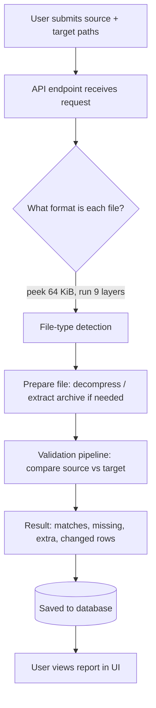
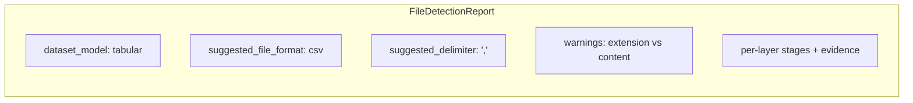
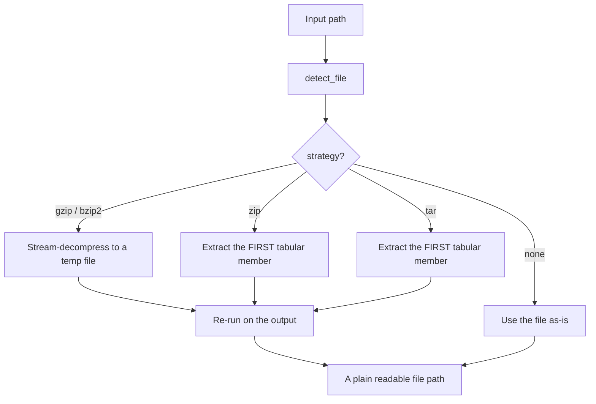
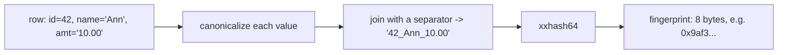
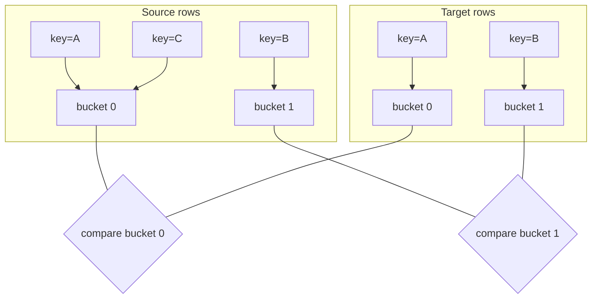
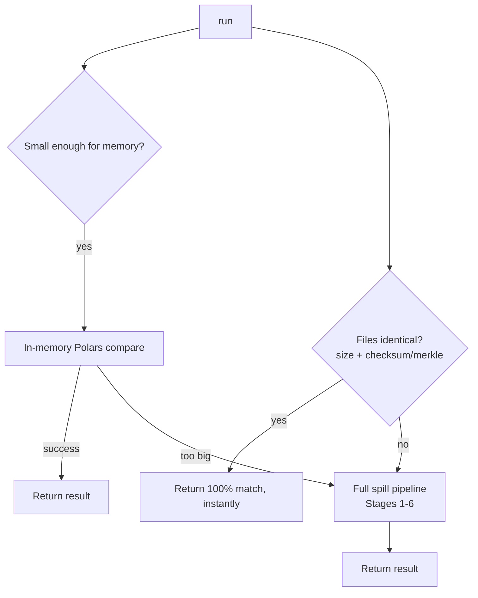
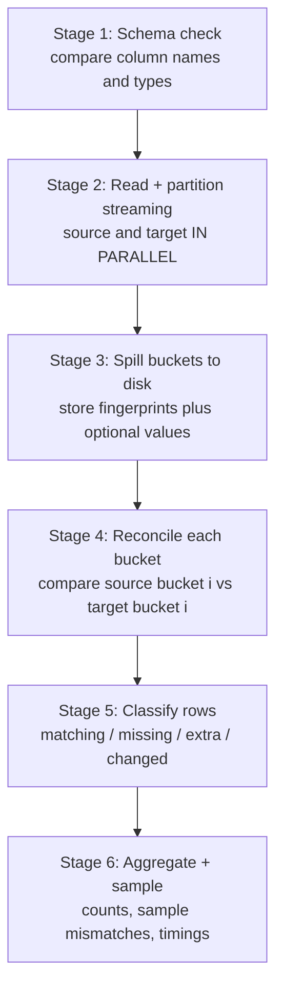
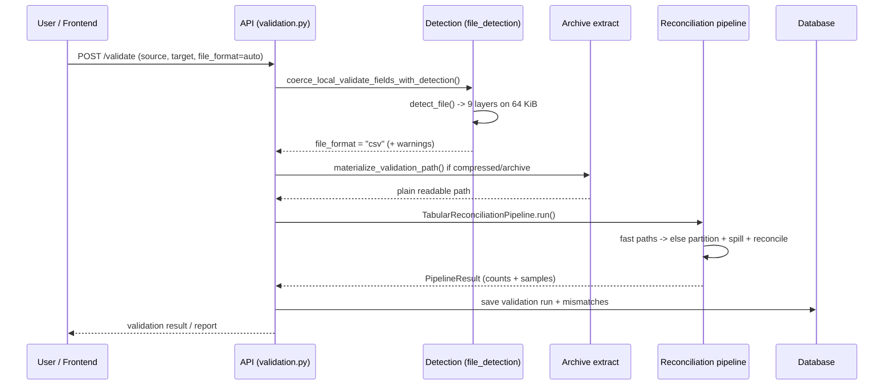

# How Pegasus Works: File-Type Detection & Validation Explained

> **Who is this for?**
> Anyone — including a first-year engineering student — who wants to understand, from
> scratch, how Pegasus figures out *what kind of file you gave it* and then *checks
> whether two files actually contain the same data*.
>
> You do **not** need to know FastAPI, Polars, or hashing to read this. Every term is
> explained the first time it appears. Code references look like
> `pegasus-backend/src/.../file.py:line` so you can jump straight to the source.

---

## Table of contents

1. [The 30-second summary](#1-the-30-second-summary)
2. [What problem does Pegasus solve?](#2-what-problem-does-pegasus-solve)
3. [The big picture: one file's journey](#3-the-big-picture-one-files-journey)
4. [Part A — Finding out the file type](#4-part-a--finding-out-the-file-type)
   - [Why we can't just trust the file name](#41-why-we-cant-just-trust-the-file-name)
   - [The golden rule: never read the whole file](#42-the-golden-rule-never-read-the-whole-file)
   - [The "confidence score" idea](#43-the-confidence-score-idea)
   - [The 9 detection layers, one by one](#44-the-9-detection-layers-one-by-one)
   - [How the layers combine into a decision](#45-how-the-layers-combine-into-a-final-decision)
   - [A full worked example](#46-a-full-worked-example)
5. [Part B — Preparing the file (decompress / extract)](#5-part-b--preparing-the-file-decompress--extract)
6. [Part C — Validating two files against each other](#6-part-c--validating-two-files-against-each-other)
   - [What "validation" means here](#61-what-validation-means-here)
   - [The core trick: fingerprints](#62-the-core-trick-fingerprints)
   - [The core trick: partitioning](#63-the-core-trick-partitioning)
   - [The "fast paths" (shortcuts)](#64-the-fast-paths-shortcuts)
   - [The full reconciliation pipeline](#65-the-full-reconciliation-pipeline)
   - [What the result looks like](#66-what-the-result-looks-like)
7. [How it all connects (end-to-end)](#7-how-it-all-connects-end-to-end)
8. [Glossary](#8-glossary)
9. [Where to look in the code](#9-where-to-look-in-the-code)

---

## 1. The 30-second summary

Pegasus is a **data validation engine**. You give it two files — a **source** and a
**target** — and it tells you whether they hold the same data, and if not, *exactly
which rows differ*.

Before it can compare anything, it must answer a simpler question: **"What kind of file
is this?"** A file called `report.csv` might secretly be a ZIP archive, a JSON blob, or a
gzip-compressed dump. Pegasus answers this by peeking at the **first 64 kilobytes** of the
file and running it through **9 inspection layers**, each adding evidence and a
**confidence score**. The layer with the strongest evidence wins.

Once the format is known, Pegasus reads both files row by row, reduces each row to a tiny
**fingerprint** (a short number), groups rows into buckets called **partitions**, and
compares the buckets. Rows that exist only on one side, or whose fingerprints differ, are
reported as mismatches.

That's the whole story. The rest of this document explains *how* and *why*.

---

## 2. What problem does Pegasus solve?

Imagine a company migrating a giant table from an old database to a new one. After the
migration they have two files:

- `source.csv` — exported from the **old** system (the "truth").
- `target.csv` — exported from the **new** system (what we hope is correct).

They want to be **certain** that every row made it across unchanged. Doing this by hand is
impossible — these files can have **hundreds of millions of rows** and be **tens of
gigabytes** large. Opening them in Excel would crash the computer.

Pegasus does this comparison automatically and efficiently. It must handle:

| Challenge | Why it's hard |
|-----------|---------------|
| **Huge files** (100 GB+) | Can't fit the whole file in memory (RAM). |
| **Many users at once** | The server can't waste memory or CPU per request. |
| **Unknown / lying file names** | `data.csv` might actually be a zip or json. |
| **Many formats** | CSV, TSV, JSON, Parquet, Excel, compressed files, archives… |
| **Exact answers** | "They're different" is useless; users need *which rows*. |

Keep these constraints in mind — they explain almost every design choice below.

---

## 3. The big picture: one file's journey

Here is the life of a validation request, from the moment a user clicks "Validate" to the
moment they get a report.



There are **three** big stages:

- **Part A — Detection:** *"What is this file?"*
- **Part B — Preparation:** *"If it's compressed or zipped, turn it into something I can read."*
- **Part C — Validation:** *"Do the two files contain the same data?"*

We'll go through each in detail.

---

## 4. Part A — Finding out the file type

All the detection code lives in one folder:

```
pegasus-backend/src/pegasus/validation/file_detection/
├── pipeline.py          ← orchestrates everything (the "conductor")
├── sample.py            ← reads the first 64 KiB safely
├── types.py             ← the data shapes (DetectionStage, FileDetectionReport)
├── coerce.py            ← turns detection results into a final "file_format"
├── archive_extract.py   ← decompress / extract archives (Part B)
└── layers/
    ├── extension.py        Layer 1
    ├── magic_bytes.py      Layer 2
    ├── container.py        Layer 3
    ├── compression.py      Layer 4
    ├── encoding.py         Layer 5
    ├── text_binary.py      Layer 6
    ├── structured.py       Layer 7
    ├── schema_discovery.py Layer 8
    └── strategy.py         Layer 9
```

### 4.1 Why we can't just trust the file name

The easy approach would be: *"the file ends in `.csv`, so it's a CSV."* This is wrong
surprisingly often:

- Someone renames `archive.zip` to `archive.csv`.
- A system exports `data.csv.gz` (a **compressed** CSV) but the tool only sees `.gz`.
- A `.txt` file actually holds JSON.
- A file has **no extension at all** (very common for big warehouse dumps).

The file name is a *hint*, not the truth. The **only** reliable source of truth is the
**actual bytes inside the file**. So Pegasus looks inside.

### 4.2 The golden rule: never read the whole file

A 100 GB file cannot be loaded into memory. So detection follows one ironclad rule:

> **Read at most the first 64 KiB (65,536 bytes) of the file — once.**

This is done by `read_file_sample()` in `file_detection/sample.py`:

```python
def read_file_sample(path, *, max_bytes=64*1024):
    file_size = path.stat().st_size          # how big is the file? (cheap, no read)
    cap = min(max_bytes, file_size)          # never read more than we need
    with path.open("rb") as fh:
        raw = fh.read(cap)                   # read only the first `cap` bytes
    return FileSample(path, file_size, raw, bytes_read=len(raw))
```

The result is a `FileSample` object — a small "window" into the start of the file. It
offers handy slices that the layers reuse so nobody reads the disk twice:

- `prefix_4k` — first 4 KiB
- `prefix_8k` — first 8 KiB
- `suffix_4` — the **last 4 bytes** (some formats, like Parquet, put a signature at the
  *end* of the file — see Layer 2).

Because every detection call touches only ~64 KiB, it stays fast and memory-cheap **no
matter how large the file is**. That's how Pegasus handles 100 GB files and hundreds of
simultaneous users.

### 4.3 The "confidence score" idea

Detection is not a single yes/no test. Instead, **each layer is an independent witness**
that reports:

```python
@dataclass
class DetectionStage:
    detected_type: str        # e.g. "csv", "gzip", "json", "unknown"
    confidence: int           # 0–100: how sure am I?
    evidence: list[str]       # human-readable reasons ("found PK zip header")
    metadata: dict            # extra facts (mime type, delimiter, column names…)
```

`confidence` is a number from **0 (no idea)** to **100 (certain)**. The intuition:

- A file **extension** is weak evidence → confidence capped around **35**.
- A **magic-byte signature** (a fixed sequence of bytes that a format always starts with)
  is strong evidence → confidence **85–98**.

By making every layer speak the same "type + confidence + evidence" language, Pegasus can
later **compare** them fairly and pick the most trustworthy answer. The `evidence` list
is also what powers the UI/ops report — you can always see *why* a decision was made.

Defined in `file_detection/types.py`.

### 4.4 The 9 detection layers, one by one

The conductor, `detect_file()` in `file_detection/pipeline.py`, runs the layers in a
fixed order. Each layer receives the 64 KiB sample (and sometimes the results of earlier
layers) and returns a `DetectionStage`.

```mermaid
flowchart LR
    S[64 KiB sample] --> L1[1 Extension]
    L1 --> L2[2 Magic bytes]
    L2 --> L3[3 Container]
    L3 --> L4[4 Compression]
    L4 --> L5[5 Encoding]
    L5 --> L6[6 Text vs Binary]
    L6 --> L7[7 Structured format]
    L7 --> L8[8 Schema discovery]
    L8 --> L9[9 Strategy decision]
    L9 --> R[FileDetectionReport]
```



Think of it like a series of medical specialists examining the same patient, each writing
notes, until a final doctor (Layer 9) reads all the notes and makes the diagnosis.

---

#### Layer 1 — Extension (`layers/extension.py`)

Looks at the file name suffix (`.csv`, `.parquet`, …) and maps it to a format using a
lookup table in `file_format.py` (e.g. `.tsv → csv`, `.pq → parquet`).

- **Confidence: 35** if the suffix is known, lower if unknown or missing.
- This is deliberately weak — it is a *hint*, **never** trusted on its own.

> **Beginner note:** "Why bother if it's weak?" Because when the file content is
> ambiguous (e.g. a plain text file that could be CSV or just text), a `.csv` extension
> can act as a gentle tie-breaker.

#### Layer 2 — Magic bytes (`layers/magic_bytes.py`)

This is the **most important** layer. A **magic number** (or "magic bytes") is a short,
fixed sequence of bytes that many file formats place at their very beginning so programs
can recognize them. For example:

| First bytes (hex) | Meaning |
|-------------------|---------|
| `1F 8B` | gzip compressed file |
| `50 4B 03 04` (`PK..`) | ZIP archive (also `.xlsx`, `.docx`) |
| `50 41 52 31` (`PAR1`) | Parquet file |
| `25 50 44 46` (`%PDF`) | PDF |
| `89 50 4E 47` (`.PNG`) | PNG image |

Pegasus keeps a built-in table of ~25 such signatures (`_BUILTIN_SIGNATURES`). It checks
whether the sample **starts with** any of them. Parquet is special: its `PAR1` signature
also appears at the **end** of the file, so Pegasus checks `suffix_4` too.

If the built-in table is unsure, it falls back — *if installed* — to three external
libraries, in order:

1. **python-magic** (wraps the battle-tested Unix `libmagic`),
2. **filetype** (pure-Python),
3. **puremagic** (another pure-Python guesser).

The first one that returns a confident answer (≥ 78) wins. If nothing matches, it returns
`unknown` with low confidence. It also detects **tar** archives, whose signature
(`ustar`) sits at byte offset 257 rather than the start.

- **Confidence: 85–98** for strong signatures.

#### Layer 3 — Container (`layers/container.py`)

A **container** is a file that holds *other* files inside it: ZIP, TAR, 7z, RAR. If Layer
2 said "zip" (or the bytes start with `PK`), this layer **opens the archive's table of
contents** — but does **not** extract anything. It just lists the entries (capped at
1000) to learn:

- how many files are inside (`entry_count`),
- a sample of their names,
- whether there's a **nested archive** (a zip inside a zip),
- and it tags the file with `strategy_hint = "container"`.

This is cheap because reading an archive's directory listing doesn't require decompressing
the data.

#### Layer 4 — Compression (`layers/compression.py`)

Detects whether the file is **compressed** (squeezed to take less space): gzip, bzip2, xz,
zstd, or lz4 — again by their magic bytes. If so, it sets `strategy_hint =
"decompress_first"`, meaning *"you must un-squeeze this before you can read the data
inside."*

- **Confidence: 88–95**.

#### Layer 5 — Encoding (`layers/encoding.py`)

**Encoding** is the rulebook that maps bytes to text characters. The same letter "A" can
be stored differently in UTF-8 vs UTF-16. This layer figures out which rulebook the file
uses, by checking:

- **BOMs** (Byte Order Marks — special bytes at the start that announce the encoding,
  e.g. `EF BB BF` = UTF-8).
- The **ratio of valid UTF-8 bytes** — if ~98%+ of the sample is valid UTF-8, it's almost
  certainly UTF-8 text.
- Clever transforms: data that is **hex-encoded**, **base64-encoded**, or **URL-encoded**.
  In those cases it *decodes a small window* and re-runs the magic-byte check on the
  decoded bytes, so it can see "this base64 actually wraps a gzip file."

UTF-16/UTF-32 files get `strategy_hint = "transcode_first"` (convert to UTF-8 before
processing).

#### Layer 6 — Text vs Binary (`layers/text_binary.py`)

A simple but crucial split: is this **human-readable text** (like CSV/JSON) or **raw
binary** (like an image or Parquet)? It measures three things over the sample:

- **null-byte ratio** — text almost never contains `0x00` bytes; binary files do. More
  than 5% nulls ⇒ binary.
- **printable ratio** — fraction of bytes that are normal letters, digits, punctuation,
  or whitespace. ≥ 85% ⇒ likely text.
- **Shannon entropy** — a measure of "randomness." Compressed/encrypted data has very
  high entropy; plain text has lower entropy.

> **Beginner note — entropy:** Entropy roughly answers *"how unpredictable are the
> bytes?"* English text is predictable (lots of `e`, spaces, etc.) so it has low entropy.
> A zip file looks like random noise, so it has high entropy (near 8 bits/byte). This is
> why high entropy is a clue that a file is compressed or binary.

#### Layer 7 — Structured format (`layers/structured.py`)

Now that we know it's text, *what structure* does it have? This layer tries, in order:

1. **JSON** — does the sample parse as a valid JSON document? Or is it **JSONL** (one JSON
   object per line)?
2. **XML** — does it contain `<?xml` or tag-like patterns?
3. **YAML** — does it start with `---` or have several `key:` lines?
4. **Delimited (CSV/TSV/PSV)** — the key test: split the first ~15 lines by a candidate
   separator (`,`, tab, or `|`) and check that **every line has the same number of
   fields**. Consistent column counts strongly imply a table. It even uses Python's `csv`
   parser to confirm. When it finds the separator, it remembers it in
   `metadata["delimiter"]`.
5. **Fixed-width** — every line is exactly the same length (old mainframe-style tables).

The first test that clears its confidence bar wins.

#### Layer 8 — Schema discovery (`layers/schema_discovery.py`)

If we found a table or JSON, peek at the **column names / keys** — still only from the 64
KiB window. For CSV it reads the **header row** and produces a list like
`[{name: "id"}, {name: "amount"}, …]`. For JSON it collects the top-level keys. This is a
*preview* of the data's shape, useful for the UI's column-mapping screen. It does **not**
try to infer precise data types here (everything is reported as `string`).

#### Layer 9 — Strategy decision (`layers/strategy.py`)

The "head doctor." It receives every previous layer's `DetectionStage` and decides:

- the **final file format** (`suggested_file_format`), and
- the **dataset model** — a high-level category that tells the rest of the system *how* to
  handle the file.

It works like a small **election**:

```python
candidates = []                       # (type, confidence, source)
# each layer that is confident enough casts a "vote":
if structured.confidence >= 60: candidates.append((structured.type, ...))
if magic.confidence      >= 70: candidates.append((magic.type, ...))
if compression != "none":       candidates.append((compression.type, ...))
if container != "none":         candidates.append((container.type, ...))
if extension.confidence  >= 20: candidates.append((extension.type, ...))
# a user-provided hint (e.g. ?file_format=csv) also gets a small vote.

candidates.sort(by=confidence, descending=True)
winner = candidates[0]
```

Then it applies **priority rules** based on the winner:

| If the file is… | Dataset model | What happens next |
|-----------------|---------------|-------------------|
| compressed (gzip/…) | `binary_asset` | must `decompress_first` |
| UTF-16/UTF-32 | `binary_asset` | must `transcode_first` |
| an archive (zip/tar/…) | `container` | inspect entries first |
| Parquet/ORC/Avro/Excel | `binary_asset` | columnar reader route |
| JSON / JSONL | `hierarchical` | JSON compare route |
| CSV/TSV/PSV/fixed-width | `tabular` | the main reconciliation pipeline |
| nothing confident (< 50) | `unknown` | don't guess — warn the user |

It also raises a **warning** when the extension and the content disagree (e.g.
*"extension suggests 'csv' but content suggests 'json'"*), so nobody is silently
surprised.

The six possible **dataset models** are the canonical buckets everything maps to:
`tabular`, `hierarchical`, `container`, `binary_asset`, `database` (reserved for live DB
connections), and `unknown`.

### 4.5 How the layers combine into a final decision

Everything is bundled into one `FileDetectionReport` (`types.py`), which carries the final
verdict **plus** every individual layer's result and evidence:



This report can be returned directly to humans via the API endpoint
`GET /api/v1/validate/local/detect` (see `api/v1/validation.py:166`), which is great for
debugging "why did Pegasus think my file was X?"

### 4.6 A full worked example

Suppose a user uploads `mystery.csv`, but the file is actually **gzip-compressed JSON**.

| Layer | Sees | Says | Confidence |
|-------|------|------|-----------|
| 1 Extension | name ends `.csv` | "maybe csv" | 35 |
| 2 Magic bytes | first bytes `1F 8B` | **"gzip!"** | 95 |
| 3 Container | not zip/tar | "not a container" | 85 |
| 4 Compression | `1F 8B` | **"gzip, decompress_first"** | 95 |
| 5 Encoding | binary-looking | "binary" | 55 |
| 6 Text/Binary | high entropy, nulls | "binary" | 90 |
| 7 Structured | binary ⇒ skip | "binary" | 75 |
| 8 Schema | nothing to read | "none" | — |
| 9 Strategy | gzip wins the vote | model = `binary_asset`, strategy = `decompress_first`, **warning: extension says csv but content is gzip** | 95 |

Outcome: Pegasus knows it must **decompress first** (Part B) before it can even tell that
the *inner* content is JSON. The `.csv` name was correctly ignored.

---

## 5. Part B — Preparing the file (decompress / extract)

Detection might conclude "this is compressed" or "this is an archive." Before validation
can read rows, the file must become a plain, readable table. That's the job of
`archive_extract.py` → `materialize_validation_path()`.



Key safety limits (so a malicious or huge archive can't crash the server):

- **Streamed in 1 MiB chunks** — never loads the whole decompressed file into memory.
- **Size cap** (`validation_archive_max_extract_bytes`, default **512 MiB**) — aborts if
  the decompressed output grows too large (this protects against "zip bombs").
- **Depth cap** (`MAX_ARCHIVE_DEPTH = 3`) — a zip inside a tar inside a gzip is allowed
  only so deep, preventing infinite nesting.
- **Entry cap** (`MAX_ARCHIVE_ENTRIES = 1000`).

For archives, it extracts the **first tabular member** (a `.csv`/`.tsv`/`.json`/… file),
then calls itself again on that member — so a `.csv.gz` inside a `.zip` is unwrapped layer
by layer until a plain CSV emerges. This behaviour can be toggled with the
`validation_auto_extract_archives` setting.

---

## 6. Part C — Validating two files against each other

Now the interesting part: comparing **source** and **target**. The code lives in
`pegasus-backend/src/pegasus/validation/pipeline/`, and the heart is
`pipeline.py` → `class TabularReconciliationPipeline`.

### 6.1 What "validation" means here

"Validation" = **reconciliation**: confirming that two datasets agree. Concretely,
Pegasus classifies every row into one of four outcomes:

| Outcome | Meaning |
|---------|---------|
| **matching** | The row exists in both files and all compared values are identical. |
| **missing** | The row is in the **source** but **not** in the target (it got lost). |
| **extra** | The row is in the **target** but **not** in the source (it appeared from nowhere). |
| **changed** | The row exists in both, but some compared value differs. |

To do this it needs two pieces of configuration:

- **identity columns** — the column(s) that uniquely identify a row (like a primary key,
  e.g. `id`). This is how Pegasus knows *"row 42 here is the same logical row as row 42
  there."*
- **compare columns** — the columns whose **values** should match (everything you care
  about besides the key).

### 6.2 The core trick: fingerprints

Comparing two rows field-by-field is slow and memory-hungry when you have hundreds of
millions of rows. Instead, Pegasus reduces each row to a tiny **fingerprint** (also called
a **hash**): a short, fixed-size number computed from the row's content.



Two key ideas (from `pipeline/fingerprint.py`):

1. **Canonicalization** — before hashing, each value is normalized so that *meaningless*
   differences don't count as changes. `canonical()` trims whitespace and treats `""`,
   `null`, `none`, `na`, `n/a` all as the same "empty" marker `__NULL__`. So `" 10 "` and
   `"10"` produce the same fingerprint — a real-world necessity, because different systems
   format the same value slightly differently.

2. **xxHash64** — the default hashing algorithm. It is ~16× faster than the more famous
   SHA-256, and for this use case the chance of two different rows accidentally getting
   the same fingerprint (a "collision") is astronomically small. (SHA-256 is still
   available as a fallback if the `xxhash` library isn't installed.)

The payoff: instead of comparing long rows, Pegasus compares **8-byte numbers**. If two
fingerprints are equal, the rows are equal; if they differ, the rows changed.

### 6.3 The core trick: partitioning

We still can't hold *all* fingerprints for a 100 GB file in memory at once. So Pegasus
**partitions** (splits) the rows into many buckets using the identity key:

```
partition_number = xxhash64(identity_key) % num_partitions
```

Because the **same key always hashes to the same bucket number**, a given logical row from
the source and its counterpart from the target are *guaranteed* to land in the
**same-numbered bucket** on both sides. That means Pegasus only ever has to compare
"source bucket 7" against "target bucket 7" — never bucket 7 against bucket 50.



Each bucket is small enough to load into memory on its own, compared, then thrown away.
This is the classic "divide and conquer" strategy and it is what lets Pegasus scale to
files far larger than RAM. The number of buckets adapts to the file size
(`_adaptive_partition_count`): tiny files use ~16 buckets; multi-gigabyte files use
thousands.

Writing buckets to disk is called **spilling** (we "spill" data out of memory onto disk),
handled by `pipeline/spill.py`.

### 6.4 The fast paths (shortcuts)

The full partition-and-spill machinery is overkill for small or obviously-identical files.
So before committing to it, `pipeline.run()` tries several cheaper shortcuts (the exact
order is decided at runtime from the file sizes and config). Conceptually:



1. **In-memory fast path** (`pipeline/in_memory.py`) — if both files fit comfortably in a
   memory budget, load them with **Polars** (a very fast dataframe library, like a
   turbo-charged pandas) and compare directly. No disk spilling needed.

2. **Merkle / identical precheck** (`pipeline/precheck.py`) — if the two files have the
   **same size** and a matching **checksum** (a CRC32C/MD5 already computed during
   download, or a content digest), they are byte-for-byte identical and Pegasus can return
   *"100% match"* without reading a single row. A **Merkle approach** also lets it hash
   each partition and skip buckets whose hashes already match.

   > **Beginner note — Merkle:** A Merkle (hash) tree summarizes a big dataset with one
   > small hash built from the hashes of its parts. If two trees' top hashes match, the
   > data underneath is identical — so you can prove "nothing changed" very cheaply, and
   > zoom in only where the hashes differ.

3. **Polars direct path** — a middle ground for medium files.

Only when all shortcuts decline does Pegasus run the heavy pipeline below.

### 6.5 The full reconciliation pipeline

When the files are big, `_run_spill_path()` runs a streaming, parallel, six-stage process:



Step by step:

- **Stage 1 — Schema & planning.** Read each file's header to get its columns. Compare
  them (`_compare_schemas`): a column present in source but not target is
  `missing_in_target`; differing types are `type_mismatch`, etc. Decide how many
  partitions to use.

- **Stage 2 — Read & partition (in parallel).** Two worker threads run at once — one
  reads the source, the other the target — chunk by chunk (`chunk_rows` at a time, so
  memory stays bounded). For every row it computes the **identity key**, the **partition
  number**, and the **fingerprint**.

- **Stage 3 — Spill.** Each row's (key, fingerprint) — and optionally the raw compared
  values, if "drilldown" is enabled so the report can show exact differing fields — is
  written to that row's bucket file on disk via `PartitionWriter`.

- **Stage 4 — Reconcile.** For each bucket number, load source-bucket *i* and
  target-bucket *i* and compare them (`partition_reconcile.py`). Buckets are processed in
  parallel across CPU cores for speed.

- **Stage 5 — Classify.** Within a bucket, match rows by identity key:
  - key in source only → **missing**
  - key in target only → **extra**
  - key in both, fingerprints equal → **matching**
  - key in both, fingerprints differ → **changed** (and, if drilldown is on, record
    *which columns* differ).

- **Stage 6 — Aggregate.** Sum the counts across all buckets, keep a **sample** of
  mismatches (not all of them — millions of diffs would be useless), record timings and
  I/O stats, and build the final result. Temporary bucket files are deleted.

Throughout, a `LiveProgressTracker` can stream progress percentages back to the UI so a
long-running validation shows a moving progress bar.

### 6.6 What the result looks like

Everything is packaged into a `PipelineResult` (`pipeline/result.py`):

```python
@dataclass
class PipelineResult:
    schema_valid: bool
    schema_differences: list[SchemaDifference]
    source_row_count: int
    target_row_count: int
    row_count_match: bool
    missing_count: int        # rows lost (in source, not target)
    extra_count: int          # rows appeared (in target, not source)
    changed_count: int        # rows present in both but different
    matching_count: int       # perfect matches
    partitions_processed: int
    sample_mismatches: list[MismatchSample]   # examples, with per-column diffs
    compared_columns: list[str]
    execution_seconds: float
    extra_stats: dict         # which path ran, timings, bytes read, etc.
```

This is saved to the database and shown to the user: a headline ("99.998% match, 12 rows
changed") plus a drill-down table of example mismatches showing exactly which column
changed from what to what.

---

## 7. How it all connects (end-to-end)

Putting Parts A, B, and C together, here is what happens when a user calls the validate
endpoint (`api/v1/validation.py`):



Notice how detection isn't just a debugging tool — its output **drives** the rest:

- `coerce.py` turns the detection report into the concrete `file_format` the pipeline
  uses, and only overrides the user's declared format when it's highly confident.
- `delimiter_bridge.py` reuses the **same 64 KiB sample** to pick the CSV delimiter,
  avoiding a second expensive read.
- `archive_extract.py` uses the detected strategy to decide whether to decompress/extract.

This reuse — *peek once, inform everything* — is the central design idea that keeps
Pegasus both **correct** (it looks at real bytes) and **fast** (it looks at very few of
them).

---

## 8. Glossary

| Term | Plain-English meaning |
|------|-----------------------|
| **Source / Target** | The two files being compared. Source is the "truth"; target is what's being checked. |
| **Reconciliation / Validation** | Confirming two datasets contain the same data. |
| **Magic bytes** | A fixed byte sequence at the start (or end) of a file that identifies its format. |
| **MIME type** | A standard label for a format, e.g. `text/csv`, `application/json`. |
| **Confidence** | A 0–100 score for how sure a detection layer is. |
| **Sample / Prefix** | The first ~64 KiB of a file that detection reads. |
| **Encoding** | The rulebook mapping bytes ↔ text characters (UTF-8, UTF-16…). |
| **BOM** | "Byte Order Mark" — special starting bytes that announce the encoding. |
| **Entropy** | A measure of randomness; high entropy hints at compressed/binary data. |
| **Container / Archive** | A file holding other files inside it (ZIP, TAR). |
| **Compression** | Squeezing data to take less space (gzip, zstd…). |
| **Delimiter** | The character separating fields in a row (`,` for CSV, tab for TSV). |
| **Fingerprint / Hash** | A short number computed from a row, used for fast comparison. |
| **xxHash64** | A very fast hashing algorithm Pegasus uses for fingerprints. |
| **Canonicalize** | Normalize a value (trim spaces, unify nulls) before hashing. |
| **Identity columns** | The column(s) that uniquely identify a row (a primary key). |
| **Compare columns** | The columns whose values must match. |
| **Partition / Bucket** | A subset of rows grouped by hash so each can be compared in isolation. |
| **Spilling** | Writing data from memory to disk when it's too big for RAM. |
| **Merkle tree** | A tree of hashes that proves whether big datasets match, cheaply. |
| **Polars** | A fast dataframe library used on the in-memory fast path. |
| **Dataset model** | A high-level category: tabular, hierarchical, container, binary_asset, database, unknown. |
| **Drilldown** | Storing per-column values so the report can show exact field differences. |

---

## 9. Where to look in the code

| You want to understand… | Read this file |
|--------------------------|----------------|
| The detection conductor | `validation/file_detection/pipeline.py` |
| The 64 KiB bounded read | `validation/file_detection/sample.py` |
| The result/data shapes | `validation/file_detection/types.py` |
| Each detection layer | `validation/file_detection/layers/*.py` (layers 1–9) |
| Final format decision | `validation/file_detection/layers/strategy.py` |
| Turning detection into a format | `validation/file_detection/coerce.py` |
| Format name ↔ extension maps | `validation/file_format.py` |
| Decompress / extract archives | `validation/file_detection/archive_extract.py` |
| Delimiter reuse of the sample | `validation/file_detection/delimiter_bridge.py` |
| The reconciliation pipeline | `validation/pipeline/pipeline.py` |
| Row fingerprints & partitioning | `validation/pipeline/fingerprint.py` |
| Fast "identical" prechecks | `validation/pipeline/precheck.py` |
| In-memory fast path | `validation/pipeline/in_memory.py` |
| Per-bucket comparison | `validation/pipeline/partition_reconcile.py` |
| Writing buckets to disk | `validation/pipeline/spill.py` |
| The result shape | `validation/pipeline/result.py` |
| The HTTP endpoints | `api/v1/validation.py` (`/validate`, `/validate/local/detect`) |

> **Related docs:** [`file-type-detection-architecture.md`](file-type-detection-architecture.md)
> is the concise engineering reference for the detection package, and
> [`file-detection-audit.md`](file-detection-audit.md) covers the before/after upgrade
> audit. This document is the long-form, learn-from-zero companion to both.
