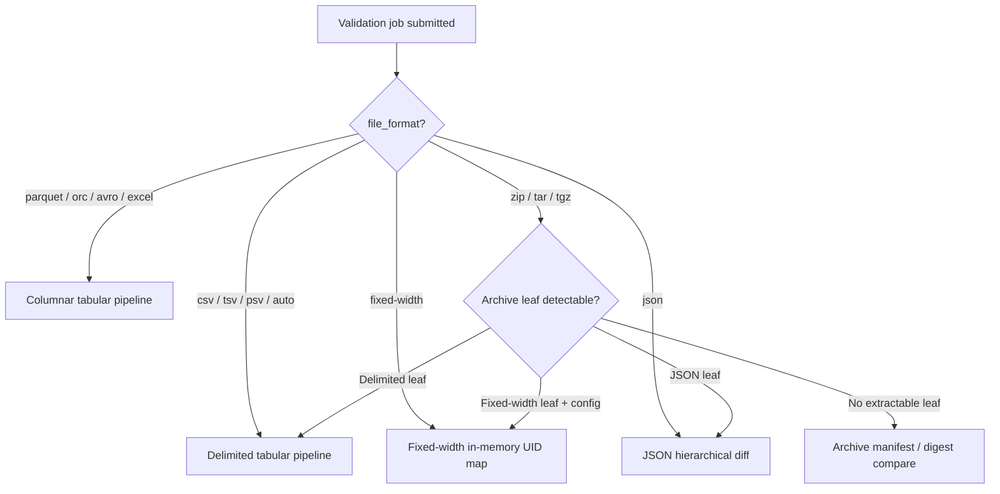

# Validation Algorithms by File Type

This document explains how Pegasus chooses validation algorithms when the input file type changes — including delimited CSVs (sorted and unsorted), fixed-width records, JSON, columnar formats, plain archives, and nested archives.

It is written against the current production code paths in `pegasus-backend` (`ValidationService`, `job_worker`, `TabularReconciliationPipeline`, `archive_compare`, `fixed_width`, `json_compare`).

**Related docs**

- [File type detection architecture](file-type-detection-architecture.md) — how format is inferred before validation
- [File type detection complete guide](file-type-detection-complete-guide.md) — full detection pipeline reference
- [Enterprise tabular architecture](enterprise-tabular/ARCHITECTURE.md) — Category-1 spill/reconcile design
- [KT: CSV validation](kt/01-validation-csv.md), [fixed-width](kt/02-validation-fixed-width.md), [JSON](kt/03-validation-json.md), [backend logic](kt/04-backend-logic.md)

---

## 1. How routing works (high level)

Validation routing happens in two stages:

1. **Format detection / user selection** — the wizard or API sets `file_format` (and related options like `delimiter`, `fixed_width_config`, `json_order_sensitive`).
2. **Engine dispatch** — `job_worker._run_job_body` and `ValidationService` pick a comparison engine based on that format.



The **comparison algorithm** (hash-join vs tree-walk vs manifest diff) depends on the **dataset shape**, not the filename extension alone.

| Dataset shape | Primary engine | Row order matters? |
|---------------|----------------|--------------------|
| Delimited tabular (CSV/TSV/PSV) | `TabularReconciliationPipeline` | **No** — match by UID |
| Columnar (Parquet/ORC/Avro/Excel) | `TabularReconciliationPipeline` | **No** — match by UID |
| Fixed-width | `validate_fixed_width_pair` | **No** — match by UID |
| JSON document | `compare_json_documents` (recursive diff) | **Optional** (`json_order_sensitive`) |
| NDJSON | UID map + per-record JSON diff | Per-record only |
| Archive (metadata-only) | `validate_archive_pair` | N/A (entry paths, not rows) |

---

## 2. Delimited CSV / TSV / PSV (sorted vs unsorted)

### What changes between sorted and unsorted?

**In the current production pipeline, row physical order does not change the algorithm.**

Both sorted and unsorted delimited files use **UID-keyed reconciliation**:

- Each row gets an **identity key** from the UID column(s) (supports composite keys like `region,id`).
- Compare columns are canonicalized and fingerprinted (default: **xxHash64**).
- Rows are hash-partitioned: `partition_id = hash(identity_key) % N`.
- Each partition is reconciled with Polars **anti-joins** (missing/extra) and **inner join + fingerprint compare** (changed rows).

Sorted CSVs do **not** automatically switch to a streaming merge-join. The `VALIDATION_RECONCILIATION_ASSUME_SORTED` and `ordered_stream` / `sliding_window` / `external_sort` settings exist in `config.py` and the backend README, but **they are not wired into `TabularReconciliationPipeline` today**. Sort order is therefore a performance characteristic of the source file, not a routing signal.

### What *does* change the delimited algorithm?

| Signal | Algorithm path | Code path |
|--------|----------------|-----------|
| Small combined file size + `enable_in_memory_reconcile` | Load both sides into Polars; anti-join + inner join on UID | `pipeline/in_memory.py` → `path: in_memory_polars` |
| Default / large files | Chunked read → hash partition spill → parallel partition reconcile | `pipeline/pipeline.py` → `path: spill` |
| Identical file size + Merkle fast-path | Skip full reconcile if per-partition Merkle trees match | `path: precheck_chunk_merkle` |
| Multi-character delimiter | Native Rust mmap/stream splitter OR Python multichar batch reader instead of Polars CSV parser | `pipeline/native_spill.py`, `readers/multichar_csv.py` |
| Column mappings / compare policy | Same reconcile core; canonicalization rules change fingerprint and drilldown | `comparators/policy.py` |

### Delimited pipeline phases

```
1. Resolve delimiter (explicit or auto-detect)
2. Schema probe — verify UID column exists
3. Build compare columns (mapped or auto-matched, UID excluded)
4. Choose execution tier:
   a. In-memory Polars (optional, size-gated)
   b. Spill path (default for production jobs)
5. Partition both sides in parallel (2 threads: source + target)
   - For each chunk: identity_key + row_fingerprint → partition file
6. Reconcile partitions (optionally parallel processes)
   - anti-join → MISSING_IN_TARGET
   - anti-join → EXTRA_IN_TARGET
   - inner join where fingerprint differs → VALUE_MISMATCH
7. Optional column drilldown on changed keys (lazy or eager)
8. Export mismatch NDJSON artifact
```

### Sorted vs unsorted — practical impact

| Aspect | Sorted by UID | Unsorted |
|--------|---------------|----------|
| Correctness | Same | Same |
| Algorithm selected | Hash partition + join | Hash partition + join |
| Disk spill layout | Same | Same |
| Theoretical streaming merge benefit | Not used in current code | N/A |

If you need merge-join performance on pre-sorted files, that would require wiring `validation_reconciliation_assume_sorted` into the pipeline (planned/legacy config only today).

---

## 3. Multi-character delimiters

When the delimiter is **more than one character** (for example `||` or `~|~`), Polars' single-char CSV reader is bypassed.

| Tier | When used | Reader |
|------|-----------|--------|
| Native Rust spill | Extension available + `force_native_multichar_spill` | `readers/native_multichar.py` — mmap or stream file, inline hash → partition write |
| Python fast multichar | File fits fast-load heuristics | `readers/multichar_csv.py` — mmap or streaming batches |
| CleverCSV fallback | Other cases | `readers/clevercsv_io.py` |

The **reconciliation algorithm after partitioning is identical** to single-char CSV. Only the **ingestion/splitting** layer changes.

---

## 4. Fixed-width files

### Routing

- `file_format=fixed-width` in job meta → `ValidationService.validate_fixed_width_pair_sync`
- Requires `fixed_width_config` with field slice definitions (`source_start`/`source_end`, `target_start`/`target_end` per field)

### Algorithm

Fixed-width validation is **fully in-memory** and **UID-keyed** (order-independent):

```
1. Read all non-empty lines from both files
2. Slice each line into fields per FixedWidthConfig
3. Build source_by_uid and target_by_uid dictionaries
4. For each source UID:
   - Missing in target → MISSING_IN_TARGET
   - Present → compare each enabled field
5. For each target UID not in source → EXTRA_IN_TARGET
```

### Field comparison rules (`fields_equal`)

| `field_type` | Comparison logic |
|--------------|------------------|
| `text` (default) | Trimmed string equality |
| `integer` | `int()` parse then compare |
| `float` | `float()` parse then compare |
| `date` | `dates_equal_fixed_width` with per-side format strings |
| `structured` | Deep equality via `eq()` with optional order sensitivity |

Additional behaviors:

- Per-field regex transform before compare (`source_regex_pattern`, `target_regex_pattern`)
- Sensitive fields masked in mismatch output
- `FixedWidthMatchStrategy` (`exact` / `fuzzy`) is defined in the schema for fuzzy UID pairing, but the current `validate_fixed_width_pair` implementation always uses exact UID dictionary lookup

### Archives containing fixed-width

When `file_format` is an archive chain (e.g. `zip -> tar -> fixed-width`) and `fixed_width_config` is provided:

1. `materialize_archive_fixed_width_leaf` recursively extracts nested members (max depth **3**)
2. Content detection verifies the leaf is actually fixed-width
3. Standard fixed-width algorithm runs on the extracted leaf files

---

## 5. JSON and NDJSON

### Routing

- `file_format=json` → `validate_json_pair_sync`
- Archives with a JSON inner leaf → extract leaf, then same JSON path (`pipeline_metadata.path = archive_json_leaf`)

### Algorithm by JSON shape

| Shape | Detection | UID | Compare algorithm |
|-------|-----------|-----|-------------------|
| Single JSON document | `json.loads` succeeds on whole file | `document` (constant) | Recursive `_diff_values` tree walk on aligned roots |
| NDJSON / JSONL | Line-by-line `json.loads` | User `uid_column` per record | UID map, then per-record tree walk |

### Tree walk (`compare_json_documents`)

- Recursively walks objects and arrays
- Emits mismatches at the leaf level with JSON paths (e.g. `$.items[2].name`)
- `json_order_sensitive=false` (default): array order ignored for comparison
- `json_order_sensitive=true`: array element order matters

Parent mappings from the wizard (`align_roots_with_parent_mappings`) restrict comparison to mapped subtrees before the diff runs.

### Memory model

JSON validation loads the **entire parsed payload into memory**. There is no spill path for large JSON documents today.

---

## 6. Columnar formats (Parquet, ORC, Avro, Excel)

### Routing

- `file_format` in `{parquet, orc, avro, excel}` → `validate_columnar_pair_sync`
- Uses format-specific adapters (`FileColumnarAdapter`, `GcsColumnarAdapter`)

### Algorithm

Columnar files use the **same `TabularReconciliationPipeline`** as delimited CSV:

- Schema from file metadata (no full scan for headers)
- Row count from metadata when available
- Chunked record streaming through the adapter
- Hash partition + fingerprint reconcile

The difference from CSV is **how rows are read**, not how they are compared.

---

## 7. Archives — metadata-only vs leaf extraction

Archive validation (`validate_archive_pair_sync`) uses a **priority cascade**:

```
1. Both sides have JSON leaf?        → extract → JSON validation
2. Both sides may be fixed-width
   AND fixed_width_config provided?  → extract → fixed-width validation
3. Both sides have delimited leaf?   → extract → CSV tabular pipeline
4. Otherwise                         → archive manifest / digest compare
```

### Leaf detection (`archive_leaf.py`)

| Leaf type | Suffix hints | Format chain hint |
|-----------|--------------|-------------------|
| JSON | `.json`, `.ndjson` | `json` in chain |
| Tabular | `.csv`, `.tsv`, `.psv` | `csv` / `tsv` / `psv` in chain |
| Fixed-width | `.fw`, or `.txt`/`.dat` with content detection | `fixed-width` in chain |

`deepest_*_leaf_path` picks the most deeply nested matching member by path depth.

### Metadata-only archive algorithm (`validate_archive_pair`)

When no inner tabular/JSON/fixed-width leaf is extracted:

```
1. GCS metadata identical?           → byte-identical short-circuit
2. Same size + streaming xxHash64 digest match? → byte-identical short-circuit
3. Manifest supported (ZIP/TAR)?     → compare_archive_manifests
4. Else                              → digest mismatch report
```

**Manifest compare** (`compare_archive_manifests`):

- Builds path → entry maps for source and target (including nested archive expansion up to `MAX_ARCHIVE_NEST_DEPTH = 3`)
- For each source entry path:
  - Missing in target → `MISSING_IN_TARGET`
  - Present → compare metadata fields: `compressed_size`, `uncompressed_size`, `crc32`, `compress_type`
- For each target-only path → `EXTRA_IN_TARGET`

No decompression of file payloads occurs in metadata-only mode. Zip-bomb guards use header-declared sizes and compression ratios only.

---

## 8. Nested archives

Nested containers (e.g. `tar.gz` containing `inner.zip` containing `data.csv`) are handled at two layers:

### Detection / profiling (`archive_compare.py`)

- Walks archive entries recursively up to **3 levels**
- Nested archive members (`.zip`, `.tar`, `.tgz`, `.tar.gz`, `.7z`, `.rar`) are opened from in-memory byte slices for inner listing
- Produces a **flat manifest** of logical paths like `outer.tar/middle.zip/data.csv`

### Materialization for validation (`archive_extract.py`)

```
materialize_validation_path(path, work_dir, depth=0):
  if gzip/bzip2 wrapper     → decompress → recurse
  if ZIP container          → extract next member (priority: nested archives first, then leaf filter) → recurse
  if TAR container          → same
  if depth > 3              → error
  else                      → return leaf file path
```

**Member priority** (`_member_priority`):

1. Nested archive containers before leaf files at the same level
2. Files matching the `leaf_filter` (`tabular`, `json`, or `fixed-width`)

After extraction, the leaf file is validated with the algorithm for its **inner format** (see sections 2–5), not the outer archive format.

### Format chain display

The UI and API can represent nested types as chains: `zip -> tar -> csv`. `archive_leaf._parse_format_chain` splits on `->` to drive leaf-type detection when manifest suffixes are ambiguous (e.g. `.dat` files).

---

## 9. Compression wrappers (gzip, bzip2)

Compression is handled **before** format-specific validation:

| Wrapper | Detection | Action |
|---------|-----------|--------|
| `.gz` / gzip magic | Layer 4 compression + strategy `decompress_first` | Decompress to temp file, re-detect inner format |
| `.bz2` | Same | Decompress, recurse |
| `.xz`, `.zstd`, `.lz4` | Detected | Not auto-decompressed in validation today |

A file named `report.csv` that is actually gzip-compressed will be decompressed first, then routed as CSV.

---

## 10. Empty files

| Condition | Behavior |
|-----------|----------|
| 0-byte source or target | Validation skipped or rejected at UI/profile stage (`isValidationFileEmpty`) |
| Detection report | `file_format=empty`, no dataset model |

---

## 11. Algorithm summary matrix

| File type | Read strategy | Match key | Compare strategy | Scales to large files? |
|-----------|---------------|-----------|------------------|------------------------|
| CSV/TSV/PSV (sorted) | Chunked / Polars / native multichar | UID column(s) | Hash partition + fingerprint join | Yes (spill path) |
| CSV/TSV/PSV (unsorted) | Same | UID column(s) | Same | Yes |
| Multi-char delimiter CSV | Native Rust or Python multichar batches | UID | Same reconcile core | Yes |
| Fixed-width | Full file line scan | UID field slice | In-memory dict + per-field compare | Limited by RAM |
| JSON document | Full file `json.loads` | `document` | Recursive tree diff | Limited by RAM |
| NDJSON | Line parse | UID column | UID map + tree diff per record | Limited by RAM |
| Parquet/ORC/Avro/Excel | Columnar adapter chunks | UID column | Hash partition + fingerprint join | Yes |
| Archive (leaf CSV) | Extract nested → delimited pipeline | UID column | Hash partition + fingerprint join | Yes (on leaf) |
| Archive (leaf JSON) | Extract nested → JSON path | UID / document | Tree diff | Limited by leaf size |
| Archive (leaf FW) | Extract nested → fixed-width path | UID slice | In-memory field compare | Limited by leaf size |
| Archive (no leaf) | Metadata listing only | Entry path | Manifest metadata + digest | Yes (no payload read) |

---

## 12. Configuration knobs that affect algorithms

| Setting | Effect |
|---------|--------|
| `VALIDATION_ENABLE_IN_MEMORY_RECONCILE` | Allows Polars in-memory path for small tabular files |
| `VALIDATION_AUTO_IN_MEMORY_MAX_BYTES` | Size cap for in-memory attempt |
| `VALIDATION_FORCE_EXTERNAL_RECONCILIATION` | Forces spill path (no full RAM load) for CSV |
| `VALIDATION_RECONCILIATION_CHUNK_ROWS` | Rows per read batch during spill |
| `VALIDATION_RECONCILIATION_PARTITION_BUCKETS` | Hash partition count (1024–8192 typical) |
| `VALIDATION_TABULAR_PARTITION_PRESET` | `small` / `medium` / `large` / `xlarge` bucket presets |
| `VALIDATION_PARTITION_RECONCILE_WORKERS` | Parallel partition workers |
| `VALIDATION_STREAM_MISMATCHES_TO_DISK` | Stream mismatch NDJSON during spill runs |
| `VALIDATION_TABULAR_ENABLE_COLUMN_DRILLDOWN` | Per-column value diff on changed fingerprints |
| `VALIDATION_ARCHIVE_MAX_NEST_DEPTH` | Nested archive walk/extract depth (default 3) |
| `VALIDATION_ARCHIVE_MAX_EXTRACT_BYTES` | Cap on extracted leaf size |
| `json_order_sensitive` (per job) | Array order sensitivity in JSON diff |
| `fixed_width_config` (per job) | Slice layout and field types for fixed-width / archive-FW |

### Legacy / not wired to pipeline

These appear in `config.py` and documentation but **do not currently change runtime behavior** in `TabularReconciliationPipeline`:

- `VALIDATION_RECONCILIATION_STRATEGY` (`auto`, `ordered_stream`, `sliding_window`, `hash_partition`, `external_sort`)
- `VALIDATION_RECONCILIATION_ASSUME_SORTED`
- `VALIDATION_RECONCILIATION_SLIDING_WINDOW`

The production tabular path always uses hash partitioning for spill reconciliation regardless of CSV sort order.

---

## 13. Where to look in code

| Concern | Primary files |
|---------|---------------|
| Job format dispatch | `pegasus-backend/src/pegasus/validation/job_worker.py` |
| Service orchestration | `pegasus-backend/src/pegasus/services/validation_service.py` |
| Tabular reconcile pipeline | `pegasus-backend/src/pegasus/validation/pipeline/pipeline.py` |
| Partition reconcile | `pegasus-backend/src/pegasus/validation/pipeline/partition_reconcile.py` |
| In-memory tabular | `pegasus-backend/src/pegasus/validation/pipeline/in_memory.py` |
| Fingerprint + partition hash | `pegasus-backend/src/pegasus/validation/pipeline/fingerprint.py` |
| Fixed-width | `pegasus-backend/src/pegasus/validation/fixed_width.py` |
| JSON | `pegasus-backend/src/pegasus/validation/json_compare.py` |
| Archive compare | `pegasus-backend/src/pegasus/validation/archive_compare.py` |
| Archive leaf extract | `pegasus-backend/src/pegasus/validation/archive_leaf.py`, `file_detection/archive_extract.py` |
| Format normalization | `pegasus-backend/src/pegasus/validation/file_format.py` |
| Detection → strategy | `pegasus-backend/src/pegasus/validation/file_detection/layers/strategy.py` |
| Frontend wizard routing | `pegasus-frontend/src/pages/validation/overviewPreview.ts`, `archiveFormat.ts` |

---

## 14. Quick decision guide

**"I changed from CSV to fixed-width"**
→ Engine switches from hash-partition spill to in-memory UID dictionary + positional field slicing. You must supply `fixed_width_config`.

**"I changed from unsorted to sorted CSV"**
→ No algorithm change in current code. Same hash-partition reconcile. Potential future optimization only.

**"I wrapped CSV in zip / tar / nested zip"**
→ If a delimited leaf is detected on both sides, archive is extracted and CSV pipeline runs on the inner file. Otherwise manifest metadata is compared without reading row data.

**"I changed from CSV to JSON"**
→ Engine switches from columnar/tabular fingerprint reconcile to hierarchical recursive JSON diff. Memory model changes from streaming to full load.

**"I changed from CSV to Parquet"**
→ Same reconcile algorithm; only the reader adapter changes. Schema and row counts may come from file metadata.
